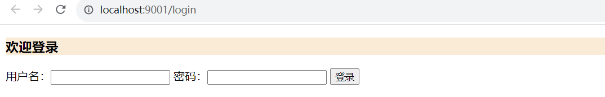
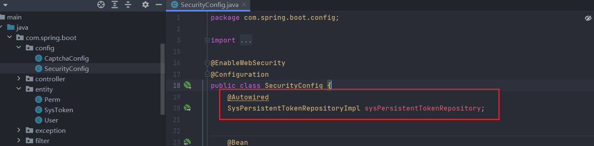
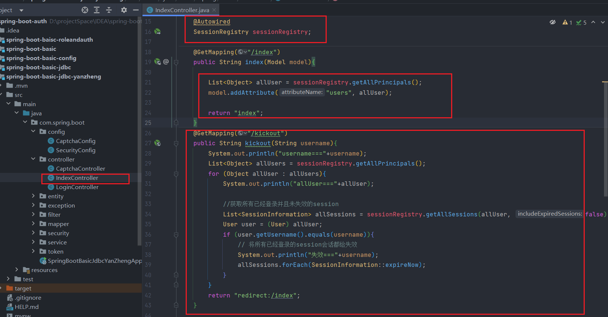

### 笔记

#### 搭建项目

新建一个空项目，之后创建项目作为模块存在


#### 创建版本一 不做任何配置

创建模块


选择组件


创建一个测试


```java
package com.spring.security.controller;

import org.springframework.web.bind.annotation.GetMapping;
import org.springframework.web.bind.annotation.RestController;

@RestController
public class TestController {

    @GetMapping("/test")
    public String test(){
        return "Hello World";
    }
}

```

修改端口 ：9000

启动成功后，如下图


访问地址：http://localhost:9000/test  会自动跳到登录页

登录名：user

密码：查看上图


登录后会自动跳到`/test`


#### 版本二 基本配置

以basic为基础

引入 thymeleaf

```
<dependency>
    <groupId>org.springframework.boot</groupId>
    <artifactId>spring-boot-starter-thymeleaf</artifactId>
</dependency>
```

创建LoginController


```java
package com.spring.security.controller;

import org.springframework.stereotype.Controller;
import org.springframework.web.bind.annotation.GetMapping;

@Controller
public class LoginController {

    @GetMapping("/login")
    public String login(){
        return "login";
    }
}
```

创建login 页面 `login.html`

```html
<!DOCTYPE html>
<html lang="en" xmlns:th="https://www.thymeleaf.org">
<head>
    <meta charset="UTF-8">
    <title>登录页</title>
</head>
<body>
    <h3 style="background-color: antiquewhite">欢迎登录</h3>
    <form th:action="@{/login}" method="post">
        用户名：<input type="text" name="username">
        密码：<input type="text" name="password">
        <input type="submit" value="登录">
    </form>
</body>
</html>

```

创建`IndexController`


```java
package com.spring.security.controller;

import org.springframework.stereotype.Controller;
import org.springframework.web.bind.annotation.GetMapping;

@Controller
public class IndexController {
    @GetMapping("/index")
    public String index(){
        return "index";
    }
}

```

创建`index.html`

```html
<!DOCTYPE html>
<html lang="en" xmlns:th="https://www.thymeleaf.org">
<head>
  <meta charset="UTF-8">
  <title>首页</title>
</head>
<body>
<h3 style="background-color: antiquewhite">首页</h3>

退出是一个post请求


</body>
</html>

```

创建Security配置类

```java
package com.spring.security.config;

import org.springframework.context.annotation.Bean;
import org.springframework.context.annotation.Configuration;
import org.springframework.security.config.Customizer;
import org.springframework.security.config.annotation.web.builders.HttpSecurity;
import org.springframework.security.config.annotation.web.configuration.EnableWebSecurity;
import org.springframework.security.web.SecurityFilterChain;

@Configuration
@EnableWebSecurity
public class SecurityConfig {

    @Bean
    public SecurityFilterChain securityFilterChain(HttpSecurity http) throws Exception {
        // authorizeHttpRequests: 针对http请求进行授权配置
        // login登录页面需要匿名访问
        // permitAll:具有所有权限，也就可以匿名访问
        // anyRequest: 任何请求 所有请求
        // authenticated: 认证【登录】
        http.authorizeHttpRequests(authorizeHttpRequests ->
                authorizeHttpRequests
                        .requestMatchers("/login").permitAll()
                        .anyRequest().authenticated());

        // loginPage:登录页面
        // loginProcessingUrl: 登录接口 过滤器
        // defaultSuccessUrl: 登录成功后访问的页面
        http.formLogin(formLogin->
                formLogin.loginPage("/login").permitAll()
                        .loginProcessingUrl("/login")
                        .defaultSuccessUrl("/index")
        );

        http.csrf(Customizer.withDefaults());//跨域漏洞防御：关闭
        //http.csrf(e->e.disable());
        //http.csrf(csrf->csrf.disable());//相当于http.csrf(Customizer.withDefaults());
        // 退出
        http.logout(logout->logout.invalidateHttpSession(true));

        return http.build();
    }

}

```

添加退出按钮 index.html

```html
<!DOCTYPE html>
<html lang="en" xmlns:th="https://www.thymeleaf.org">
<head>
  <meta charset="UTF-8">
  <title>首页</title>
</head>
<body>
<h3 style="background-color: antiquewhite">首页</h3>

退出是一个post请求
<form th:action="@{/logout}" method="post">
  <input type="submit" value="退出">
</form>

</body>
</html>

```

配置登录名和密码

application.yml

```yaml
spring:
  security:
    user:
      name: root
      password: 123

server:
  port: 9001

```

启动测试

访问http://localhost:9001 跳到登录页



访问/index


以上完成自定义登录页面

#### 版本三 前后端分离

创建一个项目，以版本一为基础修改

先创建一个vue项目

```
npm create vite@latest
```


安装`Route、axios`


```
npm install vue-router@4

npm install axios
```

创建组件

index.vue

```
<script setup lang="ts">
import { ref } from 'vue'


const count = ref(0)
</script>

<template>
  <h3 style="background-color: white">首页</h3>
</template>

<style scoped>

</style>

```

login.vue

```
<script setup lang="ts">
import { ref } from 'vue'
import axios from "axios";
import router from "../router.ts";
import Login from "./login.vue";
const username = ref('')
const password = ref('')
function doLogin(){

  // 存在跨域，
  // axios.post(
  //     'http://localhost:8080/login',
  //     {username:username.value,password:password.value},
  //     {headers:{'Content-Type': 'application/x-www-form-urlencoded;charset=UTF-8'}}
  // ).then((res:any)=>{
  //   console.log(res)
  // })

  var options = {
    url: 'api/login',
    data: {username:username.value,password:password.value},
    method: 'post',
    headers: {'Content-Type': 'application/x-www-form-urlencoded'}
  }
  axios(options).then((res:any)=>{
    console.log(res)
    console.log(res.data)
    if (res.data == 'loginOk'){
      router.push("/")
    }else {
      alert('账号密码错误')
    }
  })

}

</script>

<template>
  <h3 style="background-color: aqua">登录页面</h3>
  用户名：<input type="text" v-model="username">
  密码： <input type="text" v-model="password">
  <button @click="doLogin">登录</button>
</template>

<style scoped>

</style>

```


创建Router


```js
import {createRouter, createWebHistory} from "vue-router";

// @ts-ignore
import Index from './components/index.vue';
// @ts-ignore
import Login from "./components/login.vue";
const router = createRouter({
    history: createWebHistory(),
    routes: [
        {
            path: '/',
            name: 'index',
            component: Index
        },
        {
            path: '/login',
            name: 'login',
            component: Login
        }
    ]
})

export default router

```

修改`main.ts`

```js
import { createApp } from 'vue'
import './style.css'
// @ts-ignore
import App from './App.vue'

import router from "./router.ts";

const app = createApp(App)
app.use(router)

app.mount('#app')

```

修改`App.vue`

```vue
<script setup lang="ts">
</script>

<template>
  <router-view></router-view>
</template>

<style scoped>

</style>

```

配置代理


```
server:{
    proxy: {
      '/api': {
        target: 'http://localhost:8080',//要跨域的地址
        changeOrigin: true,// 允许跨域
        rewrite: (path) => path.replace(/^\/api/,'') //重写路径把路径变成空字符
      }
    }
  }
```

新建`SecurityConfig`

```java
package com.spring.boot.config;

import com.spring.boot.security.LoginFailureHandler;
import com.spring.boot.security.LoginSuccessHandler;
import org.springframework.context.annotation.Bean;
import org.springframework.context.annotation.Configuration;
import org.springframework.security.config.annotation.web.builders.HttpSecurity;
import org.springframework.security.config.annotation.web.configuration.EnableWebSecurity;
import org.springframework.security.web.SecurityFilterChain;

@EnableWebSecurity
@Configuration
public class SecurityConfig {
    @Bean
    public SecurityFilterChain securityFilterChain(HttpSecurity http) throws Exception {
        http.authorizeHttpRequests(authorizeHttpRequests->
                authorizeHttpRequests.requestMatchers("/login").permitAll()
                        .anyRequest().authenticated()
        );

        http.formLogin(formLogin->
                formLogin.loginProcessingUrl("/login").permitAll()
                        .successHandler(new LoginSuccessHandler())
                        .failureHandler(new LoginFailureHandler())
        );

        //http.csrf(Customizer.withDefaults());
        http.csrf(csrf->csrf.disable());

        //http.cors(Customizer.withDefaults());
        http.cors(cors->cors.disable());
        return http.build();
    }

}

```

新建CorsConfig

```java
package com.spring.boot.config;

import org.springframework.context.annotation.Configuration;
import org.springframework.web.servlet.config.annotation.CorsRegistry;
import org.springframework.web.servlet.config.annotation.WebMvcConfigurer;

@Configuration
public class CorsConfig implements WebMvcConfigurer {

    @Override
    public void addCorsMappings(CorsRegistry registry) {
        registry.addMapping("/**")
                .allowCredentials(true)
                .allowedOriginPatterns("*")
                .allowedMethods(new String[]{"GET", "POST", "PUT", "DELETE"})
                .allowedHeaders("*")
                .exposedHeaders("*");
    }
}

```

#### 版本四 权限、角色

根据版本二进行修改

项目结构


登录控制器

```
package com.spring.boot.controller;

import org.springframework.stereotype.Controller;
import org.springframework.web.bind.annotation.GetMapping;

@Controller
public class LoginController {

    @GetMapping("/login")
    public String login(){
        return "login";
    }
}

```

登录页面

```
<!DOCTYPE html>
<html lang="en" xmlns:th="https://www.thymeleaf.org">
<head>
    <meta charset="UTF-8">
    <title>登录页面</title>
</head>
<body>
  <h3 style="background-color: aquamarine">登录页面</h3>
  <form th:action="@{/login}" method="post">
      用户名: <input type="text" th:name="username">
      密码: <input type="text" th:name="password">
    <input type="submit" value="登录">
  </form>
</body>
</html>

```

创建`IndexController`

```
package com.spring.boot.controller;

import org.springframework.stereotype.Controller;
import org.springframework.web.bind.annotation.GetMapping;

@Controller
public class IndexController {

    @GetMapping("/index")
    public String index(){
        return "index";
    }

    @GetMapping("/admin/api")
    public String admin(){
        return "admin";
    }
    @GetMapping("/user/api")
    public String user(){
        return "user";
    }
    @GetMapping("/app/api")
    public String app(){
        return "app";
    }
    @GetMapping("noAuth")
    public String noAuth(){
        return "noAuth";
    }
}

```

首页

```
<!DOCTYPE html>
<html lang="en" xmlns:th="https://www.thymeleaf.org">
<head>
    <meta charset="UTF-8">
    <title>首页</title>
</head>
<body>
  <h3 style="background-color: aquamarine">首页</h3>
  <a th:href="@{/admin/api}">管理员</a>
  <a th:href="@{/user/api}">普通用户</a>
  <a th:href="@{/app/api}">游客</a>

  <form th:action="@{/logout}" method="post">
    <input type="submit" value="退出">
  </form>
</body>
</html>

```

管理员、用户、游客、未授权页面

```
<!DOCTYPE html>
<html lang="en" xmlnx:th="https://www.thymeleaf.org">
<head>
    <meta charset="UTF-8">
    <title>管理员页面</title>
</head>
<body>
  <h3 style="background-color: aqua">管理员页面</h3>
  <p>只有管理员能访问</p>
  <a th:href="@{/index}">返回首页</a>
</body>
</html>

```

```
<!DOCTYPE html>
<html lang="en" xmlnx:th="https://www.thymeleaf.org">
<head>
    <meta charset="UTF-8">
    <title>普通用户页面</title>
</head>
<body>
  <h3 style="background-color: aqua">普通用户页面</h3>
  <p>只有管理员、普通用户能访问</p>
  <a th:href="@{/index}">返回首页</a>
</body>
</html>

```

```
<!DOCTYPE html>
<html lang="en" xmlnx:th="https://www.thymeleaf.org">
<head>
    <meta charset="UTF-8">
    <title>游客页面</title>
</head>
<body>
  <h3 style="background-color: aqua">游客页面</h3>
  <p>所有人能访问</p>
  <a th:href="@{/index}">返回首页</a>
</body>
</html>

```

```
<!DOCTYPE html>
<html lang="en" xmlnx:th="https://www.thymeleaf.org">
<head>
    <meta charset="UTF-8">
    <title>未授权</title>
</head>
<body>
  <h3 style="background-color: aqua">未授权用户不能访问</h3>
  <a th:href="@{/index}">返回首页</a>
</body>
</html>

```

配置`SecurityConfig`

```java
package com.spring.boot.config;

import org.springframework.context.annotation.Bean;
import org.springframework.context.annotation.Configuration;
import org.springframework.security.config.annotation.web.builders.HttpSecurity;
import org.springframework.security.config.annotation.web.configuration.EnableWebSecurity;
import org.springframework.security.core.userdetails.User;
import org.springframework.security.core.userdetails.UserDetails;
import org.springframework.security.crypto.password.NoOpPasswordEncoder;
import org.springframework.security.crypto.password.PasswordEncoder;
import org.springframework.security.provisioning.InMemoryUserDetailsManager;
import org.springframework.security.web.SecurityFilterChain;

@EnableWebSecurity
@Configuration
public class SecurityConfig {

    @Bean
    public SecurityFilterChain securityFilterChain(HttpSecurity http) throws Exception {

        http.authorizeHttpRequests(authorizeHttpRequests->
                authorizeHttpRequests
                        .requestMatchers("/admin/api").hasRole("admin")
                        .requestMatchers("/user/api").hasAnyRole("admin","user")
                        .requestMatchers("/app/api").permitAll()
                        .requestMatchers("/login").permitAll()
                        .anyRequest().authenticated()
        );

        http.formLogin(formLogin->
                formLogin.loginPage("/login")
                        .loginProcessingUrl("/login").permitAll()
                        .defaultSuccessUrl("/index")
        );

        http.exceptionHandling(e->e.accessDeniedPage("/noAuth"));
        http.csrf(csrf->csrf.disable());

        http.logout(logout->logout.invalidateHttpSession(true));

        return http.build();
    }

    @Bean
    public InMemoryUserDetailsManager inMemoryUserDetailsManager(){

        UserDetails user1 = User.withUsername("admin").password("123").roles("admin", "user").build();
        UserDetails user2 = User.withUsername("user").password("123").roles("user").build();

        return new InMemoryUserDetailsManager(user1,user2);
    }

    @Bean
    public PasswordEncoder passwordEncoder(){
        // 这里使用 NoOpPasswordEncode，即不对密码进行加密。该方法因安全性不足够已被标记为过时
        return NoOpPasswordEncoder.getInstance();
    }
}

```

权限

```
package com.spring.boot.config;

import org.springframework.context.annotation.Bean;
import org.springframework.context.annotation.Configuration;
import org.springframework.security.config.annotation.web.builders.HttpSecurity;
import org.springframework.security.config.annotation.web.configuration.EnableWebSecurity;
import org.springframework.security.core.userdetails.User;
import org.springframework.security.core.userdetails.UserDetails;
import org.springframework.security.crypto.password.NoOpPasswordEncoder;
import org.springframework.security.crypto.password.PasswordEncoder;
import org.springframework.security.provisioning.InMemoryUserDetailsManager;
import org.springframework.security.web.SecurityFilterChain;

@EnableWebSecurity
@Configuration
public class SecurityConfig {

    @Bean
    public SecurityFilterChain securityFilterChain(HttpSecurity http) throws Exception {

        http.authorizeHttpRequests(authorizeHttpRequests->
                authorizeHttpRequests
                        // 角色
                        //.requestMatchers("/admin/api").hasRole("admin")
                        //.requestMatchers("/user/api").hasAnyRole("admin","user")
                        .requestMatchers("/admin/api").hasAuthority("admin:api")
                        .requestMatchers("/user/api").hasAnyAuthority("admin:api","user:api")
                        .requestMatchers("/app/api").permitAll()
                        .requestMatchers("/login").permitAll()
                        .anyRequest().authenticated()
        );

        http.formLogin(formLogin->
                formLogin.loginPage("/login")
                        .loginProcessingUrl("/login").permitAll()
                        .defaultSuccessUrl("/index")
        );

        http.exceptionHandling(e->e.accessDeniedPage("/noAuth"));
        http.csrf(csrf->csrf.disable());

        http.logout(logout->logout.invalidateHttpSession(true));

        return http.build();
    }

    @Bean
    public InMemoryUserDetailsManager inMemoryUserDetailsManager(){
        // 角色
        //UserDetails user1 = User.withUsername("admin").password("123").roles("admin", "user").build();
        //UserDetails user2 = User.withUsername("user").password("123").roles("user").build();
        // 权限
        UserDetails user1 = User.withUsername("admin").password("123").authorities("admin:api", "user:api").build();
        UserDetails user2 = User.withUsername("user").password("123").authorities("user:api").build();


        return new InMemoryUserDetailsManager(user1,user2);
    }

    @Bean
    public PasswordEncoder passwordEncoder(){
        // 这里使用 NoOpPasswordEncode，即不对密码进行加密。该方法因安全性不足够已被标记为过时
        return NoOpPasswordEncoder.getInstance();
    }
}

```

测试匹配

在`IndexController.java`中添加

```
  @GetMapping("/test/a")
    public String testa(){
        return "adminA";
    }
    @GetMapping("/test/api/a/b")
    public String testab(){
        return "adminAB";
    }
    @GetMapping("/test/a/b/c/d")
    public String testabcd(){
        return "adminABCD";
    }
```

创建html


修改`SecurityConfig.java`

```java
@Bean
    public SecurityFilterChain securityFilterChain(HttpSecurity http) throws Exception {

        http.authorizeHttpRequests(authorizeHttpRequests->
                authorizeHttpRequests
                        // 角色
                        //.requestMatchers("/admin/api").hasRole("admin")
                        //.requestMatchers("/user/api").hasAnyRole("admin","user")
                        .requestMatchers("/admin/api").hasAuthority("admin:api")
                        .requestMatchers("/user/api").hasAnyAuthority("admin:api","user:api")
                        .requestMatchers("/app/api").permitAll()
                        // 测试匹配
                        .requestMatchers("/test/?").hasAnyAuthority("admin:api")
                        .requestMatchers("/test/api/*/*").hasAnyAuthority("admin:api")
                        .requestMatchers("/test/a/**").hasAnyAuthority("admin:api")
                        .requestMatchers("/login").permitAll()
                        .anyRequest().authenticated()
        );

        http.formLogin(formLogin->
                formLogin.loginPage("/login")
                        .loginProcessingUrl("/login").permitAll()
                        .defaultSuccessUrl("/index")
        );

        http.exceptionHandling(e->e.accessDeniedPage("/noAuth"));
        http.csrf(csrf->csrf.disable());

        http.logout(logout->logout.invalidateHttpSession(true));

        return http.build();
    }
```

#### 版本五 整合jdbc

`pom.xml`

```xml
<dependency>
    <groupId>org.springframework.boot</groupId>
    <artifactId>spring-boot-starter-jdbc</artifactId>
</dependency>
<dependency>
    <groupId>org.springframework.boot</groupId>
    <artifactId>spring-boot-starter-security</artifactId>
</dependency>
<dependency>
    <groupId>com.mysql</groupId>
    <artifactId>mysql-connector-j</artifactId>
</dependency>
```

创建数据库

```
数据库：springsecurity
```

创建表

搜索`users.ddl`,双击shift ,弹出以下窗口


`users.ddl`内容:

```sql
create table users(username varchar(50) not null primary key,password varchar(500) not null,enabled boolean not null);
create table authorities (username varchar(50) not null,authority varchar(50) not null,constraint fk_authorities_users foreign key(username) references users(username));
create unique index ix_auth_username on authorities (username,authority);

```

创建表`t_user`

```
create table t_user
(
    id       int auto_increment
        primary key,
    username varchar(100) not null,
    password varchar(100) null,
    enabled  bit          null
);

```

创建表`t_perm`

```
create table t_perm
(
    id      int auto_increment
        primary key,
    name    varchar(100) null,
    tag     varchar(100) null,
    user_id int          null
);


```

配置`application.yml`

```
spring:
  datasource:
    driver-class-name: com.mysql.cj.jdbc.Driver
    url: jdbc:mysql://localhost:3308/springsecurity
    username: root
    password: 123456

```

创建登录控制器

```
package com.spring.boot.controller;

import org.springframework.stereotype.Controller;
import org.springframework.web.bind.annotation.GetMapping;

@Controller
public class LoginController {

    @GetMapping("/login")
    public String login(){
        return "login";
    }
}

```

创建登录页

```
<!DOCTYPE html>
<html lang="en" xmlns:th="https://www.thymeleaf.org">
<head>
    <meta charset="UTF-8">
    <title>登录页</title>
</head>
<body>
<h3>登录页</h3>
<form th:action="@{/login}" method="post">
    <input type="text" name="username" placeholder="用户名...">
    <input type="text" name="password" placeholder="密码...">
    <input type="submit" value="登录">
</form>

</body>
</html>

```

首页Controller

```
package com.spring.boot.controller;

import org.springframework.stereotype.Controller;
import org.springframework.web.bind.annotation.GetMapping;

@Controller
public class IndexController {

    @GetMapping("/index")
    public String index(){
        return "index";
    }
}

```

`index.html`

```
<!DOCTYPE html>
<html lang="en" xmlns:th="https://www.thymeleaf.org">
<head>
    <meta charset="UTF-8">
    <title>Title</title>
</head>
<body>
    <h3>首页</h3>

    <form th:action="@{/logout}" method="post">
        <input type="submit" value="退出">
    </form>

</body>
</html>

```

创建`SecurityConfig.java`

```
package com.spring.boot.config;

import org.springframework.beans.factory.annotation.Autowired;
import org.springframework.context.annotation.Bean;
import org.springframework.context.annotation.Configuration;
import org.springframework.security.config.annotation.web.builders.HttpSecurity;
import org.springframework.security.config.annotation.web.configuration.EnableWebSecurity;
import org.springframework.security.core.userdetails.User;
import org.springframework.security.core.userdetails.UserDetails;
import org.springframework.security.core.userdetails.UserDetailsService;
import org.springframework.security.crypto.password.NoOpPasswordEncoder;
import org.springframework.security.crypto.password.PasswordEncoder;
import org.springframework.security.provisioning.JdbcUserDetailsManager;
import org.springframework.security.web.SecurityFilterChain;

import javax.sql.DataSource;

@EnableWebSecurity
@Configuration
public class SecurityConfig {

    @Bean
    public SecurityFilterChain securityFilterChain(HttpSecurity http) throws Exception {
        http.authorizeHttpRequests(authorizeHttpRequests->
                authorizeHttpRequests.requestMatchers("/toLogin").permitAll()
                        .anyRequest().authenticated()
        );

        http.formLogin(formLogin->
                formLogin.loginPage("/login")
                        .loginProcessingUrl("/login").permitAll()
                        .defaultSuccessUrl("/index")
        );
       	http.exceptionHandling(e->e.accessDeniedPage("/noAuth"));

        http.logout(logout->logout.invalidateHttpSession(true));

        http.csrf(csrf->csrf.disable());

        return http.build();
    }

    @Autowired
    DataSource dataSource;

    @Bean
    public UserDetailsService userDetailsService(){
        JdbcUserDetailsManager jdbcUserDetailsManager = new JdbcUserDetailsManager();
        jdbcUserDetailsManager.setDataSource(dataSource);

        UserDetails user1 = User.withUsername("admin").password("123").authorities("admin:api", "user:api").build();
        UserDetails user2 = User.withUsername("user").password("123").authorities("user:api").build();
        //要是数据库 创建数据
        if (!jdbcUserDetailsManager.userExists("admin") && !jdbcUserDetailsManager.userExists("user")){
            jdbcUserDetailsManager.createUser(user1);
            jdbcUserDetailsManager.createUser(user2);
        }
        return jdbcUserDetailsManager;
    }

    @Bean
    public PasswordEncoder passwordEncoder(){
        // 明文编码
        return NoOpPasswordEncoder.getInstance();
    }
}

```

集成

```xml
<dependency>
    <groupId>com.baomidou</groupId>
    <artifactId>mybatis-plus-boot-starter</artifactId>
    <version>3.5.3.1</version>
</dependency>
```

创建实体类

```
package com.spring.boot.entity;

import com.baomidou.mybatisplus.annotation.IdType;
import com.baomidou.mybatisplus.annotation.TableField;
import com.baomidou.mybatisplus.annotation.TableId;
import com.baomidou.mybatisplus.annotation.TableName;
import lombok.Data;
import org.springframework.security.core.GrantedAuthority;
import org.springframework.security.core.userdetails.UserDetails;

import java.util.List;

@TableName("t_user")
@Data
public class User implements UserDetails {
    @TableId(value = "id", type = IdType.AUTO)
    private int id;

    @TableField("username")
    private String username;

    @TableField("password")
    private String password;

    @TableField("enabled")
    private Boolean enabled;

    @TableField(exist = false)
    private List<GrantedAuthority> authorities;


    @Override
    public boolean isAccountNonExpired() {
        return true;
    }

    @Override
    public boolean isAccountNonLocked() {
        return true;
    }

    @Override
    public boolean isCredentialsNonExpired() {
        return true;
    }

    @Override
    public boolean isEnabled() {
        return true;
    }
}

```

创建mapper

```
package com.spring.boot.mapper;

import com.baomidou.mybatisplus.core.mapper.BaseMapper;
import com.spring.boot.entity.User;
import org.apache.ibatis.annotations.Mapper;

@Mapper
public interface UserMapper extends BaseMapper<User> {
}

```

创建UserService

```
package com.spring.boot.service;

import com.baomidou.mybatisplus.extension.service.IService;
import com.spring.boot.entity.User;
import org.springframework.security.core.userdetails.UserDetailsService;

public interface UserService extends IService<User> , UserDetailsService {
}

```

创建`UserService`实现类

```
package com.spring.boot.service.impl;

import com.baomidou.mybatisplus.core.conditions.query.QueryWrapper;
import com.baomidou.mybatisplus.extension.service.impl.ServiceImpl;
import com.spring.boot.entity.Perm;
import com.spring.boot.entity.User;
import com.spring.boot.mapper.PermMapper;
import com.spring.boot.mapper.UserMapper;
import com.spring.boot.service.UserService;
import org.springframework.beans.factory.annotation.Autowired;
import org.springframework.security.core.authority.AuthorityUtils;
import org.springframework.security.core.userdetails.UserDetails;
import org.springframework.security.core.userdetails.UsernameNotFoundException;
import org.springframework.stereotype.Service;

import java.util.List;
import java.util.stream.Collectors;

@Service
public class UserServiceImpl extends ServiceImpl<UserMapper, User> implements UserService {

    @Autowired
    UserMapper userMapper;

    @Autowired
    PermMapper permMapper;
    @Override
    public UserDetails loadUserByUsername(String username) throws UsernameNotFoundException {
        QueryWrapper queryWrapper = new QueryWrapper();
        queryWrapper.eq("username",username);

        User user = userMapper.selectOne(queryWrapper);

        if (user == null){
            throw new UsernameNotFoundException("用户未找到");
        }
        // 根据用户名查找权限
        QueryWrapper<Perm> permQueryWrapper = new QueryWrapper<>();
        permQueryWrapper.eq("user_id",user.getId());

        List<Perm> perms = permMapper.selectList(permQueryWrapper);

        // 权限标识
        List<String> permTags = perms.stream().map(Perm::getTag).collect(Collectors.toList());
        user.setAuthorities(AuthorityUtils.createAuthorityList(permTags));
        System.out.println("user==="+user.toString());
        return user;
    }
}

```

实体类`Perm`

```
package com.spring.boot.entity;

import com.baomidou.mybatisplus.annotation.IdType;
import com.baomidou.mybatisplus.annotation.TableField;
import com.baomidou.mybatisplus.annotation.TableId;
import com.baomidou.mybatisplus.annotation.TableName;
import lombok.Data;

@TableName("t_perm")
@Data
public class Perm {
    @TableId(value = "id", type = IdType.AUTO)
    private Integer id;
    @TableField("name")
    private String name;

    @TableField("tag")
    private String tag;

    @TableField("user_id")
    private Integer userId;

    @TableField(exist = false)
    private User user;
}

```

`PermMapper`

```
package com.spring.boot.mapper;

import com.baomidou.mybatisplus.core.mapper.BaseMapper;
import com.spring.boot.entity.Perm;
import org.apache.ibatis.annotations.Mapper;

@Mapper
public interface PermMapper extends BaseMapper<Perm> {
}

```

`Service`

```
package com.spring.boot.service;

import com.baomidou.mybatisplus.extension.service.IService;
import com.spring.boot.entity.Perm;

public interface PermService extends IService<Perm> {
}

```

```
package com.spring.boot.service.impl;

import com.baomidou.mybatisplus.extension.service.impl.ServiceImpl;
import com.spring.boot.entity.Perm;
import com.spring.boot.mapper.PermMapper;
import com.spring.boot.service.PermService;
import org.springframework.stereotype.Service;

@Service
public class PermServiceImpl extends ServiceImpl<PermMapper, Perm> implements PermService {
}

```

登录失败


```
package com.spring.boot.security;

import jakarta.servlet.ServletException;
import jakarta.servlet.http.HttpServletRequest;
import jakarta.servlet.http.HttpServletResponse;
import org.springframework.security.core.AuthenticationException;
import org.springframework.security.web.authentication.AuthenticationFailureHandler;

import java.io.IOException;

public class LoginFailureHandler implements AuthenticationFailureHandler {
    @Override
    public void onAuthenticationFailure(HttpServletRequest request, HttpServletResponse response, AuthenticationException exception) throws IOException, ServletException {
        System.out.println("exception::"+exception);
        exception.printStackTrace();
        response.getWriter().write("Failure");
    }
}

```

修改`SecurityConfig`


```
http.formLogin(formLogin->
                formLogin.loginPage("/login")
                        .loginProcessingUrl("/login").permitAll()
                        .failureHandler(new LoginFailureHandler())
                        .defaultSuccessUrl("/index")
        );
```

异常处理


```
 // http.exceptionHandling(e->e.accessDeniedPage("/noAuth"));
        http.exceptionHandling(e->e.accessDeniedHandler(new AccessDeniedHandler() {
            @Override
            public void handle(HttpServletRequest request, HttpServletResponse response, AccessDeniedException accessDeniedException) throws IOException, ServletException {
                System.out.println("accessDeniedException=="+accessDeniedException);
                accessDeniedException.printStackTrace();
            }
        }));
```

#### 版本六  添加 验证码

添加依赖

```xml
<dependency>
	<groupId>com.github.penggle</groupId>
	<artifactId>kaptcha</artifactId>
	<version>2.3.2</version>
</dependency>
```

创建配置类

```java
package com.spring.boot.config;

import com.google.code.kaptcha.Producer;
import com.google.code.kaptcha.impl.DefaultKaptcha;
import com.google.code.kaptcha.util.Config;
import org.springframework.context.annotation.Bean;
import org.springframework.context.annotation.Configuration;

import java.util.Properties;

@Configuration
public class CaptchaConfig {

    @Bean
    public Producer producer(){
        Properties properties = new Properties();
        properties.setProperty("kaptcha.image.width","150");
        properties.setProperty("kaptcha.image.height","150");
        properties.setProperty("kaptcha.textproducer.char.string","0123456789");
        properties.setProperty("kaptcha.textproducer.length","4");

        Config config = new Config(properties);
        DefaultKaptcha defaultKaptcha = new DefaultKaptcha();
        defaultKaptcha.setConfig(config);
        return defaultKaptcha;


    }
}

```

创建过滤器

```java
package com.spring.boot.filter;


import com.spring.boot.exception.VerificationCodeException;
import jakarta.servlet.FilterChain;
import jakarta.servlet.ServletException;
import jakarta.servlet.http.HttpServletRequest;
import jakarta.servlet.http.HttpServletResponse;
import jakarta.servlet.http.HttpSession;
import lombok.extern.slf4j.Slf4j;
import org.springframework.security.core.AuthenticationException;
import org.springframework.security.web.authentication.AuthenticationFailureHandler;
import org.springframework.web.filter.OncePerRequestFilter;
import org.thymeleaf.util.StringUtils;

import java.io.IOException;

@Slf4j
public class VerficationCodeFilter extends OncePerRequestFilter {

    AuthenticationFailureHandler authenticationFailureHandler = new AuthenticationFailureHandler() {
        @Override
        public void onAuthenticationFailure(HttpServletRequest request, HttpServletResponse response, AuthenticationException exception) throws IOException, ServletException {
            log.info("异常：{}", exception.getMessage());
            response.sendRedirect("/loginPage");
        }
    };

    @Override
    protected void doFilterInternal(HttpServletRequest request, HttpServletResponse response, FilterChain filterChain) throws ServletException, IOException {
        if (!("/login".equals(request.getRequestURI()) && request.getMethod().equals("POST"))){
            filterChain.doFilter(request,response);
        }else {
            try {
                verificationCode(request, response);
                filterChain.doFilter(request,response);
            } catch (VerificationCodeException e) {
               authenticationFailureHandler.onAuthenticationFailure(request, response,e);
            }
        }
    }

    private void verificationCode(HttpServletRequest request, HttpServletResponse response) {
        String requestCode = request.getParameter("captcha");
        HttpSession session = request.getSession();
        String sessionCode = (String) session.getAttribute("captcha");
        if (!StringUtils.isEmpty(sessionCode)){
            session.removeAttribute("captcha");
        }
        if (StringUtils.isEmpty(requestCode) || StringUtils.isEmpty(sessionCode) || !requestCode.equals(sessionCode)){
            throw new VerificationCodeException();
        }
    }
}

```

自定义异常

```java
package com.spring.boot.exception;


import org.springframework.security.core.AuthenticationException;

public class VerificationCodeException extends AuthenticationException {
    public VerificationCodeException(){
        super("图形验证码验证失败");
    }
}

```

创建生成验证码控制器

```java
package com.spring.boot.controller;

import com.google.code.kaptcha.Producer;
import jakarta.servlet.ServletOutputStream;
import jakarta.servlet.http.HttpServletRequest;
import jakarta.servlet.http.HttpServletResponse;
import lombok.SneakyThrows;
import lombok.extern.slf4j.Slf4j;
import org.springframework.beans.factory.annotation.Autowired;
import org.springframework.stereotype.Controller;
import org.springframework.web.bind.annotation.GetMapping;
import org.springframework.web.bind.annotation.RequestMapping;

import javax.imageio.ImageIO;
import java.awt.image.BufferedImage;

@Slf4j
@Controller
@RequestMapping("/captcha")
public class CaptchaController {

    @Autowired
    public Producer producer;

    @SneakyThrows
    @GetMapping("/captcha.jpg")
    public void getCaptcha(HttpServletRequest request, HttpServletResponse response){
        response.setContentType("image/jpeg");
        String capText = producer.createText();
        log.info("验证码：{}",capText);

        request.getSession().setAttribute("captcha",capText);
        BufferedImage image = producer.createImage(capText);
        ServletOutputStream outputStream = response.getOutputStream();

        ImageIO.write(image,"jpg",outputStream);

        outputStream.flush();
    }
}

```

修改`SecurityConfig`


```java
package com.spring.boot.config;

import com.spring.boot.filter.VerficationCodeFilter;
import com.spring.boot.security.LoginFailureHandler;
import org.springframework.context.annotation.Bean;
import org.springframework.context.annotation.Configuration;
import org.springframework.security.config.annotation.web.builders.HttpSecurity;
import org.springframework.security.config.annotation.web.configuration.EnableWebSecurity;
import org.springframework.security.crypto.password.NoOpPasswordEncoder;
import org.springframework.security.crypto.password.PasswordEncoder;
import org.springframework.security.web.SecurityFilterChain;
import org.springframework.security.web.authentication.UsernamePasswordAuthenticationFilter;

@EnableWebSecurity
@Configuration
public class SecurityConfig {


    @Bean
    public SecurityFilterChain securityFilterChain(HttpSecurity http) throws Exception {

        http.authorizeHttpRequests(authorizeHttpRequests->
                authorizeHttpRequests
                        // 角色
                        //.requestMatchers("/admin/api").hasRole("admin")
                        //.requestMatchers("/user/api").hasAnyRole("admin","user")
                        .requestMatchers("/admin/api").hasAuthority("admin:api")
                        .requestMatchers("/user/api").hasAnyAuthority("admin:api","user:api")
                        .requestMatchers("/app/api").permitAll()
                        .requestMatchers("/test/?").hasAnyAuthority("admin:api")
                        .requestMatchers("/test/api/*/*").hasAnyAuthority("admin:api")
                        .requestMatchers("/test/a/**").hasAnyAuthority("admin:api")
                        .requestMatchers("/captcha/**").permitAll()
                        .requestMatchers("/login").permitAll()
                        .anyRequest().authenticated()
        );

        http.formLogin(formLogin->
                formLogin.loginPage("/login")
                        .loginProcessingUrl("/login").permitAll()
                        .failureHandler(new LoginFailureHandler())
                        .defaultSuccessUrl("/index")
        );

         http.exceptionHandling(e->e.accessDeniedPage("/noAuth"));
        //http.exceptionHandling(e->e.accessDeniedHandler(new AccessDeniedHandler() {
        //    @Override
        //    public void handle(HttpServletRequest request, HttpServletResponse response, AccessDeniedException accessDeniedException) throws IOException, ServletException {
        //        System.out.println("accessDeniedException=="+accessDeniedException);
        //        accessDeniedException.printStackTrace();
        //    }
        //}));

        http.addFilterBefore(new VerficationCodeFilter(), UsernamePasswordAuthenticationFilter.class);

        http.csrf(csrf->csrf.disable());

        http.logout(logout->logout.invalidateHttpSession(true));

        return http.build();
    }

    //@Autowired
    //DataSource dataSource;

    //@Bean
    //public UserDetailsService userDetailsService(){
    //    JdbcUserDetailsManager jdbcUserDetailsManager = new JdbcUserDetailsManager();
    //    jdbcUserDetailsManager.setDataSource(dataSource);
    //
    //    UserDetails user1 = User.withUsername("admin").password("123").authorities("admin:api", "user:api").build();
    //    UserDetails user2 = User.withUsername("user").password("123").authorities("user:api").build();
    //    //要是数据库 创建数据
    //    if (!jdbcUserDetailsManager.userExists("admin") && !jdbcUserDetailsManager.userExists("user")){
    //        jdbcUserDetailsManager.createUser(user1);
    //        jdbcUserDetailsManager.createUser(user2);
    //    }
    //    return jdbcUserDetailsManager;
    //}

    @Bean
    public PasswordEncoder passwordEncoder(){
        // 明文编码
        return NoOpPasswordEncoder.getInstance();
    }
}

```

验证码验证失败重定向登录页面


修改登录页面

```html
<!DOCTYPE html>
<html lang="en" xmlns:th="https://www.thymeleaf.org">
<head>
    <meta charset="UTF-8">
    <title>登录页面</title>
</head>
<body>
  <h3 style="background-color: aquamarine">登录页面</h3>
  <form th:action="@{/login}" method="post">
      <table>
          <tr>
              <td> 用户名:</td>
              <td><input type="text" th:name="username"></td>
          </tr>
          <tr>
              <td> 密码:</td>
              <td><input type="text" th:name="password"><br></td>
          </tr>
          <tr>
              <td> 验证码:</td>
              <td><input type="text" name="captcha"></td>
              <td></td>
          </tr>
      </table>

    <input type="submit" value="登录"><br>
  </form>
</body>
</html>

```

记住我


```
 //rememberMeParameter:表单中记住我的name
        //rememberMeCookieName:记录的cookie的名字
        //key:是cookie加密的秘钥
        http.rememberMe(e->e.rememberMeParameter("rememberMe").rememberMeCookieName("rememberMe").key("myKey"));
```

修改登录页面，添加记住我

```html
<!DOCTYPE html>
<html lang="en" xmlns:th="https://www.thymeleaf.org">
<head>
    <meta charset="UTF-8">
    <title>登录页面</title>
</head>
<body>
  <h3 style="background-color: aquamarine">登录页面</h3>
  <form th:action="@{/login}" method="post">
      <table>
          <tr>
              <td> 用户名:</td>
              <td><input type="text" th:name="username"></td>
          </tr>
          <tr>
              <td> 密码:</td>
              <td><input type="text" th:name="password"><br></td>
          </tr>
          <tr>
              <td> 验证码:</td>
              <td><input type="text" name="captcha"></td>
              <td></td>
          </tr>
          <tr>
              <td> 记住我:</td>
              <td><input type="checkbox" name="rememberMe"><br></td>
          </tr>
      </table>

    <input type="submit" value="登录"><br>
  </form>
</body>
</html>

```

持久化令牌


找到`JdbcTokenRepositoryImpl` 双击shift进行搜索


找到`CREATE_TABLE_SQL`		


```sql
 
   --使用以下语句创建表
    create table persistent_logins (username varchar(64) not null, series varchar(64) primary key, token varchar(64) not null, last_used timestamp not null)
    

```

创建实体类

```java
package com.spring.boot.entity;

import com.baomidou.mybatisplus.annotation.TableField;
import com.baomidou.mybatisplus.annotation.TableName;
import lombok.Data;

import java.util.Date;

@TableName("t_sys_token")
@Data
public class SysToken {
    @TableField("username")
    private String username;

    @TableField("series")
    private String series;

    @TableField("token")
    private String tokenValue;

    @TableField("last_used")
    private Date date;
}

```

创建Mapper

```
package com.spring.boot.mapper;

import com.baomidou.mybatisplus.core.mapper.BaseMapper;
import com.spring.boot.entity.SysToken;
import org.apache.ibatis.annotations.Mapper;

@Mapper
public interface SysTokenMapper extends BaseMapper<SysToken> {
}

```

创建service

```
package com.spring.boot.token;

import com.baomidou.mybatisplus.core.conditions.query.QueryWrapper;
import com.baomidou.mybatisplus.core.conditions.update.UpdateWrapper;
import com.spring.boot.entity.SysToken;
import com.spring.boot.mapper.SysTokenMapper;
import org.springframework.beans.factory.annotation.Autowired;
import org.springframework.security.web.authentication.rememberme.PersistentRememberMeToken;
import org.springframework.security.web.authentication.rememberme.PersistentTokenRepository;
import org.springframework.stereotype.Service;

import java.util.Date;

@Service
public class SysPersistentTokenRepositoryImpl implements PersistentTokenRepository {

    @Autowired
    SysTokenMapper sysTokenMapper;
    @Override
    public void createNewToken(PersistentRememberMeToken token) {
        SysToken sysToken = new SysToken();
        sysToken.setUsername(token.getUsername());
        sysToken.setSeries(token.getSeries());
        sysToken.setTokenValue(token.getTokenValue());
        sysToken.setDate(token.getDate());
        sysTokenMapper.insert(sysToken);
    }

    @Override
    public void updateToken(String series, String tokenValue, Date lastUsed) {
        UpdateWrapper updateWrapper = new UpdateWrapper();
        updateWrapper.set("token",tokenValue);
        updateWrapper.set("date",lastUsed);
        updateWrapper.eq("series",series);

        sysTokenMapper.update(null,updateWrapper);
    }

    @Override
    public PersistentRememberMeToken getTokenForSeries(String seriesId) {
        SysToken sysToken = sysTokenMapper.selectOne(new QueryWrapper<SysToken>().eq("series", seriesId));;
        if (sysToken == null){
            return null;
        }
        PersistentRememberMeToken persistentRememberMeToken = new PersistentRememberMeToken(sysToken.getUsername(), sysToken.getSeries(), sysToken.getTokenValue(), sysToken.getDate());

        return persistentRememberMeToken;
    }

    @Override
    public void removeUserTokens(String username) {
        UpdateWrapper updateWrapper = new UpdateWrapper();
        updateWrapper.eq("username",username);
        sysTokenMapper.delete(updateWrapper);
    }
}

```

修改`SecurityConfig`




```java
package com.spring.boot.config;

import com.spring.boot.filter.VerficationCodeFilter;
import com.spring.boot.security.LoginFailureHandler;
import com.spring.boot.token.SysPersistentTokenRepositoryImpl;
import org.springframework.beans.factory.annotation.Autowired;
import org.springframework.context.annotation.Bean;
import org.springframework.context.annotation.Configuration;
import org.springframework.security.config.annotation.web.builders.HttpSecurity;
import org.springframework.security.config.annotation.web.configuration.EnableWebSecurity;
import org.springframework.security.crypto.password.NoOpPasswordEncoder;
import org.springframework.security.crypto.password.PasswordEncoder;
import org.springframework.security.web.SecurityFilterChain;
import org.springframework.security.web.authentication.UsernamePasswordAuthenticationFilter;

@EnableWebSecurity
@Configuration
public class SecurityConfig {
    @Autowired
    SysPersistentTokenRepositoryImpl sysPersistentTokenRepository;


    @Bean
    public SecurityFilterChain securityFilterChain(HttpSecurity http) throws Exception {

        http.authorizeHttpRequests(authorizeHttpRequests->
                authorizeHttpRequests
                        // 角色
                        //.requestMatchers("/admin/api").hasRole("admin")
                        //.requestMatchers("/user/api").hasAnyRole("admin","user")
                        .requestMatchers("/admin/api").hasAuthority("admin:api")
                        .requestMatchers("/user/api").hasAnyAuthority("admin:api","user:api")
                        .requestMatchers("/app/api").permitAll()
                        .requestMatchers("/test/?").hasAnyAuthority("admin:api")
                        .requestMatchers("/test/api/*/*").hasAnyAuthority("admin:api")
                        .requestMatchers("/test/a/**").hasAnyAuthority("admin:api")
                        .requestMatchers("/captcha/**").permitAll()
                        .requestMatchers("/login").permitAll()
                        .anyRequest().authenticated()
        );

        http.formLogin(formLogin->
                formLogin.loginPage("/login")
                        .loginProcessingUrl("/login").permitAll()
                        .failureHandler(new LoginFailureHandler())
                        .defaultSuccessUrl("/index")
        );

         http.exceptionHandling(e->e.accessDeniedPage("/noAuth"));
        //http.exceptionHandling(e->e.accessDeniedHandler(new AccessDeniedHandler() {
        //    @Override
        //    public void handle(HttpServletRequest request, HttpServletResponse response, AccessDeniedException accessDeniedException) throws IOException, ServletException {
        //        System.out.println("accessDeniedException=="+accessDeniedException);
        //        accessDeniedException.printStackTrace();
        //    }
        //}));

        http.addFilterBefore(new VerficationCodeFilter(), UsernamePasswordAuthenticationFilter.class);

        //rememberMeParameter:表单中记住我的name
        //rememberMeCookieName:记录的cookie的名字
        //key:是cookie加密的秘钥
        http.rememberMe(e->
                e.rememberMeParameter("rememberMe")
                        .rememberMeCookieName("rememberMe")
                        .key("myKey")
                        .tokenRepository(sysPersistentTokenRepository)
        );
        http.csrf(csrf->csrf.disable());

        http.logout(logout->logout.invalidateHttpSession(true));

        return http.build();
    }

    //@Autowired
    //DataSource dataSource;

    //@Bean
    //public UserDetailsService userDetailsService(){
    //    JdbcUserDetailsManager jdbcUserDetailsManager = new JdbcUserDetailsManager();
    //    jdbcUserDetailsManager.setDataSource(dataSource);
    //
    //    UserDetails user1 = User.withUsername("admin").password("123").authorities("admin:api", "user:api").build();
    //    UserDetails user2 = User.withUsername("user").password("123").authorities("user:api").build();
    //    //要是数据库 创建数据
    //    if (!jdbcUserDetailsManager.userExists("admin") && !jdbcUserDetailsManager.userExists("user")){
    //        jdbcUserDetailsManager.createUser(user1);
    //        jdbcUserDetailsManager.createUser(user2);
    //    }
    //    return jdbcUserDetailsManager;
    //}

    @Bean
    public PasswordEncoder passwordEncoder(){
        // 明文编码
        return NoOpPasswordEncoder.getInstance();
    }
}

```


退出-方式一


```
//http.logout(logout->logout.invalidateHttpSession(true));
        http.logout(logout->
                logout.invalidateHttpSession(true)
                        .deleteCookies("rememberMe")
                        //.logoutSuccessUrl("/app/logout")
                        .logoutSuccessHandler(new LogoutSuccessHandler() {
                            @Override
                            public void onLogoutSuccess(HttpServletRequest request, HttpServletResponse response, Authentication authentication) throws IOException, ServletException {
                                response.setContentType("text/html;charSet=UTF-8");
                                response.getWriter().write("退出成功");
                            }
                        })

        );
```


退出-方式二


```
 @GetMapping("/app/logout")
    public String logout(){
        return "logout";
    }
```


```
http.logout(logout->
                logout.invalidateHttpSession(true)
                        .deleteCookies("rememberMe")
                        .logoutSuccessUrl("/app/logout")
                        
        );
```


会话管理

配置application.yml

```yaml
server:
  servlet:
    session:
      timeout: 1 #单位是分钟
```


```
 http.sessionManagement(e->e.invalidSessionStrategy(new InvalidSessionStrategy() {
            @Override
            public void onInvalidSessionDetected(HttpServletRequest request, HttpServletResponse response) throws IOException, ServletException {
                response.setContentType("text/html;charset=UTF-8");
                response.getWriter().write("会话失效");
            }
        }));
```

配置会话失效页面


```
@GetMapping("/app/invalidSession")
    public String invalidSession(){
        return "invalidSession";
    }
```

`invalidSession.html`

```
<!DOCTYPE html>
<html lang="en" xmlns:th="https://www.thymeleaf.org">
<head>
    <meta charset="UTF-8">
    <title>会话失效</title>
</head>
<body>
  <h3 style="background-color: aquamarine">会话失效</h3>
  <p>会话失效</p>
  <a th:href="@{/login}">登录</a>
</body>
</html>

```


设置并发控制


踢人下线


```
 /**
     * 通过SessionRegistry 可以获取待当前所有以及登录的永固，根据登录的用户获取它的session状态等等，
     * @return
     */
    @Bean
    public SessionRegistry sessionRegistry(){
        return new SessionRegistryImpl();
    }
```


```
  http.sessionManagement(e->
                e.maximumSessions(1).sessionRegistry(sessionRegistry())

        );
```

编写控制器



```
package com.spring.boot.controller;

import com.spring.boot.entity.User;
import org.springframework.beans.factory.annotation.Autowired;
import org.springframework.security.core.session.SessionInformation;
import org.springframework.security.core.session.SessionRegistry;
import org.springframework.stereotype.Controller;
import org.springframework.ui.Model;
import org.springframework.web.bind.annotation.GetMapping;

import java.util.List;

@Controller
public class IndexController {
    @Autowired
    SessionRegistry sessionRegistry;

    @GetMapping("/index")
    public String index(Model model){

        List<Object> allUser = sessionRegistry.getAllPrincipals();
        model.addAttribute("users", allUser);

        return "index";
    }
    @GetMapping("/kickout")
    public String kickout(String username){
        System.out.println("username==="+username);
        List<Object> allUsers = sessionRegistry.getAllPrincipals();
        for (Object allUser : allUsers){
            System.out.println("allUser==="+allUser);

            //获取所有已经登录并且未失效的session
            List<SessionInformation> allSessions = sessionRegistry.getAllSessions(allUser, false);
            User user = (User) allUser;
            if (user.getUsername().equals(username)){
                // 将所有已经登录的session会话都给失效
                System.out.println("失效==="+username);
                allSessions.forEach(SessionInformation::expireNow);
            }
        }
        return "redirect:/index";
    }
}

```

修改`index.html`


```
<!DOCTYPE html>
<html lang="en" xmlns:th="https://www.thymeleaf.org">
<head>
    <meta charset="UTF-8">
    <title>首页</title>
</head>
<body>
  <h3 style="background-color: aquamarine">首页</h3>
  <a th:href="@{/admin/api}">管理员</a>
  <a th:href="@{/user/api}">普通用户</a>
  <a th:href="@{/app/api}">游客</a>
  <a th:href="@{/test/a}">/test/a</a>
  <a th:href="@{/test/api/a/b}">/test/a/b</a>
  <a th:href="@{/test/a/b/c/d}">/test/a/b/c/d</a>


  <hr>
  <table>
    <tr>
      <td>用户名</td>
      <td>操作</td>
    </tr>
    <tr th:each="user:${users}">
      <td th:text="${user.username}">用户名</td>
      <td><a th:href="@{/kickout(username=${user.username})}">下线</a></td>
    </tr>

  </table>

  <hr>

  <form th:action="@{/logout}" method="post">
    <input type="submit" value="退出">
  </form>
</body>
</html>

```


#### 版本七  集成JWT

前端页面  `vue+vite+ts`

main.js

```
import { createApp } from 'vue'
import './style.css'
// @ts-ignore
import App from './App.vue'

import router from "./router.ts";

const app = createApp(App)
app.use(router)

app.mount('#app')

```

App.vue

```
<script setup lang="ts">
</script>

<template>
  <router-view></router-view>
</template>

<style scoped>

</style>

```

router.js

```
import {createRouter, createWebHistory} from "vue-router";

// @ts-ignore
import Index from './components/index.vue';
// @ts-ignore
import Login from "./components/login.vue";
const router = createRouter({
    history: createWebHistory(),
    routes: [
        {
            path: '/',
            name: 'index',
            component: Index
        },
        {
            path: '/login',
            name: 'login',
            component: Login
        }
    ]
})

export default router

```


`index.vue`

```
<script setup lang="ts">
import { ref } from 'vue'


const count = ref(0)
</script>

<template>
  <h3 style="background-color: white">首页</h3>
</template>

<style scoped>

</style>

```

`login.vue`

```
<script setup lang="ts">
import {ref} from 'vue'
import axios from "axios";
import router from "../router.ts";
import Login from "./login.vue";

const username = ref('')
const password = ref('')

async function doLogin() {

  // 存在跨域，
  // axios.post(
  //     'http://localhost:8080/login',
  //     {username:username.value,password:password.value},
  //     {headers:{'Content-Type': 'application/x-www-form-urlencoded;charset=UTF-8'}}
  // ).then((res:any)=>{
  //   console.log(res)
  // })

  var options = {
    url: 'api/login',
    data: {username: username.value, password: password.value},
    method: 'post',
    headers: {'Content-Type': 'application/x-www-form-urlencoded'}
  }
  // axios(options).then((res:any)=>{
  //   console.log(res)
  //   console.log(res.data)
  //   if (res.data == 'loginOk'){
  //     router.push("/")
  //   }else {
  //     alert('账号密码错误')
  //   }
  // })

  var ret = await axios(options);

  console.log(ret.data.token)
  // 测试携带token访问是否被拦截
  var options2 = {
    url: '/api/index',
    method: 'get',
    headers: {token: ret.data.token}
  }

  const ret2 = await axios(options2);

  console.log(ret2)

}

</script>

<template>
  <h3 style="background-color: aqua">登录页面</h3>
  用户名：<input type="text" v-model="username">
  密码： <input type="text" v-model="password">
  <button @click="doLogin">登录</button>
</template>

<style scoped>

</style>

```

`vite.config.ts`

```
import { defineConfig } from 'vite'
import vue from '@vitejs/plugin-vue'

// https://vitejs.dev/config/
export default defineConfig({
  plugins: [vue()],

  server:{
    proxy: {
      '/api': {
        target: 'http://localhost:9002/',//要跨域的地址
        changeOrigin: true,// 允许跨域
        rewrite: (path) => path.replace(/^\/api/,'') //重写路径把路径变成空字符
      }
    }
  }
})

```

后端：

pom

```
<?xml version="1.0" encoding="UTF-8"?>
<project xmlns="http://maven.apache.org/POM/4.0.0" xmlns:xsi="http://www.w3.org/2001/XMLSchema-instance"
    xsi:schemaLocation="http://maven.apache.org/POM/4.0.0 https://maven.apache.org/xsd/maven-4.0.0.xsd">
    <modelVersion>4.0.0</modelVersion>
    <groupId>com.spring.jwt</groupId>
    <artifactId>spring-boot-basic-jwt</artifactId>
    <version>0.0.1-SNAPSHOT</version>
    <name>spring-boot-basic-jwt</name>
    <description>spring-boot-basic-jwt</description>
    <properties>
        <java.version>17</java.version>
        <project.build.sourceEncoding>UTF-8</project.build.sourceEncoding>
        <project.reporting.outputEncoding>UTF-8</project.reporting.outputEncoding>
        <spring-boot.version>3.1.4</spring-boot.version>
    </properties>
    <dependencies>
        <dependency>
            <groupId>org.springframework.boot</groupId>
            <artifactId>spring-boot-starter-security</artifactId>
        </dependency>
        <dependency>
            <groupId>org.springframework.boot</groupId>
            <artifactId>spring-boot-starter-web</artifactId>
        </dependency>

        <dependency>
            <groupId>org.springframework.boot</groupId>
            <artifactId>spring-boot-starter-test</artifactId>
            <scope>test</scope>
        </dependency>
        <dependency>
            <groupId>org.springframework.security</groupId>
            <artifactId>spring-security-test</artifactId>
            <scope>test</scope>
        </dependency>

        <dependency>
            <groupId>org.springframework.boot</groupId>
            <artifactId>spring-boot-starter-jdbc</artifactId>
        </dependency>
        <dependency>
            <groupId>com.mysql</groupId>
            <artifactId>mysql-connector-j</artifactId>
        </dependency>
        <dependency>
            <groupId>org.springframework.boot</groupId>
            <artifactId>spring-boot-starter-thymeleaf</artifactId>
        </dependency>
        <dependency>
            <groupId>org.thymeleaf.extras</groupId>
            <artifactId>thymeleaf-extras-springsecurity6</artifactId>
        </dependency>

        <dependency>
            <groupId>com.baomidou</groupId>
            <artifactId>mybatis-plus-boot-starter</artifactId>
            <version>3.5.3.1</version>
        </dependency>

        <dependency>
            <groupId>com.auth0</groupId>
            <artifactId>java-jwt</artifactId>
            <version>4.2.1</version>
        </dependency>
        <dependency>
            <groupId>com.alibaba</groupId>
            <artifactId>fastjson</artifactId>
            <version>1.2.79</version>
        </dependency>


    </dependencies>
    <dependencyManagement>
        <dependencies>
            <dependency>
                <groupId>org.springframework.boot</groupId>
                <artifactId>spring-boot-dependencies</artifactId>
                <version>${spring-boot.version}</version>
                <type>pom</type>
                <scope>import</scope>
            </dependency>
        </dependencies>
    </dependencyManagement>

    <build>
        <plugins>
            <plugin>
                <groupId>org.apache.maven.plugins</groupId>
                <artifactId>maven-compiler-plugin</artifactId>
                <version>3.8.1</version>
                <configuration>
                    <source>17</source>
                    <target>17</target>
                    <encoding>UTF-8</encoding>
                </configuration>
            </plugin>
            <plugin>
                <groupId>org.springframework.boot</groupId>
                <artifactId>spring-boot-maven-plugin</artifactId>
                <version>${spring-boot.version}</version>
                <configuration>
                    <mainClass>com.spring.jwt.SpringBootBasicJwtApplication</mainClass>
                    <skip>true</skip>
                </configuration>
                <executions>
                    <execution>
                        <id>repackage</id>
                        <goals>
                            <goal>repackage</goal>
                        </goals>
                    </execution>
                </executions>
            </plugin>
        </plugins>
    </build>

</project>

```

登录控制器

```
package com.spring.jwt.controller;

import org.springframework.stereotype.Controller;
import org.springframework.web.bind.annotation.GetMapping;

@Controller
public class LoginController {

    @GetMapping("/toLogin")
    public String login(){
        return "login";
    }
}

```

```
package com.spring.jwt.controller;

import org.springframework.stereotype.Controller;
import org.springframework.web.bind.annotation.GetMapping;
import org.springframework.web.bind.annotation.PostMapping;

@Controller
public class IndexController {

    @GetMapping("/index")
    public String index(){
        return "index";
    }
    @PostMapping("/failre")
    public String failre(){
        return "failre";
    }

    @GetMapping("/noAuth")
    public String noAuth(){
        return "noAuth";
    }
    @GetMapping("/admin")
    public String admin(){
        return "admin";
    }
    @GetMapping("/user")
    public String user(){
        return "user";
    }

}

```

以上页面不再展示

```
package com.spring.jwt.security;

import com.alibaba.fastjson.JSON;
import com.spring.jwt.utils.JWTutil;
import jakarta.servlet.ServletException;
import jakarta.servlet.http.HttpServletRequest;
import jakarta.servlet.http.HttpServletResponse;
import org.springframework.security.core.Authentication;
import org.springframework.security.web.authentication.AuthenticationSuccessHandler;

import java.io.IOException;
import java.util.HashMap;
import java.util.Map;

public class LoginSuccessHandler implements AuthenticationSuccessHandler {
    @Override
    public void onAuthenticationSuccess(HttpServletRequest request, HttpServletResponse response, Authentication authentication) throws IOException, ServletException {

        response.setContentType("text/html;charset=UTF-8");
        String token = JWTutil.token(authentication);
        response.setContentType("application/json;charset=UTF-8");
        Map<String, Object> tokenInfo = new HashMap<>();
        tokenInfo.put("token",token);
        response.getWriter().write(JSON.toJSONString(tokenInfo));
    }
}

```

```
package com.spring.jwt.security;

import jakarta.servlet.ServletException;
import jakarta.servlet.http.HttpServletRequest;
import jakarta.servlet.http.HttpServletResponse;
import org.springframework.security.core.AuthenticationException;
import org.springframework.security.web.authentication.AuthenticationFailureHandler;

import java.io.IOException;

public class LoginFailureHandler implements AuthenticationFailureHandler {

    @Override
    public void onAuthenticationFailure(HttpServletRequest request, HttpServletResponse response, AuthenticationException exception) throws IOException, ServletException {
        response.setContentType("text/html;charset=UTF-8");
        //response.getWriter().write("登录失败");

        System.out.println("ex============"+exception.getMessage());
    }
}

```

```
package com.spring.jwt.filter;

import com.spring.jwt.utils.JWTutil;
import jakarta.servlet.FilterChain;
import jakarta.servlet.ServletException;
import jakarta.servlet.http.HttpServletRequest;
import jakarta.servlet.http.HttpServletResponse;
import org.springframework.web.filter.OncePerRequestFilter;

import java.io.IOException;

public class JwtAuthenticationTokenFilter extends OncePerRequestFilter {
    @Override
    protected void doFilterInternal(HttpServletRequest request, HttpServletResponse response, FilterChain filterChain) throws ServletException, IOException {
        // 获取token
        String token = request.getHeader("token");
        System.out.println("token============="+token);

        if (token != null){
            try {
                JWTutil.tokenVerify(token);
            } catch (Exception e) {
                response.setContentType("text/html;charset=UTF-8");
                response.getWriter().write("非法token");
                return;
            }
        }

        filterChain.doFilter(request,response);
    }
}

```

配置类

```
package com.spring.jwt.config;

import com.spring.jwt.filter.JwtAuthenticationTokenFilter;
import com.spring.jwt.security.LoginFailureHandler;
import com.spring.jwt.security.LoginSuccessHandler;
import jakarta.servlet.ServletException;
import jakarta.servlet.http.HttpServletRequest;
import jakarta.servlet.http.HttpServletResponse;
import org.springframework.context.annotation.Bean;
import org.springframework.context.annotation.Configuration;
import org.springframework.security.access.AccessDeniedException;
import org.springframework.security.config.annotation.web.builders.HttpSecurity;
import org.springframework.security.config.annotation.web.configuration.EnableWebSecurity;
import org.springframework.security.crypto.password.NoOpPasswordEncoder;
import org.springframework.security.crypto.password.PasswordEncoder;
import org.springframework.security.web.SecurityFilterChain;
import org.springframework.security.web.access.AccessDeniedHandler;
import org.springframework.security.web.authentication.UsernamePasswordAuthenticationFilter;

import java.io.IOException;

@Configuration
@EnableWebSecurity
public class SecurityConfig {

    @Bean
    public SecurityFilterChain securityFilterChain(HttpSecurity http) throws Exception {
        http.authorizeHttpRequests(authorizeHttpRequests->
                        authorizeHttpRequests
                                .requestMatchers("/index").hasAnyAuthority("admin:api","user:api")
                                .requestMatchers("/admin").hasAuthority("admin:api")
                                .requestMatchers("/user").hasAuthority("user:api")
                                .requestMatchers("/toLogin").permitAll()
                                .anyRequest().authenticated()

        );

        http.formLogin(formLogin->
                formLogin.loginPage("/toLogin")
                        .loginProcessingUrl("/login")
                        //.defaultSuccessUrl("/index") //
                        //.failureForwardUrl("/failre") // 只能是post
                        .successHandler(new LoginSuccessHandler())
                        .failureHandler(new LoginFailureHandler())
        );

        http.logout(logout->
                logout.logoutSuccessUrl("/logout")
        );

        // 登陆前获取token并校验
        http.addFilterBefore(new JwtAuthenticationTokenFilter(), UsernamePasswordAuthenticationFilter.class);

        http.exceptionHandling(e->e.accessDeniedHandler(new AccessDeniedHandler() {
            @Override
            public void handle(HttpServletRequest request, HttpServletResponse response, AccessDeniedException accessDeniedException) throws IOException, ServletException {
                response.setContentType("text/html;charset=UTF-8");
                response.getWriter().write("异常："+accessDeniedException.getMessage());
            }
        }));

        //http.exceptionHandling(e->e.accessDeniedPage("/noAuth"));

        http.csrf(c->c.disable());

        http.cors(e->e.disable());
        return http.build();
    }

    @Bean
    public PasswordEncoder passwordEncoder(){
        //return new BCryptPasswordEncoder();
        return  NoOpPasswordEncoder.getInstance();
    }
}

```

JWT

```
package com.spring.jwt.utils;

import com.alibaba.fastjson.JSON;
import com.auth0.jwt.JWT;
import com.auth0.jwt.JWTVerifier;
import com.auth0.jwt.algorithms.Algorithm;
import org.springframework.security.core.Authentication;
import org.springframework.security.core.context.SecurityContextHolder;

import java.util.Date;

public class JWTutil {
    private  static  final String secret = "111111";

    public static String token(Authentication authentication){
        return JWT.create()
                .withExpiresAt(new Date(System.currentTimeMillis()+1000L*60*60*24*30))
                .withAudience(JSON.toJSONString(authentication)) //设置接受方信息 一般指登录用户
                .sign(Algorithm.HMAC256(secret));
    }

    public static void tokenVerify(String token){
        JWTVerifier jwtVerifier = JWT.require(Algorithm.HMAC256(secret)).build();
        jwtVerifier.verify(token);//没报错说明验证成功


        JWT.decode(token).getExpiresAt();

        String json = JWT.decode(token).getAudience().get(0);

        JwtAuthentication jwtAuthentication = JSON.parseObject(json, JwtAuthentication.class);
        SecurityContextHolder.getContext().setAuthentication((Authentication) jwtAuthentication);

    }
}

```

```
package com.spring.jwt.utils;

import org.springframework.security.core.Authentication;
import org.springframework.security.core.GrantedAuthority;
import org.springframework.security.core.authority.SimpleGrantedAuthority;

import java.util.Collection;

/**
 * {@Link Authentication}及其实现类的大部分属性没有提供setter 方法,所以在通过json转换回Athentidation时，
 * 没有setter 方法的属性就赋值为空，此类json转换Authentication的中间类
 */
public class JwtAuthentication implements Authentication {

    private Collection<SimpleGrantedAuthority> authorities;

    private Object details;
    private boolean authenticated;
    private Object principal;
    private Object credentaials;


    @Override
    public Collection<? extends GrantedAuthority> getAuthorities() {
        return authorities;
    }

    public void setAuthorities(Collection<SimpleGrantedAuthority> authorities) {
        this.authorities = authorities;
    }

    @Override
    public Object getCredentials() {
        return credentaials;
    }

    public void setCredentaials(Object credentaials) {
        this.credentaials = credentaials;
    }

    @Override
    public Object getDetails() {
        return details;
    }

    public void setDetails(Object details) {
        this.details = details;
    }

    @Override
    public Object getPrincipal() {
        return principal;
    }

    public void setPrincipal(Object principal) {
        this.principal = principal;
    }

    @Override
    public boolean isAuthenticated() {
        return authenticated;
    }

    @Override
    public void setAuthenticated(boolean authenticated) {
        this.authenticated = authenticated;
    }

    @Override
    public String getName() {
        return null;
    }
}

```

```
package com.spring.jwt.entity;

import com.baomidou.mybatisplus.annotation.IdType;
import com.baomidou.mybatisplus.annotation.TableField;
import com.baomidou.mybatisplus.annotation.TableId;
import com.baomidou.mybatisplus.annotation.TableName;
import lombok.Data;
import org.springframework.security.core.GrantedAuthority;
import org.springframework.security.core.userdetails.UserDetails;

import java.util.List;

@Data
@TableName("t_user")
public class User implements UserDetails {
    @TableId(value = "id",type = IdType.AUTO)
    private Integer id;
    @TableField("username")
    private String username;
    @TableField("password")
    private String password;
    @TableField("enabled")
    private Boolean enabled;

    @TableField(exist = false)
    private List<GrantedAuthority> authorities;


    @Override
    public boolean isAccountNonExpired() {
        return true;
    }

    @Override
    public boolean isAccountNonLocked() {
        return true;
    }

    @Override
    public boolean isCredentialsNonExpired() {
        return true;
    }

    @Override
    public boolean isEnabled() {
        return true;
    }
}

```

```
package com.spring.jwt.mapper;

import com.baomidou.mybatisplus.core.mapper.BaseMapper;
import com.spring.jwt.entity.User;
import org.apache.ibatis.annotations.Mapper;

@Mapper
public interface UserMapper extends BaseMapper<User> {
}

```

```
package com.spring.jwt.service;


import com.baomidou.mybatisplus.extension.service.IService;
import com.spring.jwt.entity.User;
import org.springframework.security.core.userdetails.UserDetailsService;

public interface UserService extends IService<User>, UserDetailsService {
}

```

```
package com.spring.jwt.service.impl;

import com.baomidou.mybatisplus.core.conditions.query.QueryWrapper;
import com.baomidou.mybatisplus.extension.service.impl.ServiceImpl;
import com.spring.jwt.entity.User;
import com.spring.jwt.mapper.UserMapper;
import com.spring.jwt.service.UserService;
import org.springframework.security.core.GrantedAuthority;
import org.springframework.security.core.authority.AuthorityUtils;
import org.springframework.security.core.userdetails.UserDetails;
import org.springframework.security.core.userdetails.UsernameNotFoundException;
import org.springframework.stereotype.Service;

import java.util.List;

@Service
public class UserServiceImpl extends ServiceImpl<UserMapper, User> implements UserService {

    UserMapper userMapper;

    public UserServiceImpl(UserMapper userMapper) {
        this.userMapper = userMapper;
    }

    @Override
    public UserDetails loadUserByUsername(String username) throws UsernameNotFoundException {
        QueryWrapper queryWrapper = new QueryWrapper();
        queryWrapper.eq("username",username);
        User user = userMapper.selectOne(queryWrapper);
        System.out.println("user======="+user);

        List<GrantedAuthority> grantedAuthorities = AuthorityUtils.commaSeparatedStringToAuthorityList("admin:api");

        user.setAuthorities(grantedAuthorities);
        System.out.println("user1======="+user);

        return user;
    }
}

```


YML

```
spring:
  datasource:
    driver-class-name: com.mysql.cj.jdbc.Driver
    url: jdbc:mysql://localhost:3308/springsecurity
    username: root
    password: 123456
#  security:
#    user:
#      name: root
#      password: 123


mybatis-plus:
  configuration:
    log-impl: org.apache.ibatis.logging.slf4j.Slf4jImpl
server:
  port: 9002

```


注册：

```
<!DOCTYPE html>
<html lang="en" xmlns:th="https://www.thymeleaf.org">
<head>
    <meta charset="UTF-8">
    <title>注册</title>
</head>
<body>
    <p>注册页面</p>
    <form th:action="@{/user/save}" method="post">
      <input type="text" th:name="username" placeholder="用户名.....">
      <input type="text" th:name="password" placeholder="密码.....">
      <input type="submit" value="注册">
    </form>
</body>
</html>

```


```
package com.spring.jwt.controller;

import com.spring.jwt.entity.User;
import com.spring.jwt.mapper.UserMapper;
import org.springframework.security.crypto.bcrypt.BCryptPasswordEncoder;
import org.springframework.stereotype.Controller;
import org.springframework.web.bind.annotation.GetMapping;
import org.springframework.web.bind.annotation.PostMapping;

@Controller
public class LoginController {


    @GetMapping("/register")
    public String register(){
        return "register";
    }

    UserMapper userMapper;

    public LoginController(UserMapper userMapper) {
        this.userMapper = userMapper;
    }

    @PostMapping("/user/save")
    public String save(String username,String password){

        //PasswordEncoder passwordEncoder = PasswordEncoderFactories.createDelegatingPasswordEncoder();
        BCryptPasswordEncoder passwordEncoder = new BCryptPasswordEncoder();

        User user = new User();
        user.setUsername(username);
        user.setPassword(passwordEncoder.encode(password));

        user.setEnabled(true);

        userMapper.insert(user);

        return "redirect:/login";
    }
}

```


配置匿名访问


```
.requestMatchers("/register").permitAll()
.requestMatchers("/user/save").permitAll()
```

密码加密类型保持一致

```
  @Bean
    public PasswordEncoder passwordEncoder(){
       return new BCryptPasswordEncoder();
        //return PasswordEncoderFactories.createDelegatingPasswordEncoder();
        //return  NoOpPasswordEncoder.getInstance();
    }
```


