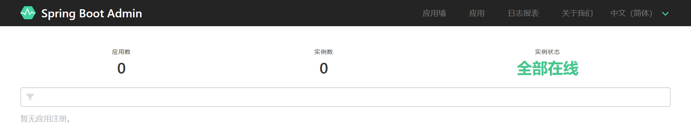
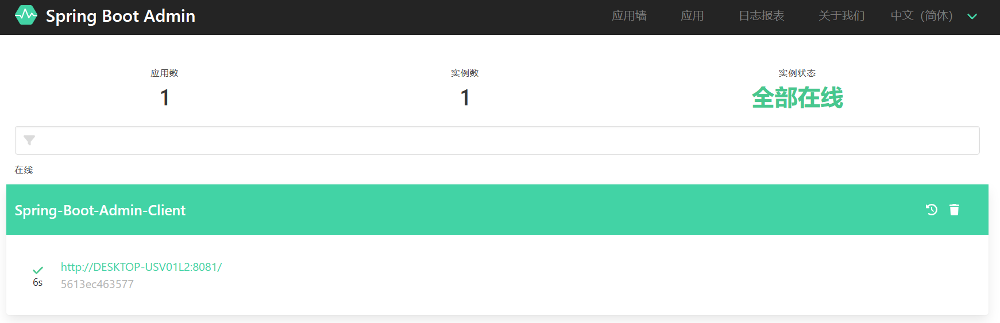
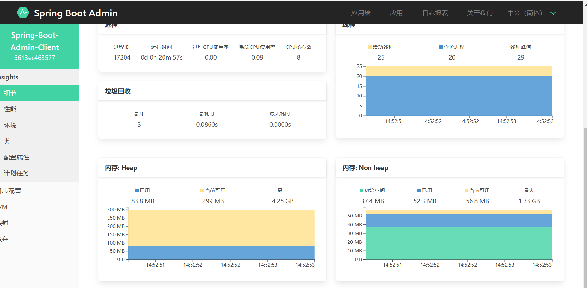
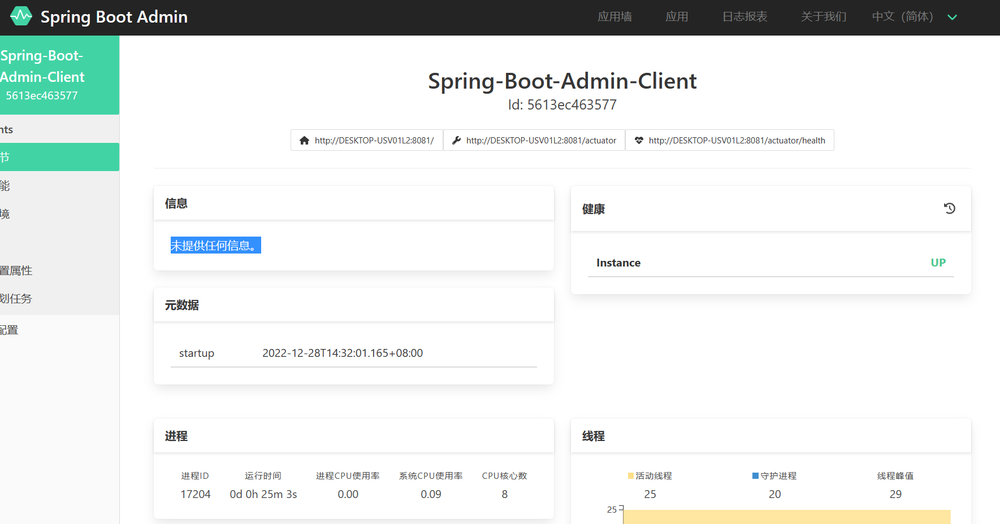
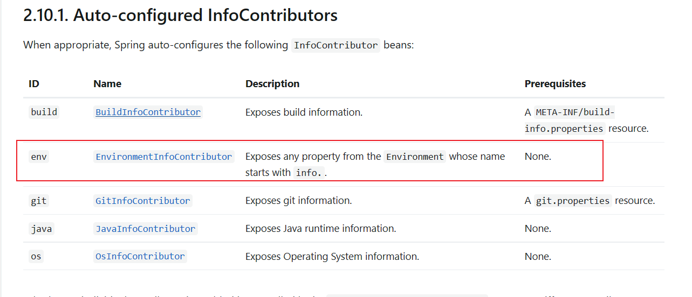
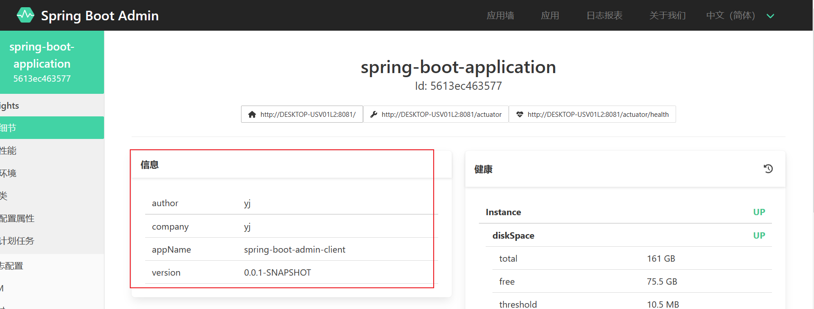
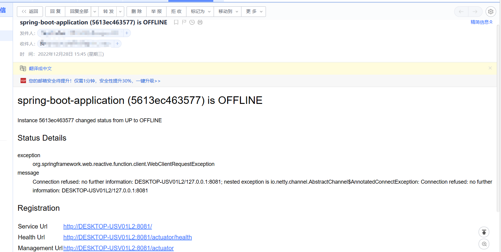

### SpringBoot之Admin监控服务

2. 0前后迁移参考http://blog.didispace.com/Spring-Boot-2.0-Migration-Guide/

在[使用Actuator监控Spring Boot应用](https://mrbird.cc/Acutator-Spring-Boot.html)一节中我们介绍了使用Actuator来监控Spring Boot应用，其提供了许多REST接口来查看应用的信息。但其返回的是大量的JSON格式数据，信息看上去不直观也不易于理解。而Spring Boot Admin（SBA）是一款基于Actuator开发的开源软件：https://github.com/codecentric/spring-boot-admin，以图形化界面的方式展示Spring Boot应用的配置信息、Beans信息、环境属性、线程信息、JVM状况等。本文使用的Spring Boot Admin版本为2.7.5，有能力的朋友可以直接阅读官方文档：http://codecentric.github.io/spring-boot-admin/2.7.5。

## 搭建SBA服务端

使用http://start.spring.io/开启一个简单的Spring Boot项目，然后引入spring-boot-admin-server相关依赖：

```
<dependency>
    <groupId>de.codecentric</groupId>
    <artifactId>spring-boot-admin-server</artifactId>
    <version>2.7.5</version>
</dependency>
<dependency>
    <groupId>de.codecentric</groupId>
    <artifactId>spring-boot-admin-server-ui</artifactId>
    <version>2.7.5</version>
</dependency>
```


### 开启Admin监控

在Spring Boot入口类中加入`@EnableAdminServer`注解开启监控功能：

```
package spring.boot.admin;

import de.codecentric.boot.admin.server.config.EnableAdminServer;
import org.springframework.boot.SpringApplication;
import org.springframework.boot.autoconfigure.SpringBootApplication;
/**
 *
 * @EnableAdminServer  注解开启监控功能：
 * @param null
 * @return
 */

@SpringBootApplication
@EnableAdminServer
public class SpringBootAdminApplication {

    public static void main(String[] args) {
        SpringApplication.run(SpringBootAdminApplication.class, args);
    }

}

```


然后在yml中对项目进行简单的配置：

```
server:
  port: 8080
  servlet:
    context-path: /admin-server
```

```
#SpringBoot 2.0.0.RELEASE版本以及之前
server:
  context-path: /admin-server

#SpringBoot 2.0.0.RELEASE版本以及之后：
server:
  servlet:
    context-path: /admin-server


  

```

启动项目，访问 http://localhost:8080/admin-server/applications(默认：http://localhost:8080/applications）：



因为还没添加客户端，所以监控列表里是空的，接下来创建一个Spring Boot应用作为客户端。

## SBA客户端

### 引入SBA Client依赖

同样的，使用http://start.spring.io/搭建一个简单的Spring Boot项目作为SBA客户端，然后引入Client依赖：

```
<dependency>
    <groupId>de.codecentric</groupId>
    <artifactId>spring-boot-admin-starter-client</artifactId>
    <version>2.7.5</version>
</dependency>
```


yml配置：

```
#spring.boot.admin.client.url=http://localhost:8090
#management.endpoints.web.exposure.include=*
  # 设置服务名称 方便识别
#spring.application.name=Spring-Boot-Admin-Client
spring:
  application:
    name: Spring-Boot-Admin-Client
  boot:
    admin:
      client:
        url: http://localhost:8080/admin-server

management:
  endpoints:
    web:
      exposure:
        include: '*'
server:
  port: 8081

```


`spring.boot.admin.client.url`配置的是SBA服务端的地址，启动客户端后查看http://localhost:8080/admin-server地址：



可看到SBA客户端已经被注册到SBA服务端了，接下来便可以在SBA服务端页面上查看各种SBA客户端信息：




### 客户端额外信息

默认客户端在服务端监控列表呈现的信息并不多：



我们可以在SBA客户端yml里配置更为详细的信息：

info 默认是不开启的需要开启



```
management:
  info:
    env:
      enabled: true

info:
  #  在info中设置了一个author,它的值是 qing
  author: yj
  company: yj
  appName: @project.artifactId@
  version: @project.version@
```


然后便可以在SBA服务端看到较为详细的客户端信息：



## 添加邮件预警

SBA服务端也可以配置邮件预警服务，默认情况下对于被检测的应用启动或者停止的时候会触发预警。

首先添加邮件依赖：

```
<dependency>
    <groupId>org.springframework.boot</groupId>
    <artifactId>spring-boot-starter-mail</artifactId>
</dependency>
```


然后在SBA服务端的yml中配置邮件预警：

```
spring:
  boot:
    admin:
      notify:
        mail:
          to: xxx@163.com  #收到告警的邮箱
          from: xxx@qq.com

  mail:
    host: smtp.qq.com # smtp.qq.com  host地址（可以在你的邮箱设置里找到）
    username: xxx@qq.com #邮箱地址，对应host的主机,对应上边from
    password: fimquffeznbhhdab #授权码
    properties:
      "[mail.smtp.socketFactory.class]": javax.net.ssl.SSLSocketFactory
      "[mail.smtp.socketFactory.fallback]": false
      "[mail.smtp.socketFactory.port]": 465
      "[mail.smtp.connectiontimeout]": 5000
      "[mail.smtp.timeout]": 3000
      "[mail.smtp.writetimeout]": 5000
```


当被检测的应用关停的时候，收到如下邮件：



使用


## 附录

### 客户端参数

Spring Boot Admin 客户端向服务端注册，并周期性的发送HTTP POST请求来确保客户端系统处于健康状态。

| 参数名称                                                     | 参数描述                                                     | 默认值                                                       |
| ------------------------------------------------------------ | ------------------------------------------------------------ | ------------------------------------------------------------ |
| spring.boot.admin.client.enabled                             | 启动 Spring Boot Admin 客户端.                               | `true`                                                       |
| spring.boot.admin.client.url                                 | 注册Spring Boot Admin 服务端的地址，多个地址之间用逗号分隔。必填属性 |                                                              |
| spring.boot.admin.client.api-path                            | 向服务端注册 Endpoint 的Http URI                             | `"instances"`                                                |
| spring.boot.admin.client.username spring.boot.admin.client.password | Spring Boot Admin 启用认证时，账号、密码信息                 |                                                              |
| spring.boot.admin.client.period                              | 重复注册时间间隔，单位毫秒                                   | `10,000`                                                     |
| spring.boot.admin.client.connect-timeout                     | 注册连接超时时间，单位毫秒                                   | `5,000`                                                      |
| spring.boot.admin.client.read-timeout                        | 注册读取超时时间，单位毫秒                                   | `5,000`                                                      |
| spring.boot.admin.client.auto-registration                   | 设置为true, 应用自动开启定时任务，向服务端法搜是那个注册信息 | `true`                                                       |
| spring.boot.admin.client.auto-deregistration                 | Spring Boot Admin 上下文信息关闭时，切换自动注销设置。如未设置该值，当检测到服务端处于运行状态，则该功能处于活跃状态 | `null`                                                       |
| spring.boot.admin.client.register-once                       | 如果设置为true，客户端将只注册一个管理服务器（按照spring.boot.admin.extence.url定义的顺序）；如果该管理服务器停机，将自动向下一个管理服务器注册。如果为false，将在所有管理服务器上注册 | `true`                                                       |
| spring.boot.admin.client.instance.health-url                 | 健康检查注册URL，可以重写为任意一个课访问的URL，但必须唯一   | Guessed based on management-url and `endpoints.health.id`.   |
| spring.boot.admin.client.instance.management-base-url        | 用于计算、管理注册的基础URL，conext 在运行时指定，并附加基础URL | Guessed based on `management.port`, service-url and `server.servlet-path`. |
| spring.boot.admin.client.instance.management-url             | 注册URL，可以被覆盖为任意可访问的URL                         | Guessed based on management-base-url and `management.context-path`. |
| spring.boot.admin.client.instance.service-base-url           | 用于计算服务注册的基础URL，context在运行时指定，并附加基础URL。在Cloudfoundary环境中，可以切换为: `spring.boot.admin.client.instance.service-base-url=https://${vcap.application.uris[0]}` | Guessed based on hostname, `server.port`.                    |
| spring.boot.admin.client.instance.service-url                | 服务注册URL，可以被覆盖为任意可访问的URL                     | Guessed based on service-base-url and `server.context-path`. |
| spring.boot.admin.client.instance.service-path               | 注册的服务路径，可以被覆盖为任意可访问的PATH                 | /                                                            |
| spring.boot.admin.client.instance.name                       | 注册服务名                                                   | `${spring.application.name}` if set, `"spring-boot-application"` otherwise. |
| spring.boot.admin.client.instance.prefer-ip                  | 使用IP地址进行服务注册。可以通过参数指定server.address`/`management.address. 否则默认使用IP地址 | `false`                                                      |
| spring.boot.admin.client.instance.metadata.*                 | 实例内部以键值对存储的元数据                                 |                                                              |
| spring.boot.admin.client.instance.metadata.tags.*            | 实例内部以键值对存储的Tag元数据                              |                                                              |

### 服务端参数

| Property name                                               | Description                                                  | Default value                                                |
| ----------------------------------------------------------- | ------------------------------------------------------------ | ------------------------------------------------------------ |
| spring.boot.admin.context-path                              | 服务端静态资源的URI访问的 上线文前缀                         |                                                              |
| spring.boot.admin.monitor.status-interval                   | 客户端实例状态检查时间间隔                                   | 10,000ms                                                     |
| spring.boot.admin.monitor.status-lifetime                   | 状态生命周期. 上次状态未过期，状态不变更                     | 10,000ms                                                     |
| spring.boot.admin.monitor.info-interval                     | 客户端实例信息检查时间间隔                                   | 1m                                                           |
| spring.boot.admin.monitor.info-lifetime                     | 信息的生命周期。只要最后一条信息未过期，信息将不会更新       | 1m                                                           |
| spring.boot.admin.monitor.default-timeout                   | 默认请求超时时间，可使用spring.boot.admin.monitor.timeout.*`进行覆盖 | 10,000                                                       |
| spring.boot.admin.monitor.timeout.*                         | Endpoints指定的超时时间，每一个Endpoint以endpointid、timeout 进行键值对存储 |                                                              |
| spring.boot.admin.monitor.default-retries                   | 失败请求重试次数，设置请求(`PUT`, `POST`, `PATCH`, `DELETE`) 不可重试.可使用spring.boot.admin.monitor.retries.*进行参数覆盖 | 0                                                            |
| spring.boot.admin.monitor.retries.*                         | Endpoints重试次数，每一个Endpoint以键值对的形式存储重试次数  |                                                              |
| spring.boot.admin.metadata-keys-to-sanitize                 | 通过正则表达式匹配元数据的值.                                | `".**password$", ".\*secret$", ".\*key$", ".\*token$", ".\*credentials.**", ".*vcap_services$"` |
| spring.boot.admin.probed-endpoints                          | 对于Spring Boot 1.x客户端应用程序，SBA使用OPTIONS请求探测指定端点。如果路径与id不同，可以将其指定为id:path（例如health:ping） | `"health", "env", "metrics", "httptrace:trace", "threaddump:dump", "jolokia", "info", "logfile", "refresh", "flyway", "liquibase", "heapdump", "loggers", "auditevents"` |
| spring.boot.admin.instance-auth.enabled                     | 从Spring 配置属性中获取认证信息                              | `true`                                                       |
| spring.boot.admin.instance-auth.default-user-name           | 注册服务时，默认认证账号信息. `spring.boot.admin.instance-auth.enabled` 必须设置为true. | `null`                                                       |
| spring.boot.admin.instance-auth.default-password            | 注册服务时，默认认证密码信息. spring.boot.admin.instance-auth.enabled` 必须设置为true. | `null`                                                       |
| spring.boot.admin.instance-auth.service-map.*.user-name     | 注册服务时，指定账号信息. spring.boot.admin.instance-auth.enabled` 必须设置为true. |                                                              |
| spring.boot.admin.instance-auth.service-map.*.user-password | 注册服务时，指定密码信息. spring.boot.admin.instance-auth.enabled` 必须设置为true… |                                                              |
| spring.boot.admin.instance-proxy.ignored-headers            | 向客户端发送请求时，不携带header 请求头                      | `"Cookie", "Set-Cookie", "Authorization"`                    |
| spring.boot.admin.ui.public-url                             | 构建UI方位URL的基础URL                                       | If running behind a reverse proxy (using path rewriting) this can be used to make correct self references. If the host/port is omitted it will be inferred from the request. |
| spring.boot.admin.ui.brand                                  | 导航栏中显示的品牌。                                         | `"<span>Spring Boot Admin</span>"` |
| spring.boot.admin.ui.title                                  | 页面展示Title信息                                            | `"Spring Boot Admin"`                                        |
| spring.boot.admin.ui.login-icon                             | 登录页面Icon图标.                                            | `"assets/img/icon-spring-boot-admin.svg"`                    |
| spring.boot.admin.ui.favicon                                | 默认桌面通知icon                                             | `"assets/img/favicon.png"`                                   |
| spring.boot.admin.ui.favicon-danger                         | 服务下线，桌面通知icon                                       | `"assets/img/favicon-danger.png"`                            |
| spring.boot.admin.ui.remember-me-enabled                    | 切换以显示/隐藏登录页面上的“记住我”复选框                    | `true`                                                       |
| spring.boot.admin.ui.poll-timer.cache                       | 设置拉取缓存数据的轮询时间（毫秒）                           | `2500`                                                       |
| spring.boot.admin.ui.poll-timer.datasource                  | 设置拉取数据库数据的轮询时间（毫秒）                         | `2500`                                                       |
| spring.boot.admin.ui.poll-timer.gc                          | 设置获取GC数据的轮询时间（毫秒）                             | `2500`                                                       |
| spring.boot.admin.ui.poll-timer.process                     | 设置获取进程数据的轮询时间（毫秒                             | `2500`                                                       |
| spring.boot.admin.ui.poll-timer.memory                      | 设置获取内存数据的轮询时间（毫秒                             | `2500`                                                       |
| spring.boot.admin.ui.poll-timer.threads                     | 设置获取线程数据的轮询时间（毫秒                             | `2500`                                                       |

### 

### 

### 邮件配置选项

| Property name                                | Description                                                  | Default value                                                | 中文说明                         |
| :------------------------------------------- | :----------------------------------------------------------- | :----------------------------------------------------------- | :------------------------------- |
| spring.boot.admin.notify.mail.enabled        | Enable mail notifications                                    | true                                                         | 默认启用                         |
| spring.boot.admin.notify.mail.ignore-changes | Comma-delimited list of status changes to be ignored. Format: “:”. Wildcards allowed. | “UNKNOWN:UP”                                                 | 需要忽略的状态改变通知，逗号分隔 |
| spring.boot.admin.notify.mail.to             | Comma-delimited list of mail recipients                      | “root@localhost”                                             | 接收通知的邮箱地址，逗号分隔     |
| spring.boot.admin.notify.mail.cc             | Comma-delimited list of carbon-copy recipients               |                                                              | 抄送                             |
| spring.boot.admin.notify.mail.from           | Mail sender                                                  |                                                              | 发送人                           |
| spring.boot.admin.notify.mail.subject        | Mail subject. SpEL-expressions are supported                 | “#{application.name} (#{application.id}) is #{to.status}”    | 主题                             |
| spring.boot.admin.notify.mail.text           | Mail body. SpEL-expressions are supported                    | “#{application.name} (#{application.id})\nstatus changed from #{from.status} to #{to.status}\n\n#{application.healthUrl}” | 内容                             |