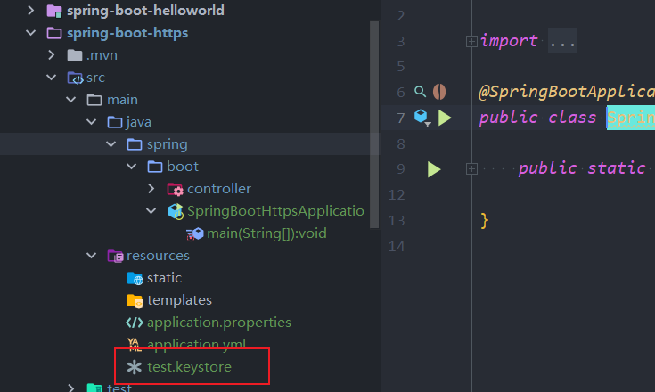
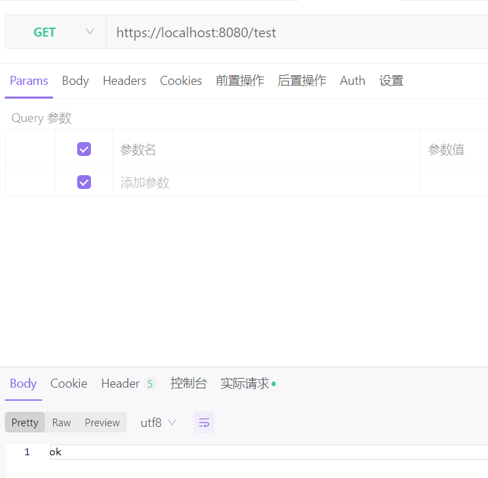
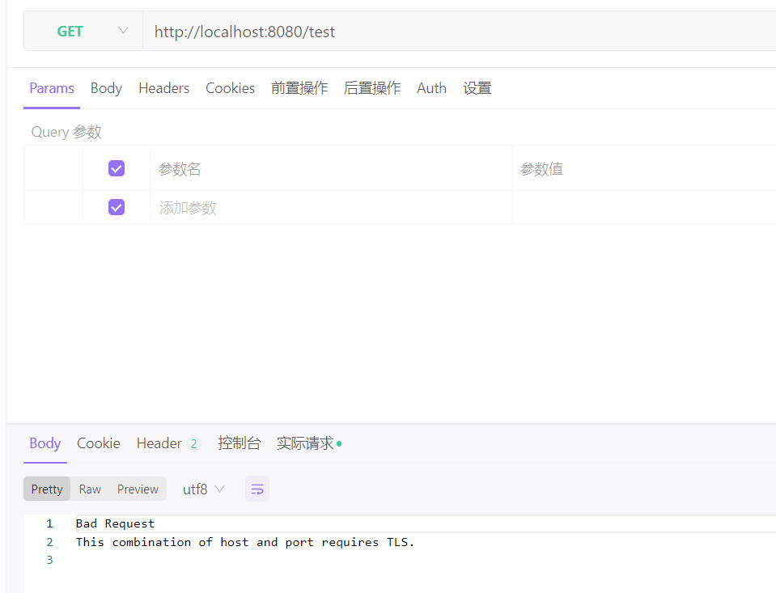
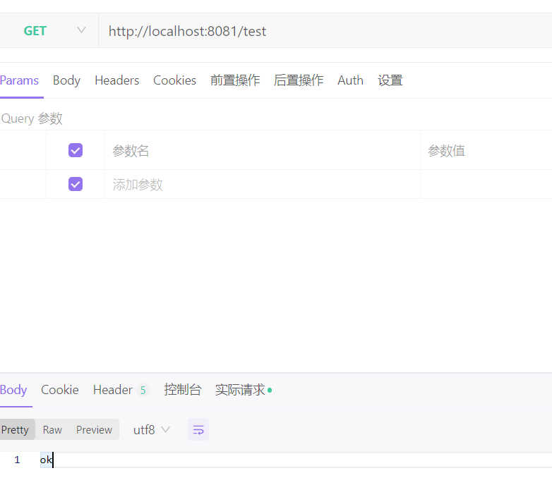

### SpringBoot之Https

 Spring Boot 内嵌式 Server 打 jar 包运行的方式，打 WAR 包部署的就不存在要 Spring Boot 支持 HTTPS 了，需要去外部对应的 Server 配置。

#### 配置Https

支持https只需要配置一系列参数（server.ssl.*）就可以，

application.properties或者application.yml 配置文件参考配置：

```
server.port=8080
server.ssl.protocol=TLS
server.ssl.key-store=classpath:test.keystore
server.ssl.key-store-password=123456 
server.ssl.key-store-type=JKS

server:
  port: 8080
  ssl:
    protocol: TLS
    key-store: classpath:test.keystore
    key-store-password: 123456
    key-store-type: JKS
```

生成keystore文件：

D:\software\install\develop\jdk\jdk8\jdk\bin

```
keytool.exe -genkey -validity 3600 -alias www.test.com -keyalg RSA -keystore d:\keystore\test.keystore

设置秘钥口令 key-store-password
我在此设置的是: test
-genkey 生成key
-validity 3600 有效期限3600天
-alias 别名 
-keyalg RSA 指定生成key的算法RSA
-keystore d:\test.keystore 指定生成的keystore文件和路径 在D盘下
```


然后将生成的test.keystore 放在项目的resources目录下



TestController:

```java
package spring.boot.controller;

import org.springframework.web.bind.annotation.GetMapping;
import org.springframework.web.bind.annotation.RestController;

/**
 * @author yangjian
 * @date 2022/11/25 10:41
 */
@RestController
public class TestController {

    @GetMapping("/test")
    public String test(){
        return "ok";
    }
}

```

访问：https://localhost:8080/test



配置之后不再支持http:




#### 支持 HTTP 和 HTTPS

在项目中添加TomcatServerCustomer 组件，然后启动项目，再次访问就可以使用http协议访问了

```java
package spring.boot.config;

import org.apache.catalina.connector.Connector;
import org.springframework.boot.web.embedded.tomcat.TomcatServletWebServerFactory;
import org.springframework.boot.web.server.WebServerFactoryCustomizer;
import org.springframework.stereotype.Component;

/**
 * @author yangjian
 * @date 2022/11/25 10:51
 */
@Component
public class TomcatServerCustomer implements WebServerFactoryCustomizer<TomcatServletWebServerFactory> {

    @Override
    public void customize(TomcatServletWebServerFactory factory) {
//      final Connector connector = new Connector("HTTP/1.1");
        Connector connector = new Connector("org.apache.coyote.http11.Http11NioProtocol");
        connector.setScheme("http");
        connector.setPort(8081);
        factory.addAdditionalTomcatConnectors(connector);
    }
}

```

或者在MAIN中添加：

```java
//https  开启同时开启http
    @Bean
    public ServletWebServerFactory servletContainer() {
        TomcatServletWebServerFactory tomcat = new TomcatServletWebServerFactory() {
//            @Override
//            protected void postProcessContext(Context context) {
//                // 如果要强制使用https，请松开以下注释
//                // SecurityConstraint constraint = new SecurityConstraint();
//                // constraint.setUserConstraint("CONFIDENTIAL");
//                // SecurityCollection collection = new SecurityCollection();
//                // collection.addPattern("/*");
//                // constraint.addCollection(collection);
//                // context.addConstraint(constraint);
//            }
        };
        tomcat.addAdditionalTomcatConnectors(createStandardConnector()); // 添加http
        return tomcat;
    }
    // 配置http
    private Connector createStandardConnector() {
        // 默认协议为org.apache.coyote.http11.Http11NioProtocol
        Connector connector = new Connector(TomcatServletWebServerFactory.DEFAULT_PROTOCOL);
        connector.setSecure(false);
        connector.setScheme("http");
        connector.setPort(port);
        connector.setRedirectPort(httpsPort); // 当http重定向到https时的https端口号
        return connector;
    }
    @Value("${http.port}")
    private Integer port;

    @Value("${server.port}")
    private Integer httpsPort;

```

pom.xml

```
server:
  port: 8080
  ssl:
    protocol: TLS
    key-store: classpath:test.keystore
    key-store-password: 123456
    key-store-type: JKS
http:
  port: 8081
```

访问：http://localhost:8081/test

