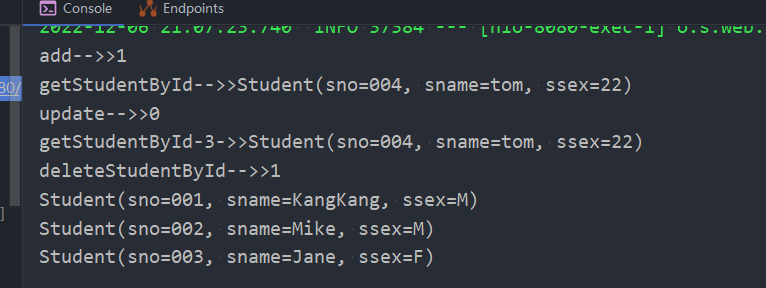

### SpringBoot之JdbcTemplate

JdbcTemplate相较于MyBaits，Hibernate等数据库框架更容易上手，对SQL的操作也更为直观方便，所以在项目中也是一个不错的选择。在Spring Boot开启JdbcTemplate很简单，只需要引入`spring-boot-starter-jdbc`依赖即可。JdbcTemplate封装了许多SQL操作

- 引入依赖

    ```
    		<dependency>
                <groupId>org.springframework.boot</groupId>
                <artifactId>spring-boot-starter-jdbc</artifactId>
            </dependency>
            <!--mysql-->
            <dependency>
                <groupId>mysql</groupId>
                <artifactId>mysql-connector-java</artifactId>
                <scope>runtime</scope>
            </dependency>
            <!-- Druid自动装配 -->
            <dependency>
                <groupId>com.alibaba</groupId>
                <artifactId>druid-spring-boot-starter</artifactId>
                <version>1.1.21</version>
            </dependency>
    ```

    数据库驱动为MySQL，数据源采用Druid。

- application.yml

    ```yaml
    spring:
      datasource:
        type: com.alibaba.druid.pool.DruidDataSource
        druid:
          driverClassName: com.mysql.cj.jdbc.Driver
          url: jdbc:mysql://localhost:3308/testsql?useUnicode=true&characterEncoding=utf-8
          username: root
          password: 123456
          initial-size: 10
          # 最大连接池个数
          max-active: 100
          # 最小连接池个数——》已经不再使用，配置了也没效果
          min-idle: 10
          # 配置获取连接等待超时的时间，单位毫秒，缺省启用公平锁，并发效率会有所下降
          max-wait: 60000
          # 打开PSCache，并且指定每个连接上PSCache的大小
          pool-prepared-statements: true
          max-pool-prepared-statement-per-connection-size: 20
          time-between-eviction-runs-millis: 60000
          min-evictable-idle-time-millis: 300000
          #max-evictable-idle-time-millis: 60000
          validation-query: SELECT 1 FROM DUAL
          # validation-query-timeout: 5000
          # 申请连接时执行validationQuery检测连接是否有效，做了这个配置会降低性能
          test-on-borrow: false
          # 归还连接时执行validationQuery检测连接是否有效，做了这个配置会降低性能
          test-on-return: false
          # 建议配置为true，不影响性能，并且保证安全性。
          # 申请连接的时候检测，如果空闲时间大于timeBetweenEvictionRunsMillis，执行validationQuery检测连接是否有效。
          test-while-idle: true
          # 通过connectProperties属性来打开mergeSql功能；慢SQL记录
          connectionProperties: druid.stat.mergeSql=true;druid.stat.slowSqlMillis=5000
          # 通过别名的方式配置扩展插件，多个英文逗号分隔，常用的插件有：
          # 监控统计用的filter:stat
          # 日志用的filter:log4j
          #filters: #配置多个英文逗号分隔(统计，sql注入，log4j过滤) 防御sql注入的filter:wall
          filters: stat,wall
          stat-view-servlet:
            enabled: true
            url-pattern: /druid/*
            # 需要账号密码才能访问控制台
            login-username: druid
            login-password: druid123
    ```

- 代码

    ```java
    package com.yj.springboot.entity;
    
    import lombok.*;
    
    import java.io.Serializable;
    
    /**
     * @author yangjian
     * @date 2022/12/6 19:46
     */
    @Data
    @NoArgsConstructor
    @AllArgsConstructor
    @Getter
    @Setter
    public class Student implements Serializable {
        private static final long serialVersionUID = -6819329604028408964L;
        private String sno;
        private String sname;
        private String ssex;
    }
    ```

    ```java
    package com.yj.springboot.dao;
    
    import com.yj.springboot.entity.Student;
    import org.springframework.beans.factory.annotation.Autowired;
    import org.springframework.jdbc.core.BeanPropertyRowMapper;
    import org.springframework.jdbc.core.JdbcTemplate;
    import org.springframework.stereotype.Repository;
    
    import java.util.List;
    
    /**
     * @author yangjian
     * @date 2022/12/6 19:57
     */
    @Repository
    public class JdbcDao {
        @Autowired
        JdbcTemplate jdbcTemplate;
    
        public int addStudent(Student student) {
            return jdbcTemplate.update("INSERT INTO student (SNO , SNAME,SSEX) VALUES (?, ?,?)",
                    student.getSno(), student.getSname(),student.getSsex());
        }
    
        public int updateStudent(Student student) {
            return jdbcTemplate.update("UPDATE student SET sname=?, ssex=? WHERE sno=?",
                    student.getSno(), student.getSname(),student.getSsex());
        }
    
        public int deleteStudentById(String sno) {
            return jdbcTemplate.update("DELETE FROM student WHERE sno=?", sno);
        }
    
        public Student getStudentById(String sno) {
            return jdbcTemplate.queryForObject("select * from student where sno=?",
                    new BeanPropertyRowMapper<>(Student.class), sno);
        }
    
        public List<Student> getAllStudents() {
            return jdbcTemplate.query("select * from student",
                    new BeanPropertyRowMapper<>(Student.class));
        }
    }
    ```

    ```java
    package com.yj.springboot.service.impl;
    
    import com.yj.springboot.dao.JdbcDao;
    import com.yj.springboot.entity.Student;
    import com.yj.springboot.service.JdbcService;
    import org.springframework.beans.factory.annotation.Autowired;
    import org.springframework.stereotype.Service;
    
    import java.util.List;
    
    /**
     * @author yangjian
     * @date 2022/12/6 19:55
     */
    @Service
    public class JdbcServiceImpl implements JdbcService {
    
        @Autowired
        JdbcDao jdbcDao;
    
        @Override
        public int addStudent(Student student) {
            return jdbcDao.addStudent(student);
        }
    
        @Override
        public int updateStudent(Student student) {
            return jdbcDao.updateStudent(student);
        }
    
        @Override
        public int deleteStudentById(String sno) {
            return jdbcDao.deleteStudentById(sno);
        }
    
        @Override
        public Student getStudentById(String sno) {
            return jdbcDao.getStudentById(sno);
        }
    
        @Override
        public List<Student> getAllStudents() {
            return jdbcDao.getAllStudents();
        }
    
    
    
    }
    ```

    ```java
    package com.yj.springboot.controller;
    
    import com.yj.springboot.entity.Student;
    import com.yj.springboot.service.JdbcService;
    import org.springframework.beans.factory.annotation.Autowired;
    import org.springframework.web.bind.annotation.GetMapping;
    import org.springframework.web.bind.annotation.RestController;
    
    import java.util.List;
    
    /**
     * @author yangjian
     * @date 2022/12/6 19:58
     */
    @RestController
    public class JdbcController {
        @Autowired
        JdbcService jdbcService;
    
        @GetMapping("/studentOps")
        public String studentOps(){
            Student student = new Student();
            student.setSno("004");
            student.setSname("tom");
            student.setSsex("22");
            int i = jdbcService.addStudent(student);
            System.out.println("add-->>"+i);
            Student student1 = jdbcService.getStudentById("004");
            System.out.println("getStudentById-->>"+student1);
            Student student2 = new Student();
            student2.setSno("004");
            student2.setSname("tom222");
            student2.setSsex("23");
            int i1 = jdbcService.updateStudent(student2);
            System.out.println("update-->>"+i1);
            Student student3 = jdbcService.getStudentById("004");
            System.out.println("getStudentById-3->>"+student3);
    
            int i2 = jdbcService.deleteStudentById("004");
            System.out.println("deleteStudentById-->>"+i2);
            List<Student> allStudents = jdbcService.getAllStudents();
            allStudents.forEach(System.out::println);
    
            return "ok";
        }
    }
    ```

- 测试

    访问   http://localhost:8080/studentOps

    

- x

- x