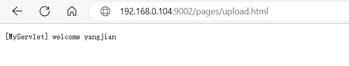
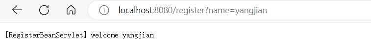
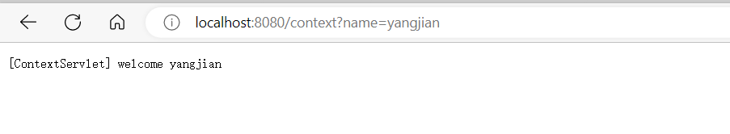
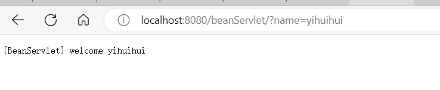
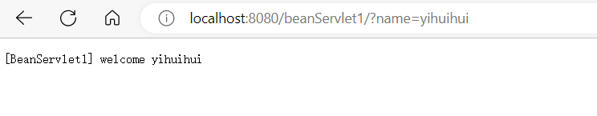
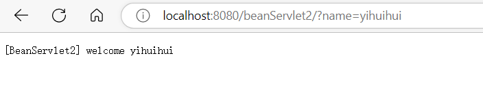

### SpringBoot之Servlet 注册的四种姿势

本篇主要带来在 SpringBoot 环境下，注册自定义的 Servelt 的四种姿势

- `@WebServlet` 注解
- `ServletRegistrationBean` bean 定义
- `ServletContext` 动态添加
- 普通的 spring bean 模式

#### 搭建环境

1. **pom.xml**

    ```xml
    <?xml version="1.0" encoding="UTF-8"?>
    <project xmlns="http://maven.apache.org/POM/4.0.0" xmlns:xsi="http://www.w3.org/2001/XMLSchema-instance"
             xsi:schemaLocation="http://maven.apache.org/POM/4.0.0 https://maven.apache.org/xsd/maven-4.0.0.xsd">
        <modelVersion>4.0.0</modelVersion>
        <parent>
            <groupId>org.springframework.boot</groupId>
            <artifactId>spring-boot-starter-parent</artifactId>
            <version>2.7.5</version>
            <relativePath/> <!-- lookup parent from repository -->
        </parent>
        <groupId>spring.boot</groupId>
        <artifactId>spring-boot-servlet</artifactId>
        <version>0.0.1-SNAPSHOT</version>
        <name>spring-boot-servlet</name>
        <description>Demo project for Spring Boot</description>
        <properties>
            <java.version>1.8</java.version>
        </properties>
        <dependencies>
            <dependency>
                <groupId>org.springframework.boot</groupId>
                <artifactId>spring-boot-starter-web</artifactId>
            </dependency>
    
            <dependency>
                <groupId>org.projectlombok</groupId>
                <artifactId>lombok</artifactId>
                <optional>true</optional>
            </dependency>
            <dependency>
                <groupId>org.springframework.boot</groupId>
                <artifactId>spring-boot-starter-test</artifactId>
                <scope>test</scope>
            </dependency>
        </dependencies>
    
        <build>
            <plugins>
                <plugin>
                    <groupId>org.springframework.boot</groupId>
                    <artifactId>spring-boot-maven-plugin</artifactId>
                    <configuration>
                        <excludes>
                            <exclude>
                                <groupId>org.projectlombok</groupId>
                                <artifactId>lombok</artifactId>
                            </exclude>
                        </excludes>
                    </configuration>
                </plugin>
            </plugins>
        </build>
    
    </project>
    
    ```

    

2. **servlet注册**

    自定义一个 Servlet 比较简单，常见的操作是继承`HttpServlet`，然后覆盖`doGet`, `doPost`等方法即可；然而我们自定义的这些 Servlet 如何才能被 SpringBoot 识别并使用才是关键，下面介绍四种注册方式

    1. ### @WebServlet

        添加 Servlet3+的注解@WebServlet，来声明这个类是一个 Servlet

        需要配合 Spring Boot 的@ServletComponentScan，否则单纯的添加上面的注解并不会生效

        servlet:

        ```java
        package spring.boot.servlet;
        
        import javax.servlet.ServletException;
        import javax.servlet.annotation.WebServlet;
        import javax.servlet.http.HttpServlet;
        import javax.servlet.http.HttpServletRequest;
        import javax.servlet.http.HttpServletResponse;
        import java.io.IOException;
        import java.io.PrintWriter;
        
        /**
         * 使用注解的方式来定义并注册一个自定义Servlet
         * @author yangjian
         * @date 2022/11/25 8:50
         */
        @WebServlet(urlPatterns = "/annotation")
        public class MyServlet extends HttpServlet {
        
        
            @Override
            protected void doGet(HttpServletRequest req, HttpServletResponse resp) throws ServletException, IOException {
                String name = req.getParameter("name");
                PrintWriter writer = resp.getWriter();
                writer.write("[MyServlet] welcome " + name);
                writer.flush();
                writer.close();
            }
        }
        
        ```

        启动类：

        ```java
        package spring.boot;
        
        import org.springframework.boot.SpringApplication;
        import org.springframework.boot.autoconfigure.SpringBootApplication;
        import org.springframework.boot.web.servlet.ServletComponentScan;
        
        @ServletComponentScan
        @SpringBootApplication
        public class SpringBootServletApplication {
        
            public static void main(String[] args) {
                SpringApplication.run(SpringBootServletApplication.class, args);
            }
        
        }
        
        ```

        访问：http://localhost:8080/annotation?name=yangjian

        

    2. ### ServletRegistrationBean

        在 Servlet 中，使用ServletRegistrationBean包装我们自定义的 bean: 

        RegisterBeanServlet:

        ```java
        package spring.boot.servlet;
        
        import javax.servlet.ServletException;
        import javax.servlet.http.HttpServlet;
        import javax.servlet.http.HttpServletRequest;
        import javax.servlet.http.HttpServletResponse;
        import java.io.IOException;
        import java.io.PrintWriter;
        
        /**
         * @author yangjian
         * @date 2022/11/25 9:06
         */
        public class RegisterBeanServlet extends HttpServlet {
            @Override
            protected void doGet(HttpServletRequest req, HttpServletResponse resp) throws ServletException, IOException {
                String name = req.getParameter("name");
                PrintWriter writer = resp.getWriter();
                writer.write("[RegisterBeanServlet] welcome " + name);
                writer.flush();
                writer.close();
            }
        }
        
        ```

        MyConfig:

        ```java
        package spring.boot.config;
        
        import org.springframework.boot.web.servlet.ServletRegistrationBean;
        import org.springframework.context.annotation.Bean;
        import org.springframework.context.annotation.Configuration;
        import spring.boot.servlet.RegisterBeanServlet;
        
        /**
         * @author yangjian
         * @date 2022/11/25 9:07
         */
        @Configuration
        public class MyConfig {
            @Bean
            public ServletRegistrationBean<RegisterBeanServlet> servletBean() {
                ServletRegistrationBean<RegisterBeanServlet> registrationBean = new ServletRegistrationBean<>();
                registrationBean.addUrlMappings("/register");
                registrationBean.setServlet(new RegisterBeanServlet());
                return registrationBean;
            }
        }
        
        ```

        访问：http://localhost:8080/register?name=yangjian

        

        x

    3. ### ServletContext

        这种方式，在实际的 Servlet 注册中，用得并不太多。

        主要思路是在 ServletContext 初始化后，借助
        javax.servlet.ServletContext#addServlet(java.lang.String, java.lang.Class<? extends javax.servlet.Servlet>)方法来主动添加一个 Servlet
        所以我们需要找一个合适的时机，获取ServletContext实例，并注册 Servlet，在 SpringBoot 生态下，可以借助ServletContextInitializer

        ServletContextInitializer 主要被 RegistrationBean 实现用于往 ServletContext 容器中注册 Servlet,Filter 或者 EventListener。这些 ServletContextInitializer 的设计目的主要是用于这些实例被 Spring IoC 容器管理

        ContextServlet:

        ```java
        package spring.boot.servlet;
        
        import javax.servlet.ServletException;
        import javax.servlet.http.HttpServlet;
        import javax.servlet.http.HttpServletRequest;
        import javax.servlet.http.HttpServletResponse;
        import java.io.IOException;
        import java.io.PrintWriter;
        
        /**
         * @author yangjian
         * @date 2022/11/25 9:24
         */
        public class ContextServlet extends HttpServlet {
            @Override
            protected void doGet(HttpServletRequest req, HttpServletResponse resp) throws ServletException, IOException {
                String name = req.getParameter("name");
                PrintWriter writer = resp.getWriter();
                writer.write("[ContextServlet] welcome " + name);
                writer.flush();
                writer.close();
            }
        }
        
        
        ```

        MyServletConfig:

        ```java
        package spring.boot.config;
        
        import org.springframework.boot.web.servlet.ServletContextInitializer;
        import org.springframework.stereotype.Component;
        import spring.boot.servlet.ContextServlet;
        
        import javax.servlet.ServletContext;
        import javax.servlet.ServletException;
        import javax.servlet.ServletRegistration;
        
        /**
         * ServletContextInitializer 主要被 RegistrationBean 实现用于往 ServletContext
         * 容器中注册 Servlet,Filter 或者 EventListener。这些 ServletContextInitializer
         * 的设计目的主要是用于这些实例被 Spring IoC 容器管理
         * @author yangjian
         * @date 2022/11/25 9:25
         */
        @Component
        public class MyServletConfig implements ServletContextInitializer {
            @Override
            public void onStartup(ServletContext servletContext) throws ServletException {
                ServletRegistration initServlet = servletContext.addServlet("contextServlet", ContextServlet.class);
                initServlet.addMapping("/context");
            }
        }
        
        ```

        访问：http://localhost:8080/context?name=yangjian

        

    4. ### bean

        这种注册方式，并不优雅，但是也可以实现 Servlet 的注册目的

        BeanServlet:

        ```java
        package spring.boot.servlet;
        
        import org.springframework.core.annotation.Order;
        import org.springframework.stereotype.Component;
        
        import javax.servlet.ServletException;
        import javax.servlet.http.HttpServlet;
        import javax.servlet.http.HttpServletRequest;
        import javax.servlet.http.HttpServletResponse;
        import java.io.IOException;
        import java.io.PrintWriter;
        
        /**
         * @author yangjian
         * @date 2022/11/25 9:30
         */
        @Component
        @Order(-10000)  //主要用来控制配置类的加载顺序，值越小，越先执行 
        public class BeanServlet extends HttpServlet {
            @Override
            protected void doGet(HttpServletRequest req, HttpServletResponse resp) throws ServletException, IOException {
                String name = req.getParameter("name");
                PrintWriter writer = resp.getWriter();
                writer.write("[BeanServlet] welcome " + name);
                writer.flush();
                writer.close();
            }
        }
        
        ```

        默认场景下 Spring 的 Servlet 优先级更高，所以它接收不到请求,需要加@Order() 控制配置类的加载顺序，此时 url: '/'

        访问：http://localhost:8080/?name=yihuihui

        

        不加@Order,创建BeanServlet1、BeanServlet2

        ```java
        package spring.boot.servlet;
        
        import org.springframework.stereotype.Component;
        
        import javax.servlet.ServletException;
        import javax.servlet.http.HttpServlet;
        import javax.servlet.http.HttpServletRequest;
        import javax.servlet.http.HttpServletResponse;
        import java.io.IOException;
        import java.io.PrintWriter;
        
        /**
         * @author yangjian
         * @date 2022/11/25 9:41
         */
        @Component
        public class BeanServlet1 extends HttpServlet {
            @Override
            protected void doGet(HttpServletRequest req, HttpServletResponse resp) throws ServletException, IOException {
                String name = req.getParameter("name");
                PrintWriter writer = resp.getWriter();
                writer.write("[BeanServlet1] welcome " + name);
                writer.flush();
                writer.close();
            }
        }
        
        package spring.boot.servlet;
        
        import org.springframework.stereotype.Component;
        
        import javax.servlet.ServletException;
        import javax.servlet.http.HttpServlet;
        import javax.servlet.http.HttpServletRequest;
        import javax.servlet.http.HttpServletResponse;
        import java.io.IOException;
        import java.io.PrintWriter;
        
        /**
         * @author yangjian
         * @date 2022/11/25 9:41
         */
        @Component
        public class BeanServlet2 extends HttpServlet {
            @Override
            protected void doGet(HttpServletRequest req, HttpServletResponse resp) throws ServletException, IOException {
                String name = req.getParameter("name");
                PrintWriter writer = resp.getWriter();
                writer.write("[BeanServlet2] welcome " + name);
                writer.flush();
                writer.close();
            }
        }
        
        ```

        访问：http://localhost:8080/beanServlet1/?name=yihuihui、http://localhost:8080/beanServlet2/?name=yihuihui

        

        

        不指定优先级时，响应的Url :beanName + '/'

3. 小结

    常见的两种注册 case:

    - `@WebServlet`注解放在 Servlet 类上，然后启动类上添加`@ServletComponentScan`，确保 Serlvet3+的注解可以被 Spring 识别
    - 将自定义 Servlet 实例委托给 bean `ServletRegistrationBean`

    

    - 

    

