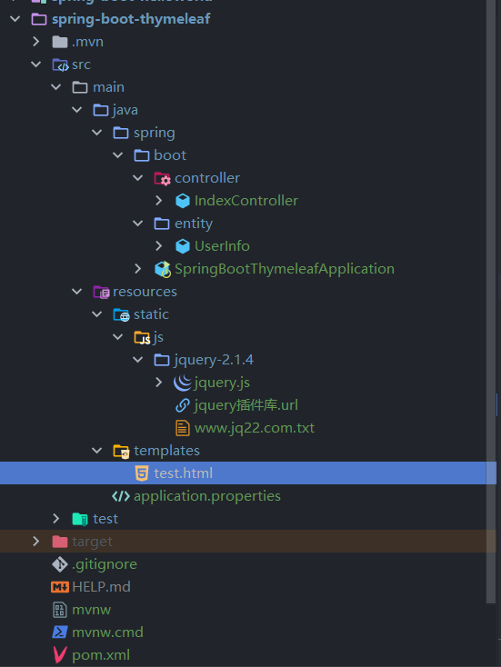
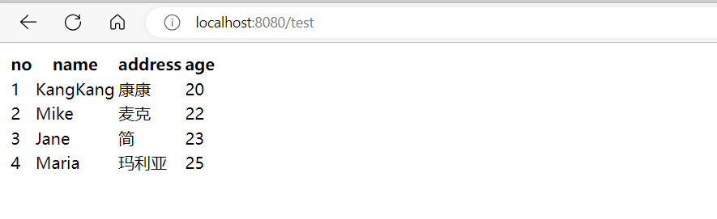

### SpringBoot之Thymeleaf模板引擎

Spring Boot支持FreeMarker、Groovy、Thymeleaf和Mustache四种模板解析引擎，官方推荐使用Thymeleaf。

#### 什么是Thymeleaf

Thymeleaf是一个面向web和独立环境的现代服务器端Java模板引擎。

Thymeleaf最大的特点是能够直接在浏览器中打开并正确显示模板页面，而不需要启动整个Web应用。在开发团队中实现更强大的协调作用。

Thymeleaf是一款用于渲染XML、XHTML、HTML5内容的模板引擎。类似Velocity，FreeMaker模板引擎，它也可以轻易的与Spring MVC等Web框架进行集成作为Web应用的模板引擎。

#### 集成Thymeleaf

1. 引入依赖

    需要引入Spring Boot的Thymeleaf启动器依赖

    ```xml
     <dependency>
         <groupId>org.springframework.boot</groupId>
         <artifactId>spring-boot-starter-thymeleaf</artifactId>
    </dependency>
    ```

    在Spring Boot中，默认的html页面地址为src/main/resources/templates，默认的静态资源地址为src/main/resources/static。

2. Thymeleaf默认配置

    ```
    #开启模板缓存（默认值：true）
    spring.thymeleaf.cache=true 
    #Check that the template exists before rendering it.
    spring.thymeleaf.check-template=true 
    #检查模板位置是否正确（默认值:true）
    spring.thymeleaf.check-template-location=true
    #Content-Type的值（默认值：text/html）
    spring.thymeleaf.content-type=text/html
    #开启MVC Thymeleaf视图解析（默认值：true）
    spring.thymeleaf.enabled=true
    #模板编码
    spring.thymeleaf.encoding=UTF-8
    #要被排除在解析之外的视图名称列表，用逗号分隔
    spring.thymeleaf.excluded-view-names=
    #要运用于模板之上的模板模式。另见StandardTemplate-ModeHandlers(默认值：HTML5)
    spring.thymeleaf.mode=HTML5
    #在构建URL时添加到视图名称前的前缀（默认值：classpath:/templates/）
    spring.thymeleaf.prefix=classpath:/templates/
    #在构建URL时添加到视图名称后的后缀（默认值：.html）
    spring.thymeleaf.suffix=.html
    #Thymeleaf模板解析器在解析器链中的顺序。默认情况下，它排第一位。顺序从1开始，只有在定义了额外的TemplateResolver Bean时才需要设置这个属性。
    spring.thymeleaf.template-resolver-order=
    #可解析的视图名称列表，用逗号分隔
    spring.thymeleaf.view-names=
    ```

    默认的编码是：UTF-8

    默认的类型是：text/html

    默认的模板文件目录是：classpath:/templates/

    默认的模板文件后缀是：.html

    这些参数都可以通过在application配置文件中指定 `spring.thymeleaf.xx`进行更改

    Thymeleaf的自动配置类：

    > org.springframework.boot.autoconfigure.thymeleaf.ThymeleafAutoConfiguration

    Thymeleaf的自动配置参数类：

    > org.springframework.boot.autoconfigure.thymeleaf.ThymeleafProperties

    

    在Spring Boot配置文件中可对Thymeleaf的默认配置进行修改

    一般开发中将`spring.thymeleaf.cache`设置为false，其他保持默认值即可。

3. 在resources目录下创建templates目录

4. 在templates目录下创建.html模板文件

5. 静态资源放在src/main/resources/static

6. 使用模板：

    1. 模板文件头部使用 `<html lang="en" xmlns:th="http://www.thymeleaf.org">`定义

    2. html标签上使用 `th:`开头标识作为前缀

    3. 通过 `@{}`引入web静态文件

        ```
        <link rel="stylesheet" th:href="@{/css/jquery.min.css}"/>
        ```

    4. 访问数据

        访问springmvc中的model数据： `${user.name}`，访问更多不同对象的数据请点击参考官方定义

6. 代码

    ```java
    package spring.boot.entity;
    
    /**
     * @author yangjian
     * @date 2022/11/22 18:30
     */
    
    
    public class UserInfo {
    
    
        private String name;
        private String address;
        private int age;
    
        public UserInfo(String name, String address, int age) {
            this.name = name;
            this.address = address;
            this.age = age;
        }
    
        public String getName() {
            return name;
        }
    
        public void setName(String name) {
            this.name = name;
        }
    
        public String getAddress() {
            return address;
        }
    
        public void setAddress(String address) {
            this.address = address;
        }
    
        public int getAge() {
            return age;
        }
    
        public void setAge(int age) {
            this.age = age;
        }
    
        @Override
        public String toString() {
            return "UserInfo{" +
                    "name='" + name + '\'' +
                    ", address='" + address + '\'' +
                    ", age=" + age +
                    '}';
        }
    }
    
    package spring.boot.controller;
    
    import org.springframework.stereotype.Controller;
    import org.springframework.ui.Model;
    import org.springframework.web.bind.annotation.RequestMapping;
    import spring.boot.entity.UserInfo;
    
    import java.util.ArrayList;
    import java.util.List;
    
    /**
     * @author yangjian
     * @date 2022/11/23 8:48
     */
    @Controller
    public class IndexController {
    
        @RequestMapping("/test")
        public String index(Model m) {
            List<UserInfo> list = new ArrayList<UserInfo>();
            list.add(new UserInfo("KangKang", "康康", 20));
            list.add(new UserInfo("Mike", "麦克", 22));
            list.add(new UserInfo("Jane","简",23));
            list.add(new UserInfo("Maria", "玛利亚", 25));
            m.addAttribute("userInfo",list);
            return "test";
        }
    }
    
    ```

    ```html
    <!DOCTYPE html>
    <html lang="en" xmlns:th="http://www.thymeleaf.org">
    <head>
        <meta http-equiv="Content-Type" content="text/html; charset=UTF-8" />
        <title>Test</title>
        <script th:src="@{/js/jquery-2.1.4/jquery.min.js}"></script>
    </head>
    <body>
        <table>
            <tr>
                <th>no</th>
                <th>name</th>
                <th>address</th>
                <th>age</th>
            </tr>
            <tr th:each="list,stat : ${userInfo}">
                <td th:text="${stat.count}"></td>
                <td th:text="${list.name}"></td>
                <td th:text="${list.address}"></td>
                <td th:text="${list.age}"></td>
            </tr>
        </table>
    </body>
    </html>
    ```

7. 整体目录

    

8. 运行

    浏览器运行：http://localhost:8080/test

    


#### 语法规则

Thymeleaf提供六种开箱即用的模板，均可以称为“模板模式”。

- HTML
- XML
- TEXT
- JAVASCRIPT
- CSS
- RAW

其中，有两种*标记型*模板模式（`HTML`和`XML`），三个*文本型*模板模式（`TEXT`，`JAVASCRIPT`和`CSS`）和*无操作型*模板模式（`RAW`）。

**`HTML`**模板模式允许任何类型的HTML的输入，包括HTML5，HTML4和XHTML。不会进行任何验证或格式的正确性检查，并且模板代码/结构将在输出中得到最大程度的保留。

**`XML`**模板模式允许XML输入。在此情况下，代码应该保持格式正确。没有未关闭的标签、没有未引用的属性等，如果发现不友好的格式，解析器将抛出异常。请注意，将不会执行任何*验证*（针对DTD或XML模式）。

**`TEXT`**模板模式允许非标记性质的模板使用特殊的语法。此类模板的示例可能是文本电子邮件或模板化文档。请注意，HTML或XML模板也可以处理为`TEXT`，在这种情况下，它们不会被解析为标记，并且每个标签、DOCTYPE、注释等都将被视为纯文本。

**`JAVASCRIPT`**模板模式允许在Thymeleaf应用程序中处理JavaScript文件。这意味着能够以与在HTML文件中相同的方式，在JavaScript文件中使用模型数据，但是需要特定于JavaScript的集成，如*专用转义*或*原始脚本*。`JAVASCRIPT`模板模式也会被认为是一种*文本*模式，因此可以使用与`TEXT`模板模式相同的特殊语法。

**`CSS`**模板模式允许处理Thymeleaf应用中涉及的CSS文件。与`JAVASCRIPT`模式相似，`CSS`模板模式也是*文本*模式，并使用`TEXT`模板模式中的特殊语法处理。

**`RAW`**模板模式不会处理所有模板，它旨在用于将未触及的资源（文件，URL响应等）插入正在处理的模板中。例如，可以将HTML格式的外部不受控制的资源包含在应用程序模板中，因为他们知道这些资源包含的任何Thymeleaf代码都将不会执行。

th:text；改变当前元素里面的文本内容；
th：任意html属性；来替换原生属性的值

