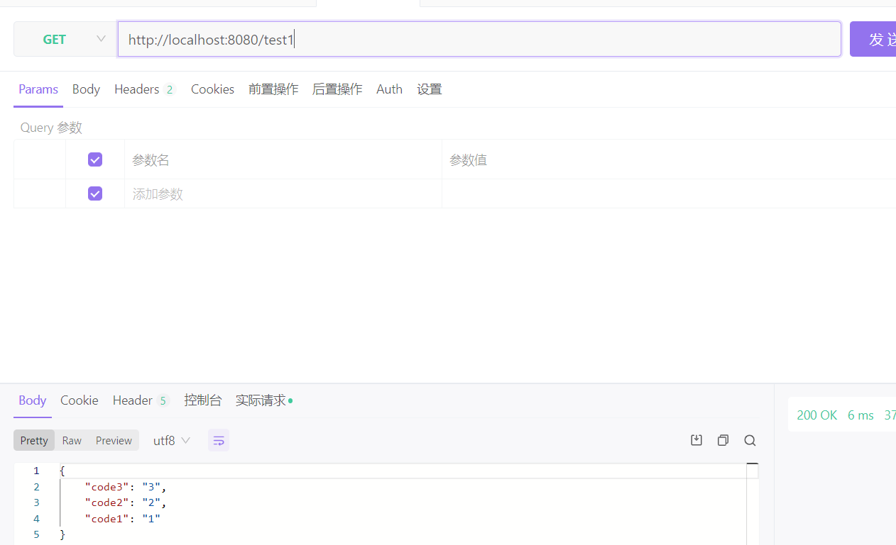
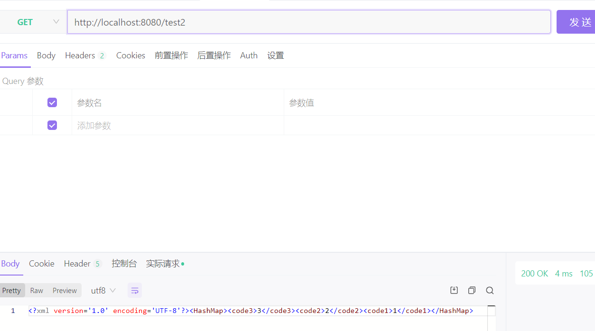
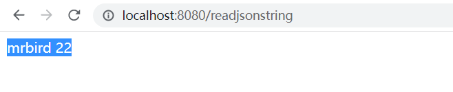
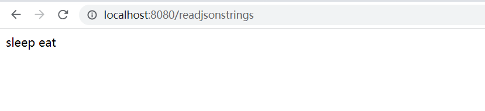
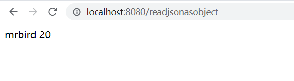
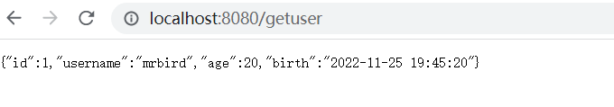
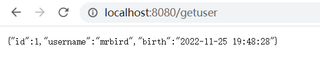
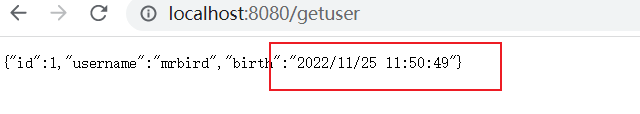

### SpringBoot之XML和JSON

#### XML

1. 引入依赖

    ```xml
    <dependency>
        <groupId>com.fasterxml.jackson.dataformat</groupId>
        <artifactId>jackson-dataformat-xml</artifactId>
        <version>2.9.9</version>
    </dependency>
    
    ```

    

2. 配置bean

    目的是让返回的xml有版本信息和字符集

    ```java
    package spring.boot.config;
    
    
    import com.fasterxml.jackson.dataformat.xml.XmlMapper;
    import com.fasterxml.jackson.dataformat.xml.ser.ToXmlGenerator;
    import org.springframework.context.annotation.Bean;
    import org.springframework.context.annotation.Configuration;
    import org.springframework.http.converter.xml.MappingJackson2XmlHttpMessageConverter;
    
    /**
     * @author yangjian
     * @date 2022/11/25 11:32
     */
    @Configuration
    public class MyConfig {
        @Bean
        public MappingJackson2XmlHttpMessageConverter mappingJackson2XmlHttpMessageConverter() {
            XmlMapper xmlMapper = new XmlMapper();
            xmlMapper.configure(ToXmlGenerator.Feature.WRITE_XML_DECLARATION, true);
            return new MappingJackson2XmlHttpMessageConverter(xmlMapper);
        }
    
    }
    ```

3. 测试代码

    ```java
    package spring.boot.controller;
    
    import org.springframework.http.MediaType;
    import org.springframework.web.bind.annotation.GetMapping;
    import org.springframework.web.bind.annotation.RestController;
    
    import java.util.HashMap;
    import java.util.Map;
    
    /**
     * @author yangjian
     * @date 2022/11/25 11:38
     */
    @RestController
    public class TestController {
    
        /**
         * MediaType 类型：
         * APPLICATION_JSON_VALUE = "application/json"
         * APPLICATION_XML_VALUE = "application/xml"
         * @return
         */
        @GetMapping(value = "/test",produces = {MediaType.APPLICATION_JSON_VALUE,MediaType.APPLICATION_XML_VALUE})
        public Object test(){
            Map<String,String> map = new HashMap<>();
            map.put("code1","1");
            map.put("code2","2");
            map.put("code3","3");
            return map;
        }
        @GetMapping(value = "/test1",produces = {MediaType.APPLICATION_JSON_VALUE})
        public Object test1(){
            Map<String,String> map = new HashMap<>();
            map.put("code1","1");
            map.put("code2","2");
            map.put("code3","3");
            return map;
        }
        @GetMapping(value = "/test2",produces = {MediaType.APPLICATION_XML_VALUE})
        public Object test2(){
            Map<String,String> map = new HashMap<>();
            map.put("code1","1");
            map.put("code2","2");
            map.put("code3","3");
            return map;
        }
    
    }
    
    ```

4. 访问

    

    

    

    

    

#### JSON

Spring Boot内置的Jackson,Jackson不但可以完成简单的序列化和反序列化操作，也能实现复杂的个性化的序列化和反序列化操作。

1. 自定义ObjectMapper

    实体类

    ```java
    package spring.boot.entity;
    
    import lombok.AllArgsConstructor;
    import lombok.Data;
    import lombok.NoArgsConstructor;
    
    import java.io.Serializable;
    import java.util.Date;
    
    /**
     * @author yangjian
     * @date 2022/11/25 18:15
     */
    @Data
    @AllArgsConstructor
    @NoArgsConstructor
    public class User implements Serializable {
    
        private static final long serialVersionUID = -4558452511469027511L;
        private int id;
        private String username;
        private int age;
        private Date birthday;
    
    }
    
    ```

    

    测试类

    ```java
    package spring.boot.controller;
    
    import org.springframework.web.bind.annotation.GetMapping;
    import org.springframework.web.bind.annotation.RestController;
    import spring.boot.entity.User;
    
    import java.util.Date;
    
    /**
     * @author yangjian
     * @date 2022/11/25 18:25
     */
    @RestController
    public class UserController {
    
    
        @GetMapping("/getuser")
        public User getUser() {
            User user = new User();
            user.setId(1);
            user.setUsername("mrbird");
            user.setAge(20);
            user.setBirthday(new Date());
            System.out.println(user);
            return user;
        }
    }
    ```

    访问`getuser`页面输出：

    ```
    {"id":1,"username":"mrbird","age":20,"birthday":"2022-11-25T11:03:35.952+00:00"}
    ```

    第一种自定义ObjectMapper

    ```java
    package spring.boot.config;
    
    import com.fasterxml.jackson.databind.ObjectMapper;
    import org.springframework.context.annotation.Bean;
    import org.springframework.context.annotation.Configuration;
    
    import java.text.SimpleDateFormat;
    
    /**
     * @author yangjian
     * @date 2022/11/25 18:52
     */
    @Configuration
    public class JacksonConfig {
        @Bean
        public ObjectMapper getObjectMapper(){
            ObjectMapper mapper = new ObjectMapper();
            mapper.setDateFormat(new SimpleDateFormat("yyyy-MM-dd HH:mm:ss"));
            return mapper;
        }
    }
    ```

    访问`getuser`页面输出：

    ```
    {"id":1,"username":"mrbird","age":20,"birthday":"2022-11-25 19:00:08"}
    ```

    

    第二种使用application.yml配置

    ```
    spring:
      jackson:
        # 全局设置@JsonFormat的格式pattern
        date-format: yyyy-MM-dd HH:mm:ss
    
    ```

    访问`getuser`页面输出：

    ```
    {"id":1,"username":"mrbird","age":20,"birthday":"2022-11-25 11:10:53"}
    ```

    application.yml配置参考：

    ```
      spring:
        jackson:
          # 设置属性命名策略,对应jackson下PropertyNamingStrategy中的常量值，SNAKE_CASE-返回的json驼峰式转下划线，json body下划线传到后端自动转驼峰式
          property-naming-strategy: SNAKE_CASE
          # 全局设置@JsonFormat的格式pattern
          date-format: yyyy-MM-dd HH:mm:ss
          # 当地时区
          locale: zh
          # 设置全局时区
          time-zone: GMT+8
          # 常用，全局设置pojo或被@JsonInclude注解的属性的序列化方式
          default-property-inclusion: NON_NULL #不为空的属性才会序列化,具体属性可看JsonInclude.Include
          # 常规默认,枚举类SerializationFeature中的枚举属性为key，值为boolean设置jackson序列化特性,具体key请看SerializationFeature源码
          serialization:
            WRITE_DATES_AS_TIMESTAMPS: true # 返回的java.util.date转换成timestamp
            FAIL_ON_EMPTY_BEANS: true # 对象为空时是否报错，默认true
          # 枚举类DeserializationFeature中的枚举属性为key，值为boolean设置jackson反序列化特性,具体key请看DeserializationFeature源码
          deserialization:
            # 常用,json中含pojo不存在属性时是否失败报错,默认true
            FAIL_ON_UNKNOWN_PROPERTIES: false
          # 枚举类MapperFeature中的枚举属性为key，值为boolean设置jackson ObjectMapper特性
          # ObjectMapper在jackson中负责json的读写、json与pojo的互转、json tree的互转,具体特性请看MapperFeature,常规默认即可
          mapper:
            # 使用getter取代setter探测属性，如类中含getName()但不包含name属性与setName()，传输的vo json格式模板中依旧含name属性
            USE_GETTERS_AS_SETTERS: true #默认false
          # 枚举类JsonParser.Feature枚举类中的枚举属性为key，值为boolean设置jackson JsonParser特性
          # JsonParser在jackson中负责json内容的读取,具体特性请看JsonParser.Feature，一般无需设置默认即可
          parser:
            ALLOW_SINGLE_QUOTES: true # 是否允许出现单引号,默认false
          # 枚举类JsonGenerator.Feature枚举类中的枚举属性为key，值为boolean设置jackson JsonGenerator特性，一般无需设置默认即可
          # JsonGenerator在jackson中负责编写json内容,具体特性请看JsonGenerator.Feature
     
    
    ```

    

#### 序列化

Jackson通过使用mapper的`writeValueAsString`方法将Java对象序列化为JSON格式字符串：

使用`@ResponseBody`注解可以使对象序列化为JSON格式字符串，除此之外，Jackson也提供了反序列化方法。

```java
@Autowired
ObjectMapper mapper;

@GetMapping("/serialization")
public String serialization() {
    try {
        User user = new User();
        user.setId(1);
        user.setUsername("mrbird");
        user.setAge(22);
        user.setBirthday(new Date());
        String str = mapper.writeValueAsString(user);
        return str;
    } catch (Exception e) {
        e.printStackTrace();
    }
    return null;
}
```

结果：

{"id":1,"username":"mrbird","age":22,"birthday":"2022-11-25 19:21:16"}

#### 树遍历

`readTree`方法可以接受一个字符串或者字节数组、文件、InputStream等， 返回JsonNode作为根节点，你可以像操作XML DOM那样操作遍历JsonNode以获取数据。

```java
 	@Autowired
    ObjectMapper mapper;

    @GetMapping("readjsonstring")
    public String readJsonString() {
        try {
            String json = "{\"id\":1,\"username\":\"mrbird\",\"age\":22,\"birthday\":\"2022-11-25 19:21:16\"}";
            JsonNode node = this.mapper.readTree(json);
            String name = node.get("username").asText();
            int age = node.get("age").asInt();
            return name + " " + age;
        } catch (Exception e) {
            e.printStackTrace();
        }
        return null;
    }
```

结果



解析多级JSON例子

```java
	@Autowired
    ObjectMapper mapper;

    @GetMapping("readjsonstrings")
    public String readJsonStrings() {
        try {
            String json = "{\"id\":1,\"username\":\"mrbird\",\"age\":20,\"birthday\":\"2022-11-25 19:20:47\",\"hobby\":{\"first\":\"sleep\",\"second\":\"eat\"}}";
            JsonNode node = this.mapper.readTree(json);
            JsonNode hobby = node.get("hobby");
            String first = hobby.get("first").asText();
            String second = hobby.get("second").asText();

            return first + " " + second;
        } catch (Exception e) {
            e.printStackTrace();
        }
        return null;
    }
```



#### 绑定对象

可以将Java对象和JSON数据进行绑定

```java
@Autowired
ObjectMapper mapper;

@GetMapping("readjsonasobject")
public String readJsonAsObject() {
    try {
        String json = "{\"id\":1,\"username\":\"mrbird\",\"age\":20,\"birthday\":\"2022-11-25 19:20:47\"}";
        User user = mapper.readValue(json, User.class);
        String name = user.getUsername();
        int age = user.getAge();
        return name + " " + age;
    } catch (Exception e) {
        e.printStackTrace();
    }
    return null;
}
```



#### Jackson注解

Jackson包含了一些实用的注解：

- @JsonProperty   

```
实体类字段
@JsonProperty("birth")
private Date birthday;
```

再次访问`getuser`页面输出：birthday  ->birth



- `@Jsonlgnore`，作用在属性上，用来忽略此属性。

    ```
    @JsonIgnore
    private int age;
    ```

    age属性已被忽略。

    

- @JsonFormat

    用于日期格式化

    ```
    @JsonFormat(pattern = "yyyy/MM/dd HH:mm:ss")
    private Date birthday;
    ```




### @JsonSerialize

`@JsonSerialize`，指定一个实现类来自定义序列化。类必须实现`JsonSerializer`接口，代码如下：

```
public class UserSerializer extends JsonSerializer<User> {

    @Override
    public void serialize(User user, JsonGenerator generator, SerializerProvider provider)
            throws IOException, JsonProcessingException {
        generator.writeStartObject();
        generator.writeStringField("user-name", user.getUserName());
        generator.writeEndObject();
    }
}
```


上面的代码中我们仅仅序列化userName属性，且输出的key是`user-name`。 使用注解`@JsonSerialize`来指定User对象的序列化方式：

```
@JsonSerialize(using = UserSerializer.class)
public class User implements Serializable {
    ...
}
```


再次访问`getuser`页面输出：

```
{"user-name":"mrbird"}
```


### @JsonDeserialize

`@JsonDeserialize`，用户自定义反序列化，同`@JsonSerialize` ，类需要实现`JsonDeserializer`接口。

```

public class UserDeserializer extends JsonDeserializer<User> {

    @Override
    public User deserialize(JsonParser parser, DeserializationContext context)
            throws IOException, JsonProcessingException {
        JsonNode node = parser.getCodec().readTree(parser);
        String userName = node.get("user-name").asText();
        User user = new User();
        user.setUserName(userName);
        return user;
    }
}
```


使用注解`@JsonDeserialize`来指定User对象的序列化方式：

```
@JsonDeserialize (using = UserDeserializer.class)
public class User implements Serializable {
    ...
}
```


测试：

```
@Autowired
ObjectMapper mapper;

@RequestMapping("readjsonasobject")
@ResponseBody
public String readJsonAsObject() {
    try {
        String json = "{\"user-name\":\"mrbird\"}";
        User user = mapper.readValue(json, User.class);
        String name = user.getUserName();
        return name;
    } catch (Exception e) {
        e.printStackTrace();
    }
    return null;
}
```


访问`readjsonasobject`，页面输出：

```
mrbird
```


### @JsonView

`@JsonView`，作用在类或者属性上，用来定义一个序列化组。 比如对于User对象，某些情况下只返回userName属性就行，而某些情况下需要返回全部属性。 因此User对象可以定义成如下：

```
public class User implements Serializable {
    private static final long serialVersionUID = 6222176558369919436L;
    
    public interface UserNameView {};
    public interface AllUserFieldView extends UserNameView {};
    
    @JsonView(UserNameView.class)
    private String userName;
    
    @JsonView(AllUserFieldView.class)
    private int age;
    
    @JsonView(AllUserFieldView.class)
    private String password;
    
    @JsonView(AllUserFieldView.class)
    private Date birthday;
    ...	
}
```


User定义了两个接口类，一个为`userNameView`，另外一个为`AllUserFieldView`继承了`userNameView`接口。这两个接口代表了两个序列化组的名称。属性userName使用了`@JsonView(UserNameView.class)`，而剩下属性使用了`@JsonView(AllUserFieldView.class)`。

Spring中Controller方法允许使用`@JsonView`指定一个组名，被序列化的对象只有在这个组的属性才会被序列化，代码如下：

```
@JsonView(User.UserNameView.class)
@RequestMapping("getuser")
@ResponseBody
public User getUser() {
    User user = new User();
    user.setUserName("mrbird");
    user.setAge(26);
    user.setPassword("123456");
    user.setBirthday(new Date());
    return user;
}
```


访问`getuser`页面输出：

```
{"userName":"mrbird"}
```


如果将`@JsonView(User.UserNameView.class)`替换为`@JsonView(User.AllUserFieldView.class)`，输出：

```
{"userName":"mrbird","age":26,"password":"123456","birthday":"2018-04-02 11:24:00"}
```


因为接口`AllUserFieldView`继承了接口`UserNameView`所以userName也会被输出。

## 集合的反序列化

在Controller方法中，可以使用`＠RequestBody`将提交的JSON自动映射到方法参数上，比如：

```
@RequestMapping("updateuser")
@ResponseBody
public int updateUser(@RequestBody List<User> list){
    return list.size();
}
```


上面方法可以接受如下一个JSON请求，并自动映射到User对象上：

```
[{"userName":"mrbird","age":26},{"userName":"scott","age":27}]
```


Spring Boot 能自动识别出List对象包含的是User类，因为在方法中定义的泛型的类型会被保留在字节码中，所以Spring Boot能识别List包含的泛型类型从而能正确反序列化。

有些情况下，集合对象并没有包含泛型定义，如下代码所示，反序列化并不能得到期望的结果。

```
@Autowired
ObjectMapper mapper;

@RequestMapping("customize")
@ResponseBody
public String customize() throws JsonParseException, JsonMappingException, IOException {
    String jsonStr = "[{\"userName\":\"mrbird\",\"age\":26},{\"userName\":\"scott\",\"age\":27}]";
    List<User> list = mapper.readValue(jsonStr, List.class);
    String msg = "";
    for (User user : list) {
        msg += user.getUserName();
    }
    return msg;
}
```


访问`customize`，控制台抛出异常：

```
java.lang.ClassCastException: java.util.LinkedHashMap cannot be cast to com.example.pojo.User
```


这是因为在运行时刻，泛型己经被擦除了（不同于方法参数定义的泛型，不会被擦除）。为了提供泛型信息，Jackson提供了JavaType ，用来指明集合类型，将上述方法改为：

```
@Autowired
ObjectMapper mapper;

@RequestMapping("customize")
@ResponseBody
public String customize() throws JsonParseException, JsonMappingException, IOException {
    String jsonStr = "[{\"userName\":\"mrbird\",\"age\":26},{\"userName\":\"scott\",\"age\":27}]";
    JavaType type = mapper.getTypeFactory().constructParametricType(List.class, User.class);
    List<User> list = mapper.readValue(jsonStr, type);
    String msg = "";
    for (User user : list) {
        msg += user.getUserName();
    }
    return msg;
}
```