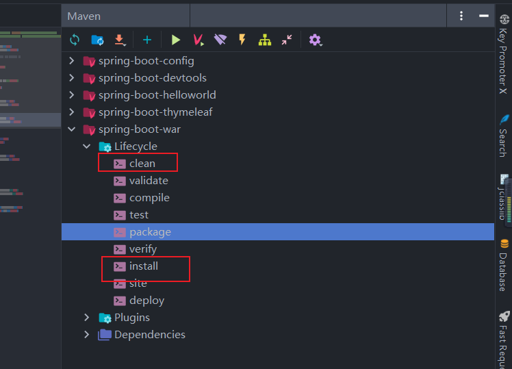
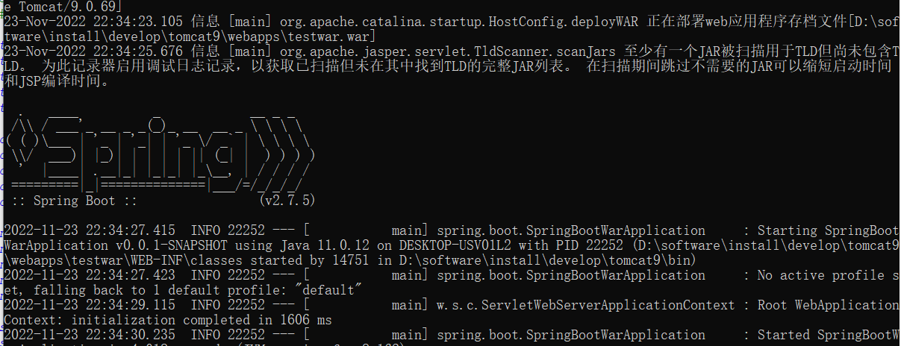

### SpringBoot之jar包转war包

Spring Boot是支持发布jar包和war的，但它推荐的是使用jar形式发布。

以下配置以Maven为说明讲解

1. **修改Spring Boot启动类**

    启动类继承 `SpringBootServletInitializer`类，并覆盖 `configure`方法

    修改前：

    ```java
    package spring.boot;
    
    import org.springframework.boot.SpringApplication;
    import org.springframework.boot.autoconfigure.SpringBootApplication;
    
    @SpringBootApplication
    public class SpringBootWarApplication {
    
        public static void main(String[] args) {
            SpringApplication.run(SpringBootWarApplication.class, args);
        }
    
    }
    
    ```

    修改后：

    使其继承自`SpringBootServletInitializer`， 并重写`configure`方法

    ```java
    package spring.boot;
    
    import org.springframework.boot.SpringApplication;
    import org.springframework.boot.autoconfigure.SpringBootApplication;
    import org.springframework.boot.builder.SpringApplicationBuilder;
    import org.springframework.boot.web.servlet.support.SpringBootServletInitializer;
    
    @SpringBootApplication
    public class SpringBootWarApplication extends SpringBootServletInitializer {
    
        /**
         *  sources方法中传入当前启动类即可
         */
        @Override
        protected SpringApplicationBuilder configure(SpringApplicationBuilder application) {
            return application.sources(SpringBootWarApplication.class);
        }
        public static void main(String[] args) {
            SpringApplication.run(SpringBootWarApplication.class, args);
        }
    
    }
    
    ```

    

2. 修改`pom.xml`文件

    添加war配置

    ```
    <packaging>war</packaging>
    ```

    

3. 加入如下的依赖

    ```
    <dependency>
        <groupId>org.springframework.boot</groupId>
        <artifactId>spring-boot-starter-tomcat</artifactId>
        <scope>provided</scope>
    </dependency>
    ```

    此依赖实际作用，是改变springBoot内置Tomcat依赖的scope，scope为provided表示该依赖在打包过程中，不需要打进最后的包中去，防止与外部tomcat发生冲突。这个依赖由运行的环境来提供，比如tomcat或者基础类库等等，事实上，该依赖可以参与编译、测试和运行等周期，与compile等同，区别在于打包阶段进行了exclude操作

4. 添加war包打包插件

    如果你用的是继承spring-boot-starter-parent的形式使用Spring Boot，那可以跳过，因为它已经帮你配置好了。如果你使用的依赖spring-boot-dependencies形式，你需要添加以下插件。

    ```
        <build>
            <plugins>
                <plugin>
                    <groupId>org.springframework.boot</groupId>
                    <artifactId>spring-boot-maven-plugin</artifactId>
                    <configuration>
                        <includeSystemScope>true</includeSystemScope>
                        <fork>true</fork>
                    </configuration>
                </plugin>
            <plugin>
                <groupId>org.apache.maven.plugins</groupId>
                <artifactId>maven-war-plugin</artifactId>
                <configuration>
                     <failOnMissingWebXml>false</failOnMissingWebXml>
                </configuration>
            </plugin>
            </plugins>
        </build>
    
    ```

    failOnMissingWebXml需要开启为false，不然打包会报没有web.xml错误。

    整体pom.xml

    ```
    <?xml version="1.0" encoding="UTF-8"?>
    <project xmlns="http://maven.apache.org/POM/4.0.0" xmlns:xsi="http://www.w3.org/2001/XMLSchema-instance"
             xsi:schemaLocation="http://maven.apache.org/POM/4.0.0 https://maven.apache.org/xsd/maven-4.0.0.xsd">
        <modelVersion>4.0.0</modelVersion>
        <parent>
            <groupId>org.springframework.boot</groupId>
            <artifactId>spring-boot-starter-parent</artifactId>
            <version>2.7.5</version>
            <relativePath/> <!-- lookup parent from repository -->
        </parent>
        <groupId>spring.boot</groupId>
        <artifactId>spring-boot-war</artifactId>
        <version>0.0.1-SNAPSHOT</version>
        <packaging>war</packaging>
        <name>spring-boot-war</name>
        <description>Demo project for Spring Boot</description>
        <properties>
            <java.version>1.8</java.version>
        </properties>
        <dependencies>
            <dependency>
                <groupId>org.springframework.boot</groupId>
                <artifactId>spring-boot-starter-web</artifactId>
                <exclusions>
                    <exclusion>
                        <groupId>org.springframework.boot</groupId>
                        <artifactId>spring-boot-starter-tomcat</artifactId>
                    </exclusion>
                </exclusions>
            </dependency>
    
            <dependency>
                <groupId>org.springframework.boot</groupId>
                <artifactId>spring-boot-starter-tomcat</artifactId>
                <scope>provided</scope>
            </dependency>
    
    
            <dependency>
                <groupId>org.springframework.boot</groupId>
                <artifactId>spring-boot-starter-test</artifactId>
                <scope>test</scope>
            </dependency>
    
        </dependencies>
    
        <build>
            <plugins>
                <plugin>
                    <groupId>org.springframework.boot</groupId>
                    <artifactId>spring-boot-maven-plugin</artifactId>
                    <configuration>
                        <!--配置springboot入口类-->
                        <includeSystemScope>true</includeSystemScope>
                        <fork>true</fork>
                        <jvmArguments>Dfile.encoding=UTF-8</jvmArguments>
                        <!--配置入口类的标签名-->
                        <mainClass>spring.boot.SpringBootWarApplication</mainClass>
                    </configuration>
                </plugin>
                <plugin>
                    <groupId>org.apache.maven.plugins</groupId>
                    <artifactId>maven-war-plugin</artifactId>
                    <configuration>
                        <failOnMissingWebXml>false</failOnMissingWebXml>
                    </configuration>
                </plugin>
            </plugins>
        </build>
    
    </project>
    
    ```

    

5. 如何打war包

    打war包方式和打jar包方式一样，没有区别。

    - 在Maven中使用 `mvn cleanpackage`命令即可打包。

    - 在Idea中可以这样设置打包：

        

**注意**：

1. application配置文件中的server.xx等关于容器的配置就无效了，改配置需要在外部tomcat中进行。

2. 访问地址：http://localhost:8080/testwar/test

    ​	需要添加 /testwar , testwar 为testwar.war 名称

3. 需要和tomcat版本匹配，版本可能不会加载

    正常启动：

    ​	

    tomcat乱码问题：

    - 找到Tomcat安装目录下的conf文件下面的logging.[properties](https://so.csdn.net/so/search?q=properties&spm=1001.2101.3001.7020)文件，使用编辑器打开来。
    - 将里面的属性java.util.logging.ConsoleHandler.encoding的值由原来的UTF-8修改为GBK即可

    

4. x


