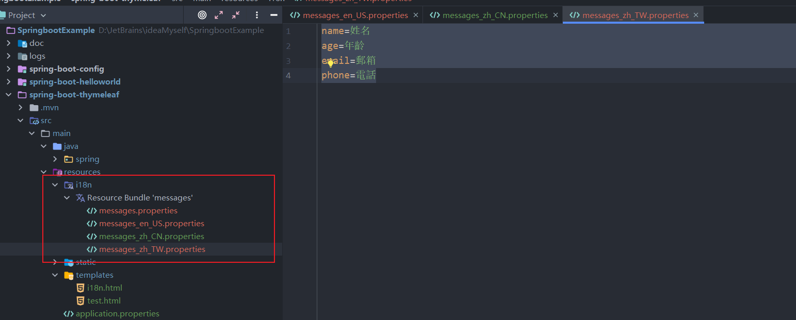
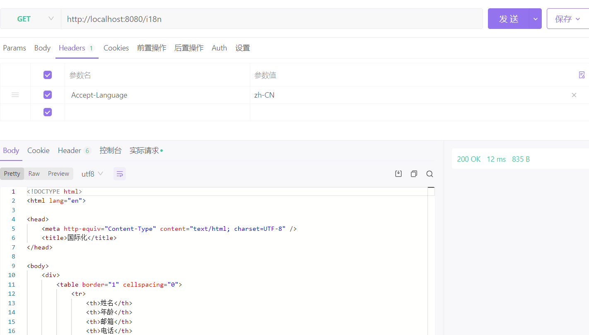
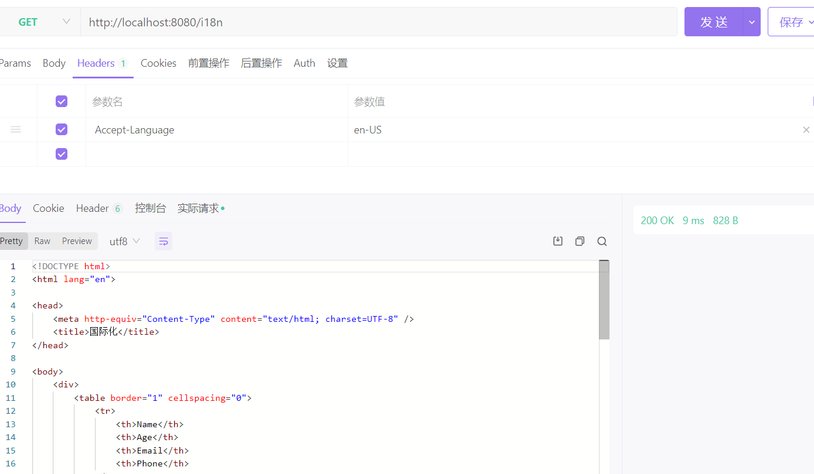
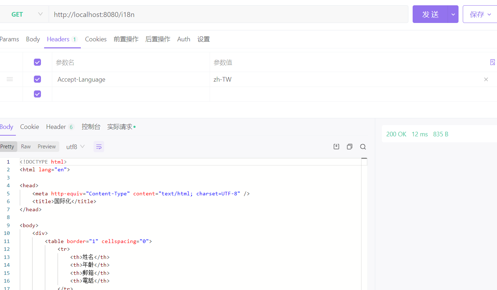
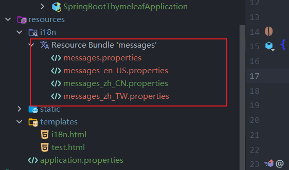

### SpringBoot之国际化配置

本文以Spring Boot和Thymeleaf中做页面模板国际化的支持为例

Springboot国际化存在三种使用方式：

- AcceptHeaderLocaleResolver （默认解析器，通过请求头的 Accept-Language 字段来判断当前请求所属的环境的，进而给出合适的响应）
- SessionLocaleResolver
- CookieLocaleResolver

在默认情况下，国际化文件夹直接放在`src\main\resources`文件夹下

#### 国际化自动配置

Spring Boot中已经对国际化这一块做了自动配置。

国际化自动配置类：

> org.springframework.boot.autoconfigure.context.MessageSourceAutoConfiguration

#### 配置国际化

##### 使用默认AcceptHeaderLocaleResolver 

1. 编写国际化配置文件；

    

    

    ```
    name=Name
    age=Age
    email=Email
    phone=Phone
    
    name=姓名
    age=年龄
    email=邮箱
    phone=电话
    
    name=姓名
    age=年齡
    email=郵箱
    phone=電話
    ```

    在application.properties配置basename：

    ```
    pring.messages.basename=i18n.messages
    ```

    

2. 创建Controller和实体类

    ```java
    package spring.boot.entity;
    
    import lombok.AllArgsConstructor;
    import lombok.Data;
    
    /**
     * @author yangjian
     * @date 2022/11/23 18:17
     */
    @Data
    @AllArgsConstructor
    public class Student {
        private String name;
        private int age;
        private String email;
        private String phone;
    }
    
    package spring.boot.controller;
    
    import org.springframework.stereotype.Controller;
    import org.springframework.ui.Model;
    import org.springframework.web.bind.annotation.GetMapping;
    import spring.boot.entity.Student;
    
    import java.util.ArrayList;
    
    /**
     * @author yangjian
     * @date 2022/11/23 16:40
     */
    @Controller
    public class I18nController {
    
    
        @GetMapping("/i18n")
        public String index(Model model) {
                Student stu1 = new Student("张三", 20, "1155@qq.com", "13333835901");
                Student stu2 = new Student("李四", 21, "1154@qq.com", "13333835902");
                Student stu3 = new Student("王五", 22, "1153@qq.com", "13333835903");
                Student stu4 = new Student("小芳", 23, "1156@qq.com", "13333835904");
                ArrayList<Student> stus = new ArrayList<>();
                stus.add(stu1);
                stus.add(stu2);
                stus.add(stu3);
                stus.add(stu4);
                model.addAttribute("stus", stus);
                return "i18n";
        }
    }
    
    ```

    在`src\main\resources\templates`目录下创建一个i18n.html，内容如下

    ```html
    <!DOCTYPE html>
    <html lang="en" xmlns:th="http://www.thymeleaf.org">
    <head>
      <meta http-equiv="Content-Type" content="text/html; charset=UTF-8" />
        <title>国际化</title>
    </head>
    <body>
    <div>
      <table border="1" cellspacing="0">
        <tr>
          <th th:text="#{name}"></th>
          <th th:text="#{age}"></th>
          <th th:text="#{email}"></th>
          <th th:text="#{phone}"></th>
        </tr>
        <tr th:each="stu:${stus}">
          <td th:text="${stu.name}"></td>
          <td th:text="${stu.age}"></td>
          <td th:text="${stu.email}"></td>
          <td th:text="${stu.phone}"></td>
        </tr>
    
      </table>
    </div>
    </body>
    </html>
    ```

    

3. 效果

​	使用postman和apifox  分别在请求的头中设置 Accept-Language 为 zh-CN、en-US，zh-TW查看结果如下：








##### 自定义切换Local保存方式

进行自定义解析，**SessionLocaleResolver 将客户端的 Locale 保存到 HttpSession 对象中，CookieLocaleResolver 将LOCAL保存到Cookie中**


无论是哪一种自定义的LocalResolver都需要定义**LocaleChangeInterceptor**，，用于拦截请求中 key 为 lang 的参数（不配置的话是 locale），这个参数则指定了当前的环境信息

1. 切换国际化-自定义 LocaleResolver,使用SessionLocaleResolver 、CookieLocaleResolver 不用此类

    ```java
    package spring.boot.resolver;
    
    import lombok.extern.slf4j.Slf4j;
    import org.springframework.web.servlet.LocaleResolver;
    import org.thymeleaf.util.StringUtils;
    
    import javax.servlet.http.HttpServletRequest;
    import javax.servlet.http.HttpServletResponse;
    import java.util.Locale;
    
    /**
     * @author yangjian
     * @date 2022/11/23 18:47
     */
    @Slf4j
    public class MyLocaleResolver implements LocaleResolver {
        @Override
        public Locale resolveLocale(HttpServletRequest request) {
    
            String language = request.getParameter("language");
            //如果没有获取到就使用默认的
            Locale locale = Locale.getDefault();
            //如果请求不为空
            if (!StringUtils.isEmpty(language)) {
                // zh_CN
                String[] split = language.split("_");
                log.info("=={}",split);
                //语言，国家
                locale = new Locale(split[0], split[1]);
            }
            return locale;
        }
    
        @Override
        public void setLocale(HttpServletRequest request, HttpServletResponse response, Locale locale) {
    
        }
    }
    
    ```

    

2. 拦截器-向容器中注入LocaleResolver 组件

    使用MyLocaleResolver

    ```java
    package spring.boot.config;
    
    import org.springframework.context.annotation.Bean;
    import org.springframework.context.annotation.Configuration;
    import org.springframework.web.servlet.LocaleResolver;
    import org.springframework.web.servlet.config.annotation.ViewControllerRegistry;
    import org.springframework.web.servlet.config.annotation.WebMvcConfigurer;
    import spring.boot.resolver.MyLocaleResolver;
    
    /**
     * @author yangjian
     * @date 2022/11/23 18:43
     */
    @Configuration
    public class MyMvcConfig implements WebMvcConfigurer {
    
        /**
         * 为了方便测试设置默认页面为首页-i18n
         * @param registry
         * @return
         */
        @Override
        public void addViewControllers(ViewControllerRegistry registry) {
            registry.addViewController("/").setViewName("i18n");
            registry.addViewController("/i18n.html").setViewName("i18n");
        }
    
        /**
         * 注册国际化组件
         * @param null
         * @return
         */
        @Bean
        public LocaleResolver localeResolver(){
            return new MyLocaleResolver();
        }
    }
    
    ```

    使用SessionLocaleResolver

    ```java
    package spring.boot.config;
    
    import org.springframework.context.annotation.Bean;
    import org.springframework.context.annotation.Configuration;
    import org.springframework.web.servlet.LocaleResolver;
    import org.springframework.web.servlet.config.annotation.InterceptorRegistry;
    import org.springframework.web.servlet.config.annotation.ViewControllerRegistry;
    import org.springframework.web.servlet.config.annotation.WebMvcConfigurer;
    import org.springframework.web.servlet.i18n.LocaleChangeInterceptor;
    import org.springframework.web.servlet.i18n.SessionLocaleResolver;
    
    import java.util.Locale;
    
    /**
     * @author yangjian
     * @date 2022/11/23 18:43
     */
    @Configuration
    public class MyMvcConfig implements WebMvcConfigurer {
    
        /**
         * 为了方便测试设置默认页面为首页-i18n
         * @param registry
         * @return
         */
        @Override
        public void addViewControllers(ViewControllerRegistry registry) {
            registry.addViewController("/").setViewName("i18n");
            registry.addViewController("/i18n.html").setViewName("i18n");
        }
    
    
    
    
        /**
         * 注册国际化组件-使用自定义LocaleResolver
         *
         * @return
         */
        /*@Bean
        public LocaleResolver localeResolver(){
            return new MyLocaleResolver();
        }*/
    
        /**
         * 使用SessionLocaleResolver 、cookie
         * @return
         */
        @Bean
        public LocaleChangeInterceptor localeChangeInterceptor() {
            LocaleChangeInterceptor localeChangeInterceptor = new LocaleChangeInterceptor();
            localeChangeInterceptor.setParamName("language");
            return localeChangeInterceptor;
        }
    
        /**
         * 拦截器
         * @param registry
         * @return
         */
        @Override
        public void addInterceptors(InterceptorRegistry registry) {
            //添加locale拦截器
            registry.addInterceptor(localeChangeInterceptor());
        }
        /**
         * 使用自定义SessionLocaleResolver
         * @return
         */
        @Bean
        public LocaleResolver localeResolver() {
            SessionLocaleResolver localeResolver = new SessionLocaleResolver();
            localeResolver.setDefaultLocale(Locale.SIMPLIFIED_CHINESE);
            return localeResolver;
        }
    
    }
    
    ```

    使用CookieLocaleResolver

    ```java
    package spring.boot.config;
    
    import org.springframework.context.annotation.Bean;
    import org.springframework.context.annotation.Configuration;
    import org.springframework.web.servlet.LocaleResolver;
    import org.springframework.web.servlet.config.annotation.InterceptorRegistry;
    import org.springframework.web.servlet.config.annotation.ViewControllerRegistry;
    import org.springframework.web.servlet.config.annotation.WebMvcConfigurer;
    import org.springframework.web.servlet.i18n.CookieLocaleResolver;
    import org.springframework.web.servlet.i18n.LocaleChangeInterceptor;
    
    import java.util.Locale;
    
    /**
     * @author yangjian
     * @date 2022/11/23 18:43
     */
    @Configuration
    public class MyMvcConfig implements WebMvcConfigurer {
    
        /**
         * 为了方便测试设置默认页面为首页-i18n
         * @param registry
         * @return
         */
        @Override
        public void addViewControllers(ViewControllerRegistry registry) {
            registry.addViewController("/").setViewName("i18n");
            registry.addViewController("/i18n.html").setViewName("i18n");
        }
    
    
    
    
        /**
         * 注册国际化组件-使用自定义LocaleResolver
         *
         * @return
         */
        /*@Bean
        public LocaleResolver localeResolver(){
            return new MyLocaleResolver();
        }*/
    
        /**
         * 使用SessionLocaleResolver 、cookie
         * @return
         */
        @Bean
        public LocaleChangeInterceptor localeChangeInterceptor() {
            LocaleChangeInterceptor localeChangeInterceptor = new LocaleChangeInterceptor();
            localeChangeInterceptor.setParamName("language");
            return localeChangeInterceptor;
        }
    
        /**
         * 拦截器
         * @param registry
         * @return
         */
        @Override
        public void addInterceptors(InterceptorRegistry registry) {
            //添加locale拦截器
            registry.addInterceptor(localeChangeInterceptor());
        }
        /**
         * 使用自定义SessionLocaleResolver
         * @return
         */
        /*@Bean
        public LocaleResolver localeResolver() {
            SessionLocaleResolver localeResolver = new SessionLocaleResolver();
            localeResolver.setDefaultLocale(Locale.SIMPLIFIED_CHINESE);
            return localeResolver;
        }*/
        @Bean
        public LocaleResolver localeResolver(){
            CookieLocaleResolver localeResolver = new CookieLocaleResolver();
            localeResolver.setCookieName("localeCookie");
            //设置默认区域
            localeResolver.setDefaultLocale(Locale.SIMPLIFIED_CHINESE);
            //设置cookie有效期.
            localeResolver.setCookieMaxAge(3600);
            return localeResolver;
        }
    
    
    }
    
    ```

    

3. 配置国际化文件

    

    ```
    name=姓名
    age=年龄
    email=邮箱
    phone=电话
    
    name=Name
    age=Age
    email=Email
    phone=Phone
    
    name=姓名
    age=年齡
    email=郵箱
    phone=電話
    ```

    

4. 在application.properties配置

    ```
    # 禁用缓存
    spring.thymeleaf.cache=false
    spring.messages.basename=i18n.messages
    spring.messages.encoding=utf-8
    
    
    ```

    

5. Controller

    ```java
    package spring.boot.controller;
    
    import org.springframework.stereotype.Controller;
    import org.springframework.ui.Model;
    import org.springframework.web.bind.annotation.GetMapping;
    import spring.boot.entity.Student;
    
    import java.util.ArrayList;
    
    /**
     * @author yangjian
     * @date 2022/11/23 16:40
     */
    @Controller
    public class I18nController {
    
    
        @GetMapping("/i18n")
        public String index(Model model) {
                Student stu1 = new Student("张三", 20, "1155@qq.com", "13333835901");
                Student stu2 = new Student("李四", 21, "1154@qq.com", "13333835902");
                Student stu3 = new Student("王五", 22, "1153@qq.com", "13333835903");
                Student stu4 = new Student("小芳", 23, "1156@qq.com", "13333835904");
                ArrayList<Student> stus = new ArrayList<>();
                stus.add(stu1);
                stus.add(stu2);
                stus.add(stu3);
                stus.add(stu4);
                model.addAttribute("stus", stus);
                return "i18n";
        }
    }
    
    ```

    

6. 创建i18n.html

    ```
    <!DOCTYPE html>
    <html lang="en" xmlns:th="http://www.thymeleaf.org">
    <head>
      <meta http-equiv="Content-Type" content="text/html; charset=UTF-8" />
        <title>国际化</title>
    </head>
    <body>
    <div>
      <table border="1" cellspacing="0">
        <tr>
          <th th:text="#{name}"></th>
          <th th:text="#{age}"></th>
          <th th:text="#{email}"></th>
          <th th:text="#{phone}"></th>
        </tr>
        <tr th:each="stu:${stus}">
          <td th:text="${stu.name}"></td>
          <td th:text="${stu.age}"></td>
          <td th:text="${stu.email}"></td>
          <td th:text="${stu.phone}"></td>
        </tr>
    
      </table>
    </div>
    </body>
    </html>
    ```

    

7. 访问http://localhost:8080/i18n?language=zh_CN

    指定国际化，URL后添加：?language=zh_TW、?language=zh_CN、?language=en_US

8. 国际化

    基本格式：基名_语言_地区.properties
    常见的资源文件命名规范
    i18n_en.properties：所有英文语言的资源
    i18n_en_US.properties：美国地区，英文语言的资源
    i18n_zh.properties：所有中文语言的资源
    i18n_zh_CN.properties：中国大陆的，中文语言的资源
    基名.properties：默认资源文件，如果请求相应的资源文件不存在，将使用此资源文件

    ```
    日本 : ja_JP
    秘鲁 : es_PE
    巴拿马 : es_PA
    波斯尼亚和黑山共和国 : sr_BA
    危地马拉 : es_GT
    阿拉伯联合酋长国 : ar_AE
    挪威 : no_NO
    阿尔巴尼亚 : sq_AL
    伊拉克 : ar_IQ
    也门 : ar_YE
    葡萄牙 : pt_PT
    塞浦路斯 : el_CY
    卡塔尔 : ar_QA
    马其顿王国 : mk_MK
    瑞士 : de_CH
    美国 : en_US
    芬兰 : fi_FI
    马耳他 : en_MT
    斯洛文尼亚 : sl_SI
    斯洛伐克 : sk_SK
    土耳其 : tr_TR
    沙特阿拉伯 : ar_SA
    英国 : en_GB
    塞尔维亚及黑山 : sr_CS
    新西兰 : en_NZ
    挪威 : no_NO
    立陶宛 : lt_LT
    尼加拉瓜 : es_NI
    爱尔兰 : ga_IE
    比利时 : fr_BE
    西班牙 : es_ES
    黎巴嫩 : ar_LB
    加拿大 : fr_CA
    爱沙尼亚 : et_EE
    科威特 : ar_KW
    塞尔维亚 : sr_RS
    美国 : es_US
    墨西哥 : es_MX
    苏丹 : ar_SD
    印度尼西亚 : in_ID
    乌拉圭 : es_UY
    拉脱维亚 : lv_LV
    巴西 : pt_BR
    叙利亚 : ar_SY
    多米尼加共和国 : es_DO
    瑞士 : fr_CH
    印度 : hi_IN
    委内瑞拉 : es_VE
    巴林 : ar_BH
    菲律宾 : en_PH
    突尼斯 : ar_TN
    奥地利 : de_AT
    荷兰 : nl_NL
    厄瓜多尔 : es_EC
    台湾地区 : zh_TW
    约旦 : ar_JO
    冰岛 : is_IS
    哥伦比亚 : es_CO
    哥斯达黎加 : es_CR
    智利 : es_CL
    埃及 : ar_EG
    南非 : en_ZA
    泰国 : th_TH
    希腊 : el_GR
    意大利 : it_IT
    匈牙利 : hu_HU
    爱尔兰 : en_IE
    乌克兰 : uk_UA
    波兰 : pl_PL
    卢森堡 : fr_LU
    比利时 : nl_BE
    印度 : en_IN
    西班牙 : ca_ES
    摩洛哥 : ar_MA
    玻利维亚 : es_BO
    澳大利亚 : en_AU
    新加坡 : zh_SG
    萨尔瓦多 : es_SV
    俄罗斯 : ru_RU
    韩国 : ko_KR
    阿尔及利亚 : ar_DZ
    越南 : vi_VN
    黑山 : sr_ME
    利比亚 : ar_LY
    中国 : zh_CN
    台湾：zh_TW
    香港 : zh_HK
    白俄罗斯 : be_BY
    以色列 : iw_IL
    保加利亚 : bg_BG
    马耳他 : mt_MT
    巴拉圭 : es_PY
    法国 : fr_FR
    捷克共和国 : cs_CZ
    瑞士 : it_CH
    罗马尼亚 : ro_RO
    波多黎哥 : es_PR
    加拿大 : en_CA
    德国 : de_DE
    卢森堡 : de_LU
    阿根廷 : es_AR
    马来西亚 : ms_MY
    克罗地亚 : hr_HR
    新加坡 : en_SG
    阿曼 : ar_OM
    泰国 : th_TH
    瑞典 : sv_SE
    丹麦 : da_DK
    洪都拉斯 : es_HN
    ```

    

9. x


