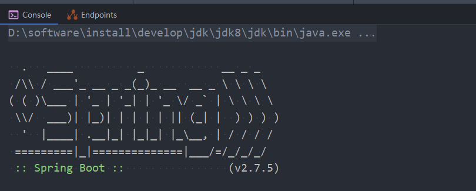
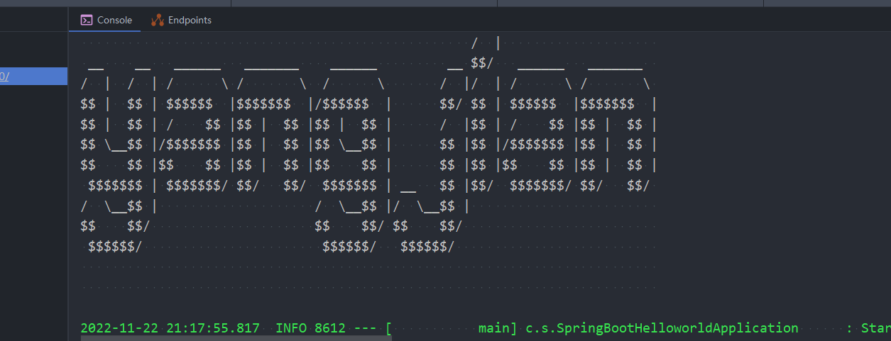

### SpringBoot之定制启动图案

Spring Boot在启动的时候会显示一个默认的Spring的图案，对应的类为SpringBootBanner。

#### 启动图案

默认图案：



图案输出有以下几种模式，默认是CONSOLE的，即只打印到控制台，也可以输出到日志文件。

```java
 public static enum Mode {
        OFF,
        CONSOLE,
        LOG;

        private Mode() {
        }
    }
```

#### 关闭图案

```java
package com.springboot;

import org.springframework.boot.Banner;
import org.springframework.boot.SpringApplication;
import org.springframework.boot.autoconfigure.SpringBootApplication;

@SpringBootApplication
public class SpringBootHelloworldApplication {

    public static void main(String[] args) {
        //SpringApplication..run(SpringBootHelloworldApplication.class, args);
        //获取入口SpringBoot类
        SpringApplication springApplication = new SpringApplication(SpringBootHelloworldApplication.class);
        //设置它的属性
        springApplication.setBannerMode(Banner.Mode.OFF);
        springApplication.run(args);
    }

}

```

#### 修改图案

在classpath目录下创建banner.txt即可，把图案放入该文件就行，这是Spring Boot默认的图案位置，Spring Boot会自动加载该文件显示图案。

生成LOGO的网页链接：
[bootschool官网](https://www.bootschool.net/ascii)：https://www.bootschool.net/ascii

生成图案的网站：https://patorjk.com/software/taag/#p=display&f=Graffiti&t=

​							http://www.network-science.de/ascii/

也可以使用图片，更详细的可以研究Banner接口及其子类

当然也支持通过application配置文件来定制图案。


1.  这个是MANIFEST.MF文件中的版本号

    ${application.version}

2.  这个是上面的的版本号前面加v后上括号

    ${application.formatted-version} 

3.  这个是springboot的版本号

    ${spring-boot.version}

4.  #这个是springboot的版本号

    ${spring-boot.formatted-version}

5. 图案背景色

    ${AnsiBackground.BRIGHT_YELLOW} 

6. 字体颜色

    ${AnsiColor.BRIGHT_RED}

7. 在application中配置

    application.version=1.0.0.0
    application.formatted-version=v1.0.0.0
    spring-boot.version=2.7.5
    spring-boot.formatted-version=v2.7.5
    application.title=My App 

实现：

在resourses文件夹下创建一个文本文件命名为banner.txt

