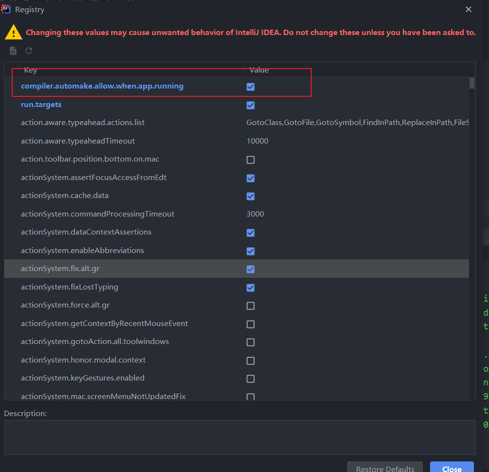

### SpringBoot之热部署

在实际开发中，项目开发中难免会出现一些bug，但是我们知道我们处理完这些bug后，我们需要重启一下服务器才能生效.也就是说修改了项目的代码后需要重启一下服务器然后修改后的代码才生效，不重启服务器的话要不然还是以前代码，但是在实际开发中每次修改代码都要重启一次服务器是非常麻烦的，因此热部署就解决了这个问题，热部署可以在我们修改完项目代码后不用重启服务器就能把代码部署到服务器中。

#### 开启热部署

引入依赖

```xml
<dependency>
    <groupId>org.springframework.boot</groupId>
    <artifactId>spring-boot-devtools</artifactId>
    <scope>runtime</scope>
    <optional>true</optional>
</dependency>	
```

##### 第一种：手动启动热部署

使用ctrl+F9 手动build


##### 自动build

1. Intellij Idea修改

    勾上自动编译或者手动重新编译

    File > Settings > Compiler-Build Project automatically

    

    

    注册

    ctrl + shift + alt + / > Registry > 勾选Compiler autoMake allow when app running

    

    

    有的idea版本在项目中点击CTRL + ALT + SHIFT + / 无反应那么就可以点击CTRL+SHIFT+A搜索Registry点击进去找到上面的那个key在后面勾上对勾即可

    

2. 设置不进行热部署的文件或文件夹

    

    ```yaml
    spring:
      devtools:
        restart:
          # 设置不参与热部署的文件或文件夹，多个用逗号隔开， # /** 表示此目录下的所有文件,config/application.yml 已经具体到哪个目录下的哪个文件
          exclude: static/**, config/application.yml
    ```

    

3. 关闭热部署

    第一种 在application.yml文件中配置 enabled: false

    ```yaml
    spring:
      devtools:
        restart:
          # 设置不参与热部署的文件或文件夹
          # /** 表示此目录下的所有文件
          # config/application.yml 已经具体到哪个目录下的哪个文件
          exclude: static/**
          enabled: false
    
        
    ```

    第二种：在优先级别高的地方禁用热部署

     优先级参照文章：SpringBoot之配置加载顺序详解

    

#### 注意

1. 生产环境devtools将被禁用，如java -jar方式或者自定义的类加载器等都会识别为生产环境。
2. 打包应用默认不会包含devtools，除非你禁用SpringBoot Maven插件的 `excludeDevtools`属性。
3. Thymeleaf无需配置 `spring.thymeleaf.cache:false`，devtools默认会自动设置，参考完整属性。

