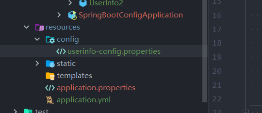

### SpringBoot之读取配置的几种方式

#### 读取application文件

在application.yml或者properties文件中添加：

```yaml
userinfo:
  name: yy
  address: china
  age: 20
```

- @Value

    ```java
    package spring.boot.entity;
    
    import org.springframework.beans.factory.annotation.Value;
    import org.springframework.stereotype.Component;
    
    /**
     * @author yangjian
     * @date 2022/11/22 18:30
     */
    
    @Component
    public class UserInfo {
    
        @Value("${userInfo.name}")
        private String name;
        @Value("${userInfo.address}")
        private String address;
        @Value("${userInfo.age}")
        private int age;
    
        public String getName() {
            return name;
        }
    
        public void setName(String name) {
            this.name = name;
        }
    
        public String getAddress() {
            return address;
        }
    
        public void setAddress(String address) {
            this.address = address;
        }
    
        public int getAge() {
            return age;
        }
    
        public void setAge(int age) {
            this.age = age;
        }
    }
    
    
    ```
    
    
    
- @ConfigurationProperties注解读取方式

    ```java
    package spring.boot.entity;
    
    import org.springframework.boot.context.properties.ConfigurationProperties;
    import org.springframework.stereotype.Component;
    
    /**
     * @author yangjian
     * @date 2022/11/22 18:30
     */
    
    @Component
    @ConfigurationProperties(prefix = "userinfo")
    public class UserInfo1 {
    
    
        private String name;
        private String address;
        private int age;
    
        public String getName() {
            return name;
        }
    
        public void setName(String name) {
            this.name = name;
        }
    
        public String getAddress() {
            return address;
        }
    
        public void setAddress(String address) {
            this.address = address;
        }
    
        public int getAge() {
            return age;
        }
    
        public void setAge(int age) {
            this.age = age;
        }
    }
    
    ```

    

- @PropertySource+@Value注解读取方式

    资源目录下创建config/userinfo-config.properties

    

    ```java
    package spring.boot.entity;
    
    import org.springframework.beans.factory.annotation.Value;
    import org.springframework.context.annotation.PropertySource;
    import org.springframework.stereotype.Component;
    
    /**
     * @author yangjian
     * @date 2022/11/22 18:30
     */
    
    @Component
    @PropertySource(value = {"config/userinfo-config.properties"})
    public class UserInfo2 {
    
        @Value("${userinfo.name}")
        private String name;
        @Value("${userinfo.address}")
        private String address;
        @Value("${userinfo.age}")
        private int age;
    
        public String getName() {
            return name;
        }
    
        public void setName(String name) {
            this.name = name;
        }
    
        public String getAddress() {
            return address;
        }
    
        public void setAddress(String address) {
            this.address = address;
        }
    
        public int getAge() {
            return age;
        }
    
        public void setAge(int age) {
            this.age = age;
        }
    }
    
    ```

    

- Environment读取方式

    ```java
      @Autowired
      private Environment env;
      
       @GetMapping("/user/userInfo3")
        public  Map<String, Object>  getUserInfo3(){
            Map<String, Object> map = new HashMap<String, Object>();
            map.put("name", env.getProperty("userinfo.name"));
            map.put("address", env.getProperty("userinfo.address"));
            map.put("age", env.getProperty("userinfo.age"));
            return map;
        }
    ```

    

- controller整体代码

    ```java
    package spring.boot.controller;
    
    import org.springframework.beans.factory.annotation.Autowired;
    import org.springframework.core.env.Environment;
    import org.springframework.web.bind.annotation.GetMapping;
    import org.springframework.web.bind.annotation.RestController;
    import spring.boot.entity.UserInfo;
    import spring.boot.entity.UserInfo1;
    import spring.boot.entity.UserInfo2;
    
    import java.util.HashMap;
    import java.util.Map;
    
    /**
     * @author yangjian
     * @date 2022/11/22 18:36
     */
    @RestController
    public class UserInfoController {
        @Autowired
        UserInfo userInfo;
    
        @Autowired
        UserInfo1 userInfo1;
    
        @Autowired
        UserInfo2 userInfo2;
    
        @Autowired
        private Environment env;
    
        @GetMapping("/user/userInfo")
        public UserInfo getUserInfo(){
            return userInfo;
        }
    
        @GetMapping("/user/userInfo1")
        public UserInfo1 getUserInfo1(){
            return userInfo1;
        }
    
    
        @GetMapping("/user/userInfo2")
        public UserInfo2 getUserInfo2(){
            return userInfo2;
        }
    
        @GetMapping("/user/userInfo3")
        public  Map<String, Object>  getUserInfo3(){
            Map<String, Object> map = new HashMap<String, Object>();
            map.put("name", env.getProperty("userinfo.name"));
            map.put("address", env.getProperty("userinfo.address"));
            map.put("age", env.getProperty("userinfo.age"));
            return map;
        }
    }
    
    ```

    

- @Value获取值和@ConfigurationProperties获取值比较

    |                      | @ConfigurationProperties | @Value     |
    | -------------------- | ------------------------ | ---------- |
    | 功能                 | 批量注入配置文件中的属性 | 一个个指定 |
    | 松散绑定（松散语法） | 支持                     | 不支持     |
    | SpEL                 | 不支持                   | 支持       |
    | JSR303数据校验       | 支持                     | 不支持     |
    | 复杂类型封装         | 支持                     | 不支持     |

    配置文件yml还是properties他们都能获取到值；
    如果说，我们只是在某个业务逻辑中需要获取一下配置文件中的某项值，使用@Value；
    如果说，我们专门编写了一个javaBean来和配置文件进行映射，我们就直接使用@ConfigurationProperties；

- x

- x