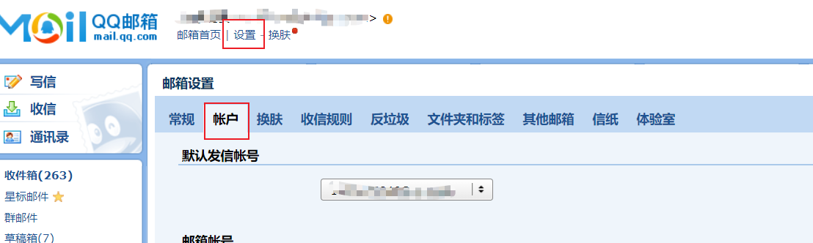
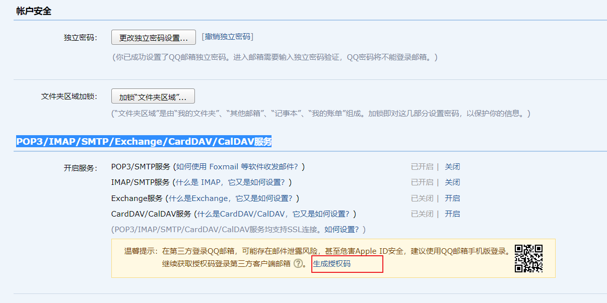
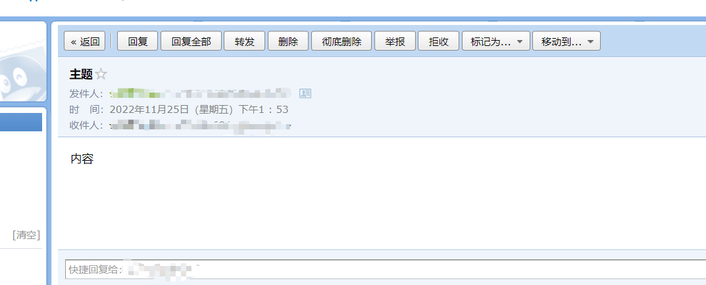
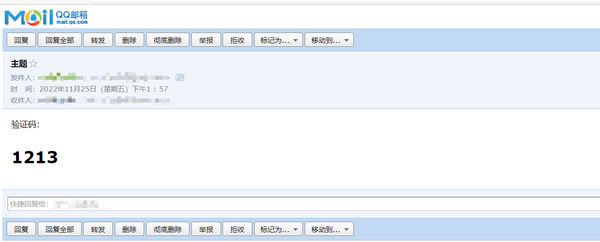
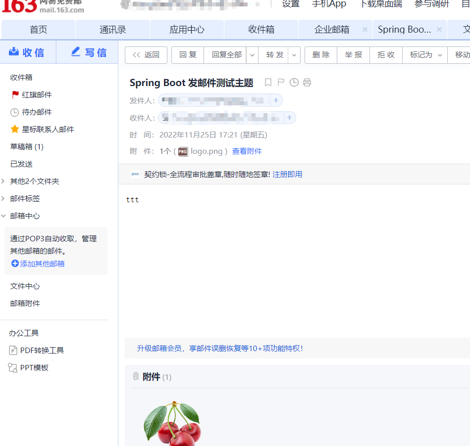

### SpringBoot之邮件发送

Spring Boot 提供了一个发送邮件的简单抽象，使用的是下面这个接口。

```
org.springframework.mail.javamail.JavaMailSender
```


邮箱开启

设置-账户-POP3/IMAP/SMTP/Exchange/CardDAV/CalDAV服务

SMTP（Simple Mail Transfer Protocol）：简单邮件传输协议，用于发送电子邮件的传输协议

POP3（Post Office Protocol - Version 3）：用于接收电子邮件的标准协议

IMAP（Internet Mail Access Protocol）：互联网消息协议，是POP3的替代协议





#### 代码实现

1. 引入依赖

    ```
    <dependency>
        <groupId>org.springframework.boot</groupId>
        <artifactId>spring-boot-starter-mail</artifactId>
    </dependency>
    ```

    

2. yml配置

    ```
    spring:
      mail:
        host: smtp.qq.com # host地址（可以在你的邮箱设置里找到）
        username: 11@qq.com #邮箱地址，对应host的主机
        password: evotmsxxxefmyriiaj  #授权码
    ```

    

3. 测试发送

    ```java
    package spring.boot;
    
    import org.junit.jupiter.api.Test;
    import org.springframework.boot.test.context.SpringBootTest;
    import org.springframework.mail.SimpleMailMessage;
    import org.springframework.mail.javamail.JavaMailSender;
    import org.springframework.mail.javamail.MimeMessageHelper;
    
    import javax.annotation.Resource;
    import javax.mail.internet.MimeMessage;
    
    @SpringBootTest
    class SpringBootEmailApplicationTests {
    
        @Test
        void contextLoads() {
        }
    
        @Resource
        private JavaMailSender javaMailSender;
    
        /**
         * 普通文本内容
         * @return
         */
        @Test
        public void sendSimpleMail() throws Exception {
    
            SimpleMailMessage message = new SimpleMailMessage();
            message.setFrom("11@qq.com");
            message.setTo("11@qq.com");
            message.setSubject("主题");
            message.setText("内容");
    
            javaMailSender.send(message);
        }
    
        /**
         * html内容
         * @return
         */
        @Test
        public void sendInlineMail() throws Exception {
    
            MimeMessage mimeMessage = javaMailSender.createMimeMessage();
    
            MimeMessageHelper helper = new MimeMessageHelper(mimeMessage, true);
            helper.setFrom("11@qq.com");
            helper.setTo("11@qq.com");
            helper.setSubject("主题");
            helper.setText("<html><body>验证码：<h1>1213</h1></body></html>", true);
            javaMailSender.send(mimeMessage);
        }
    
    
    }
    
    ```

    

4. 测试结果

    

    

    

5. x

#### qq邮箱发送163

1. 依赖

    ```xml
    <?xml version="1.0" encoding="UTF-8"?>
    <project xmlns="http://maven.apache.org/POM/4.0.0" xmlns:xsi="http://www.w3.org/2001/XMLSchema-instance"
             xsi:schemaLocation="http://maven.apache.org/POM/4.0.0 https://maven.apache.org/xsd/maven-4.0.0.xsd">
        <modelVersion>4.0.0</modelVersion>
        <parent>
            <groupId>org.springframework.boot</groupId>
            <artifactId>spring-boot-starter-parent</artifactId>
            <version>2.7.5</version>
            <relativePath/> <!-- lookup parent from repository -->
        </parent>
        <groupId>spring.boot</groupId>
        <artifactId>spring-boot-email</artifactId>
        <version>0.0.1-SNAPSHOT</version>
        <name>spring-boot-email</name>
        <description>Demo project for Spring Boot</description>
        <properties>
            <java.version>1.8</java.version>
        </properties>
        <dependencies>
            <dependency>
                <groupId>org.springframework.boot</groupId>
                <artifactId>spring-boot-starter-web</artifactId>
            </dependency>
    
            <dependency>
                <groupId>org.springframework.boot</groupId>
                <artifactId>spring-boot-configuration-processor</artifactId>
            </dependency>
    
            <dependency>
                <groupId>org.springframework.boot</groupId>
                <artifactId>spring-boot-starter-mail</artifactId>
            </dependency>
    
            <dependency>
                <groupId>org.projectlombok</groupId>
                <artifactId>lombok</artifactId>
                <optional>true</optional>
            </dependency>
            <dependency>
                <groupId>org.springframework.boot</groupId>
                <artifactId>spring-boot-starter-test</artifactId>
                <scope>test</scope>
            </dependency>
        </dependencies>
    
        <build>
            <plugins>
                <plugin>
                    <groupId>org.springframework.boot</groupId>
                    <artifactId>spring-boot-maven-plugin</artifactId>
                    <configuration>
                        <excludes>
                            <exclude>
                                <groupId>org.projectlombok</groupId>
                                <artifactId>lombok</artifactId>
                            </exclude>
                        </excludes>
                    </configuration>
                </plugin>
            </plugins>
        </build>
    
    </project>
    
    ```

    

2. yml

    ```yaml
    
    
    spring:
      mail:
        host: smtp.qq.com # smtp.qq.com  host地址（可以在你的邮箱设置里找到）
        username: 1111@qq.com #邮箱地址，对应host的主机
        password: fimquffeznbhhdab #授权码
        properties:
          "[mail.smtp.socketFactory.class]": javax.net.ssl.SSLSocketFactory
          "[mail.smtp.socketFactory.fallback]": false
          "[mail.smtp.socketFactory.port]": 465
          "[mail.smtp.connectiontimeout]": 5000
          "[mail.smtp.timeout]": 3000
          "[mail.smtp.writetimeout]": 5000
    
    mail:
      from: 1111@qq.com
      personal: 木白
      bcc: 2222@qq.com
      subject: Spring Boot 发邮件测试主题
    ```

    

3. 代码

    ```java
    package spring.boot.mail;
    
    import lombok.Data;
    import org.springframework.boot.context.properties.ConfigurationProperties;
    
    /**
     * @ConfigurationProperties(prefix = "mail") 报错：Not registered via @EnableConfigurationProperties, marked as Spring component, or scanned via @Confi
     * 解决方法一：@Component
     * 解决方法二：@EnableConfigurationProperties({MailProperties.class})
     * @author yangjian
     * @date 2022/11/25 16:32
     */
    
    @Data
    @ConfigurationProperties(prefix = "mail")
    public class MailProperties {
    
        /**
         * 发件人
         */
        private String from;
    
        /**
         * 发件人昵称
         */
        private String personal;
    
        /**
         * 抄送人
         */
        private String bcc;
    
        /**
         * 主题
         */
        private String subject;
    
    }
    
    ```

    ```java
    package spring.boot.controller;
    
    import lombok.RequiredArgsConstructor;
    import lombok.extern.slf4j.Slf4j;
    import org.springframework.core.io.ClassPathResource;
    import org.springframework.mail.SimpleMailMessage;
    import org.springframework.mail.javamail.JavaMailSender;
    import org.springframework.mail.javamail.MimeMessageHelper;
    import org.springframework.web.bind.annotation.RequestMapping;
    import org.springframework.web.bind.annotation.RequestParam;
    import org.springframework.web.bind.annotation.ResponseBody;
    import org.springframework.web.bind.annotation.RestController;
    import spring.boot.mail.MailProperties;
    
    import javax.mail.MessagingException;
    import javax.mail.internet.MimeMessage;
    import java.io.File;
    import java.io.IOException;
    import java.io.UnsupportedEncodingException;
    
    /**
     * @author yangjian
     * @date 2022/11/25 14:26
     */
    
    @Slf4j
    @RequiredArgsConstructor
    @RestController
    public class EmailController {
    
        private final JavaMailSender javaMailSender;
    
        private final MailProperties mailProperties;
    
        @RequestMapping("/sendEmail")
        @ResponseBody
        public boolean sendEmail(@RequestParam("email") String email,
                                 @RequestParam("text") String text) {
            try {
                log.info("email==="+email);
                log.info("text==="+text);
                MimeMessage msg = createMimeMsg(email, text, "logo.png");
                javaMailSender.send(msg);
            } catch (Exception ex) {
                log.error("邮件发送失败：", ex);
                return false;
            }
            return true;
        }
        @RequestMapping("/sendEmail1")
        @ResponseBody
        public boolean sendEmail1(@RequestParam("email") String email,
                                 @RequestParam("text") String text) {
            try {
                log.info("email{}",email);
                log.info("tex{}",text);
                SimpleMailMessage msg = createSimpleMsg(email, text);
                javaMailSender.send(msg);
            } catch (Exception ex) {
                log.error("邮件发送失败：", ex);
                return false;
            }
            return true;
        }
    
        /**
         * 创建复杂邮件
         *
         * @param email
         * @param text
         * @param attachmentClassPath
         * @return
         * @throws MessagingException
         * @throws UnsupportedEncodingException
         */
        private MimeMessage createMimeMsg(String email, String text, String attachmentClassPath) throws MessagingException, IOException {
            MimeMessage msg = javaMailSender.createMimeMessage();
            MimeMessageHelper mimeMessageHelper = new MimeMessageHelper(msg, true);
            mimeMessageHelper.setFrom(mailProperties.getFrom(), mailProperties.getPersonal());
            mimeMessageHelper.setTo(email);
            mimeMessageHelper.setBcc(mailProperties.getBcc());
            mimeMessageHelper.setSubject(mailProperties.getSubject());
            mimeMessageHelper.setText(text);
            // 第一个参数是自定义的名称，后缀需要加上，第二个参数是文件的位置
            //mimeMessageHelper.addAttachment("资料.xlsx",new File("/Users/gamedev/Desktop/测试数据 2.xlsx"));
            //ClassPathResource 读取项目resource下的文件
            File file = new ClassPathResource(attachmentClassPath).getFile();
            log.info("filename{}",file.getName());
            mimeMessageHelper.addAttachment(file.getName(), file);
            return msg;
        }
    
        /**
         * 创建简单邮件
         *
         * @param email
         * @param text
         * @return
         */
        private SimpleMailMessage createSimpleMsg(String email, String text) {
            SimpleMailMessage msg = new SimpleMailMessage();
            log.info("from==="+mailProperties.getFrom());
            log.info("to==="+email);
            log.info("setBcc==="+mailProperties.getBcc());
            log.info("setSubject==="+mailProperties.getSubject());
            log.info("text==="+text);
            msg.setFrom(mailProperties.getFrom());
            msg.setTo(email);
            msg.setBcc(mailProperties.getBcc());
            msg.setSubject(mailProperties.getSubject());
            msg.setText(text);
            return msg;
        }
    }
    
    ```

    ```java
    package spring.boot;
    
    import org.springframework.boot.SpringApplication;
    import org.springframework.boot.autoconfigure.SpringBootApplication;
    import org.springframework.boot.context.properties.EnableConfigurationProperties;
    import spring.boot.mail.MailProperties;
    
    @EnableConfigurationProperties({MailProperties.class})
    @SpringBootApplication
    public class SpringBootEmailApplication {
    
        public static void main(String[] args) {
            SpringApplication.run(SpringBootEmailApplication.class, args);
        }
    
    }
    
    ```

    

4. 测试

    

5. 
