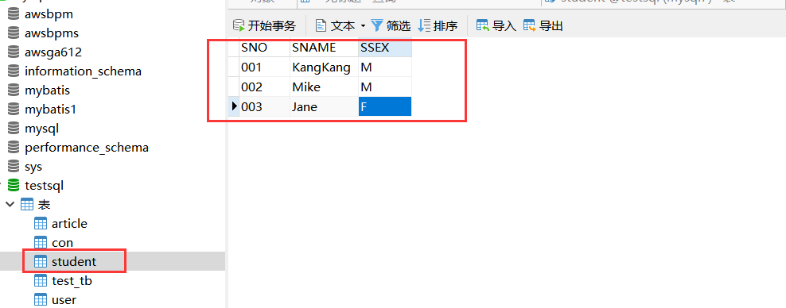
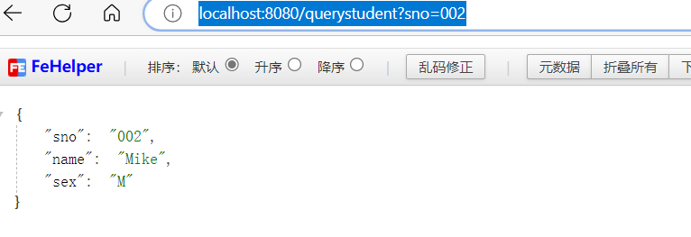
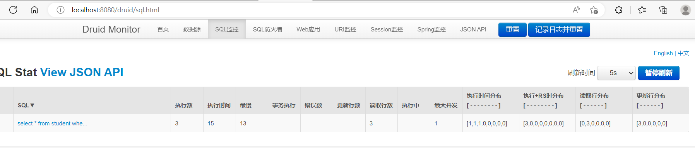

### SpringBoot之集成 Mybatis 

- 引入依赖

    ```xml
    	<!-- https://mvnrepository.com/artifact/org.mybatis.spring.boot/mybatis-spring-boot-starter -->
        <dependency>
        <groupId>org.mybatis.spring.boot</groupId>
        <artifactId>mybatis-spring-boot-starter</artifactId>
        <version>2.2.2</version>
        </dependency>
    ```

    不同版本的Spring Boot和MyBatis版本对应不一样，具体可查看官方文档：http://www.mybatis.org/spring-boot-starter/mybatis-spring-boot-autoconfigure/

    接着引入

    ```xml
    <!--mysql-->
    <dependency>
        <groupId>mysql</groupId>
        <artifactId>mysql-connector-java</artifactId>
        <scope>runtime</scope>
    </dependency>
    ```

    Druid数据源

    Druid是一个关系型数据库连接池，是阿里巴巴的一个开源项目，地址：https://github.com/alibaba/druid。Druid不但提供连接池的功能，还提供监控功能，可以实时查看数据库连接池和SQL查询的工作情况。

    引入依赖

    ```xml
    <!-- Druid自动装配 -->
    <dependency>
        <groupId>com.alibaba</groupId>
        <artifactId>druid-spring-boot-starter</artifactId>
        <version>1.1.21</version>
    </dependency>
    ```

- application.yml

    ```
    
    
    spring:
      datasource:
        type: com.alibaba.druid.pool.DruidDataSource
        druid:
          driverClassName: com.mysql.cj.jdbc.Driver
          url: jdbc:mysql://localhost:3308/testsql?useUnicode=true&characterEncoding=utf-8
          username: root
          password: 123456
          initial-size: 10
          # 最大连接池个数
          max-active: 100
          # 最小连接池个数——》已经不再使用，配置了也没效果
          min-idle: 10
          # 配置获取连接等待超时的时间，单位毫秒，缺省启用公平锁，并发效率会有所下降
          max-wait: 60000
          # 打开PSCache，并且指定每个连接上PSCache的大小
          pool-prepared-statements: true
          max-pool-prepared-statement-per-connection-size: 20
          time-between-eviction-runs-millis: 60000
          min-evictable-idle-time-millis: 300000
          #max-evictable-idle-time-millis: 60000
          validation-query: SELECT 1 FROM DUAL
          # validation-query-timeout: 5000
          # 申请连接时执行validationQuery检测连接是否有效，做了这个配置会降低性能
          test-on-borrow: false
          # 归还连接时执行validationQuery检测连接是否有效，做了这个配置会降低性能
          test-on-return: false
          # 建议配置为true，不影响性能，并且保证安全性。
          # 申请连接的时候检测，如果空闲时间大于timeBetweenEvictionRunsMillis，执行validationQuery检测连接是否有效。
          test-while-idle: true
          # 通过connectProperties属性来打开mergeSql功能；慢SQL记录
          connectionProperties: druid.stat.mergeSql=true;druid.stat.slowSqlMillis=5000
          # 通过别名的方式配置扩展插件，多个英文逗号分隔，常用的插件有：
          # 监控统计用的filter:stat
          # 日志用的filter:log4j
          #filters: #配置多个英文逗号分隔(统计，sql注入，log4j过滤) 防御sql注入的filter:wall
          filters: stat,wall
          stat-view-servlet:
            enabled: true
            url-pattern: /druid/*
            # 需要账号密码才能访问控制台
            login-username: druid
            login-password: druid123
    
    ```

    ```yaml
    server:
      context-path: /web
    
    spring:
      datasource:
        druid:
          # 数据库访问配置, 使用druid数据源
          type: com.alibaba.druid.pool.DruidDataSource
          driver-class-name: oracle.jdbc.driver.OracleDriver
          url: jdbc:oracle:thin:@localhost:1521:ORCL
          username: scott
          password: 123456
          # 连接池配置
          initial-size: 5
          min-idle: 5
          max-active: 20
          # 连接等待超时时间
          max-wait: 30000
          # 配置检测可以关闭的空闲连接间隔时间
          time-between-eviction-runs-millis: 60000
          # 配置连接在池中的最小生存时间
          min-evictable-idle-time-millis: 300000
          validation-query: select '1' from dual
          test-while-idle: true
          test-on-borrow: false
          test-on-return: false
          # 打开PSCache，并且指定每个连接上PSCache的大小
          pool-prepared-statements: true
          max-open-prepared-statements: 20
          max-pool-prepared-statement-per-connection-size: 20
          # 配置监控统计拦截的filters, 去掉后监控界面sql无法统计, 'wall'用于防火墙
          filters: stat,wall
          # Spring监控AOP切入点，如x.y.z.service.*,配置多个英文逗号分隔
          aop-patterns: com.springboot.servie.*
          
        
          # WebStatFilter配置
          web-stat-filter:
            enabled: true
            # 添加过滤规则
            url-pattern: /*
            # 忽略过滤的格式
            exclusions: '*.js,*.gif,*.jpg,*.png,*.css,*.ico,/druid/*'
          
          # StatViewServlet配置 
          stat-view-servlet:
            enabled: true
            # 访问路径为/druid时，跳转到StatViewServlet
            url-pattern: /druid/*
            # 是否能够重置数据
            reset-enable: false
            # 需要账号密码才能访问控制台
            login-username: druid
            login-password: druid123
            # IP白名单
            # allow: 127.0.0.1
            #　IP黑名单（共同存在时，deny优先于allow）
            # deny: 192.168.1.218
          
          # 配置StatFilter
          filter: 
            stat: 
              log-slow-sql: true
    ```

    上述配置不但配置了Druid作为连接池，而且还开启了Druid的监控功能。 其他配置可参考官方wiki——https://github.com/alibaba/druid/tree/master/druid-spring-boot-starter

    此时，运行项目，访问http://localhost:8080/web/druid：

- 创建测试数据表

    

- 代码

    ```
    package spring.boot.entity;
    
    import lombok.*;
    
    import java.io.Serializable;
    
    /**
     * @author yangjian
     * @date 2022/12/6 18:58
     */
    @Data
    @NoArgsConstructor
    @AllArgsConstructor
    @Getter
    @Setter
    public class Student implements Serializable {
        private static final long serialVersionUID = -6819329604028408964L;
        private String sno;
        private String name;
        private String sex;
    }
    ```

    ```
    package spring.boot.mapper;
    
    import org.apache.ibatis.annotations.*;
    import org.springframework.stereotype.Component;
    import spring.boot.entity.Student;
    
    /**
     * @author yangjian
     * @date 2022/12/6 19:00
     */
    @Component
    @Mapper
    public interface StudentMapper {
        @Insert("insert into student(sno,sname,ssex) values(#{sno},#{name},#{sex})")
        int add(Student student);
    
        @Update("update student set sname=#{name},ssex=#{sex} where sno=#{sno}")
        int update(Student student);
    
        @Delete("delete from student where sno=#{sno}")
        int deleteBysno(String sno);
    
        @Select("select * from student where sno=#{sno}")
        @Results(id = "student", value = {
                @Result(property = "sno", column = "sno", javaType = String.class),
                @Result(property = "name", column = "sname", javaType = String.class),
                @Result(property = "sex", column = "ssex", javaType = String.class)
        })
        Student queryStudentBySno(String sno);
    }
    ```

    ```
    package spring.boot.service;
    
    import spring.boot.entity.Student;
    
    /**
     * @author yangjian
     * @date 2022/12/6 19:01
     */
    public interface StudentService {
        int add(Student student);
        int update(Student student);
        int deleteBysno(String sno);
        Student queryStudentBySno(String sno);
    }
    ```

    ```
    package spring.boot.service.impl;
    
    import org.springframework.beans.factory.annotation.Autowired;
    import org.springframework.stereotype.Service;
    import spring.boot.entity.Student;
    import spring.boot.mapper.StudentMapper;
    import spring.boot.service.StudentService;
    
    /**
     * @author yangjian
     * @date 2022/12/6 19:02
     */
    @Service("studentService")
    public class StudentServiceImp implements StudentService {
        @Autowired
        private StudentMapper studentMapper;
    
        @Override
        public int add(Student student) {
            return this.studentMapper.add(student);
        }
    
        @Override
        public int update(Student student) {
            return this.studentMapper.update(student);
        }
    
        @Override
        public int deleteBysno(String sno) {
            return this.studentMapper.deleteBysno(sno);
        }
    
        @Override
        public Student queryStudentBySno(String sno) {
            return this.studentMapper.queryStudentBySno(sno);
        }
    }
    ```

    ```
    package spring.boot.controller;
    
    import org.springframework.beans.factory.annotation.Autowired;
    import org.springframework.web.bind.annotation.RequestMapping;
    import org.springframework.web.bind.annotation.RequestMethod;
    import org.springframework.web.bind.annotation.RestController;
    import spring.boot.entity.Student;
    import spring.boot.service.StudentService;
    
    /**
     * @author yangjian
     * @date 2022/12/6 19:03
     */
    @RestController
    public class TestController {
    
        @Autowired
        private StudentService studentService;
    
        @RequestMapping( value = "/querystudent", method = RequestMethod.GET)
        public Student queryStudentBySno(String sno) {
            return this.studentService.queryStudentBySno(sno);
        }
    }
    ```

- 测试

    > http://localhost:8080/querystudent?sno=002

    

    

- x

- x

- x