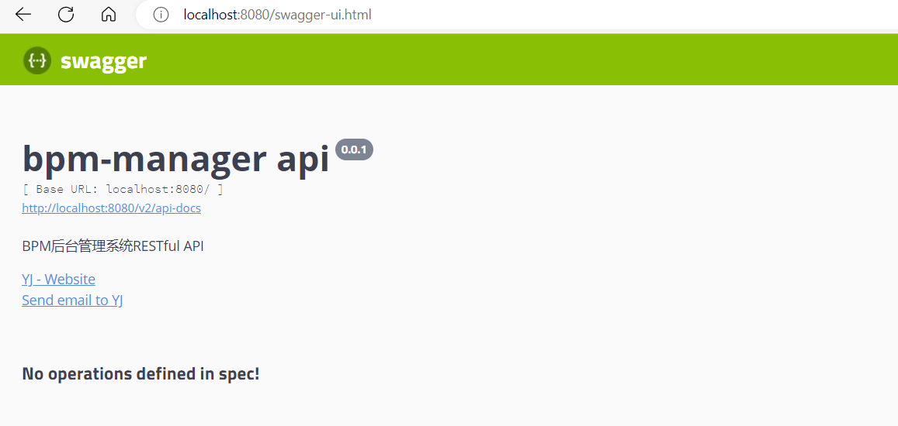

### SpringBoot之集成 Swagger

#### swagger2.9.2

1. 添加依赖

    springboot版本2.6及之上

    ```xml
    		<!-- https://mvnrepository.com/artifact/io.springfox/springfox-swagger-ui -->
            <dependency>
                <groupId>io.springfox</groupId>
                <artifactId>springfox-swagger-ui</artifactId>
                <version>2.9.2</version>
            </dependency>
            <!-- https://mvnrepository.com/artifact/io.springfox/springfox-swagger2 -->
            <dependency>
                <groupId>io.springfox</groupId>
                <artifactId>springfox-swagger2</artifactId>
                <version>2.9.2</version>
            </dependency>
    
    ```

    ```yaml
    #在springboot2.6之上中将SpringMVC 默认路径匹配策略从AntPathMatcher 更改为PathPatternParser，导致出错，解决办法是切换回原先的AntPathMatcher。
    spring:
      mvc:
        pathmatch:
          matching-strategy: ant_path_matcher
    
    ```

    springboot版本2.6以下

    ```xml
    	<!-- https://mvnrepository.com/artifact/io.springfox/springfox-swagger-ui -->
            <dependency>
                <groupId>io.springfox</groupId>
                <artifactId>springfox-swagger-ui</artifactId>
                <version>2.9.2</version>
            </dependency>
            <!-- https://mvnrepository.com/artifact/io.springfox/springfox-swagger2 -->
            <dependency>
                <groupId>io.springfox</groupId>
                <artifactId>springfox-swagger2</artifactId>
                <version>2.9.2</version>
            </dependency>
    ```

    ```java
    package spring.boot.config;
    
    import org.springframework.context.annotation.Bean;
    import org.springframework.context.annotation.Configuration;
    import springfox.documentation.builders.ApiInfoBuilder;
    import springfox.documentation.builders.PathSelectors;
    import springfox.documentation.builders.RequestHandlerSelectors;
    import springfox.documentation.service.ApiInfo;
    import springfox.documentation.service.Contact;
    import springfox.documentation.spi.DocumentationType;
    import springfox.documentation.spring.web.plugins.Docket;
    import springfox.documentation.swagger2.annotations.EnableSwagger2;
    
    /**
     * @author yangjian
     * @date 2022/11/24 21:03
     */
    @Configuration
    @EnableSwagger2
    public class SwaggerConfig {
        @Bean
        public Docket createRestApi() {
            return new Docket(DocumentationType.SWAGGER_2)
                    .apiInfo(apiInfo())
                    .select()
                    .apis(RequestHandlerSelectors.basePackage("spring.boot.controller"))
                    .paths(PathSelectors.any())
                    .build();
        }
    
        private ApiInfo apiInfo() {
            return new ApiInfoBuilder()
                    .title("bpm-manager api")
                    .description("BPM后台管理系统RESTful API")
                    .contact(contact())
                    .version("0.0.1")
                    .build();
        }
    
        private Contact contact() {
            return new Contact("YJ", "*****", "YJ@*****.com");
        }
    }
    
    ```

    ```java
    package spring.boot.pojo;
    
    import io.swagger.annotations.ApiModel;
    import io.swagger.annotations.ApiModelProperty;
    import lombok.AllArgsConstructor;
    import lombok.Data;
    import lombok.NoArgsConstructor;
    
    /**
     * @author yangjian
     * @date 2022/11/24 21:04
     */
    @Data
    @NoArgsConstructor
    @AllArgsConstructor
    @ApiModel(value = "员工实体类")
    public class Employee {
    
        @ApiModelProperty(value = "域账号")
        private String account;
    
        @ApiModelProperty(value = "密码，即yyyymmdd格式生日")
        private String password;
    
        @ApiModelProperty(value = "姓")
        private String familyName;
    
        @ApiModelProperty(value = "名")
        private String firstName;
    
        @ApiModelProperty(value = "获取用户全名")
        public String getFullName() {
            return familyName + firstName;
        }
    
        public String getAccount() {
            return account;
        }
    
        public void setAccount(String account) {
            this.account = account;
        }
    
        public String getPassword() {
            return password;
        }
    
        public void setPassword(String password) {
            this.password = password;
        }
    
        public String getFamilyName() {
            return familyName;
        }
    
        public void setFamilyName(String familyName) {
            this.familyName = familyName;
        }
    
        public String getFirstName() {
            return firstName;
        }
    
        public void setFirstName(String firstName) {
            this.firstName = firstName;
        }
    }
    ```

    ```java
    package spring.boot.controller;
    
    import io.swagger.annotations.Api;
    import io.swagger.annotations.ApiOperation;
    import org.springframework.beans.factory.annotation.Autowired;
    import org.springframework.web.bind.annotation.GetMapping;
    import org.springframework.web.bind.annotation.RequestMapping;
    import org.springframework.web.bind.annotation.RestController;
    import spring.boot.pojo.Employee;
    import spring.boot.service.EmployeeService;
    
    import java.util.ArrayList;
    import java.util.List;
    
    /**
     * @author yangjian
     * @date 2022/11/24 21:05
     */
    @RestController
    @RequestMapping("employee")
    @Api(value = "员工接口表")
    public class EmployeeController {
        @Autowired
        private EmployeeService employeeService;
    
        /**
         * 获取员工实体类集合
         * @return
         */
        @GetMapping
        @ApiOperation(value = "获取员工数据", notes = "返回类型为List")
        public List<Employee> getFormCounters() {
            List<Employee> employeeList = new ArrayList<>();
            employeeList.add(new Employee("zhangsan","20220101","张","三"));
            return employeeList;
        }
    
    
    }
    
    ```

    

2. 注解

    | 注解名称           | 使用说明               |
    | :----------------- | :--------------------- |
    | @Api               | 描述一个 API 类        |
    | @ApiImplicitParam  | 描述一个请求参数       |
    | @ApiImplicitParams | 描述一组请求参数       |
    | @ApiModel          | 描述一个返回的对象     |
    | @ApiModelProperty  | 描述一个返回的对象参数 |
    | @ApiOperation      | 描述一个 API 方法      |
    | @ApiParam          | 描述一个方法的参数     |
    | @ApiResponse       | 描述一个请求响应       |
    | @ApiResponses      | 描述一组请求响应       |

    ```
    //在Controller层的应用:
    //1.在类上应用的注解:
    @Api(tags = "这是一个控制器类")
    //2.在具体请求方法上的注解:
    @ApiOperation(value = "功能总述" , notes = "具体描述")
    @ApiParam(value = "请求参数说明")
    
    //在POJO层的应用:
    //1.在类上应用的注解:
    @ApiModel(description = "XX实体类")
    //2.在实体类属性上应用的注解:
    @ApiModelProperty(value = "属性说明")
    
    ```

    

3. 访问

    ```
    Swagger版本为2.9.2：
    直接访问：localhost:8080/swagger-ui.html
    
    
    ```

    

4. x

#### swagger3.0

1. 添加依赖

    ```xml
    		<!--swagger3.0.0-->
            <dependency>
                <groupId>io.springfox</groupId>
                <artifactId>springfox-boot-starter</artifactId>
                <version>3.0.0</version>
            </dependency>
    
    ```

    application.yml

    ```
    #在springboot2.6之上中将SpringMVC 默认路径匹配策略从AntPathMatcher 更改为PathPatternParser，导致出错，解决办法是切换回原先的AntPathMatcher。
    spring:
      mvc:
        pathmatch:
          matching-strategy: ant_path_matcher
    ```

    

2. 暴露接口

    如果pom中还引用了spring-boot-starter-web，一定要在配置类上增加@EnableWebMvc注解。

    @EnableOpenApi是Swagger3.0的注解，默认已经开启，可选。

    文档类型选择OAS_30，表示用swagger3.0。

    通过enable参数配置来控制swagger的开关，在生产环境中，swagger功能不需要开启。

    ```java
    package spring.boot.config;
    
    import org.springframework.context.annotation.Bean;
    import org.springframework.context.annotation.Configuration;
    import org.springframework.web.servlet.config.annotation.EnableWebMvc;
    import springfox.documentation.builders.ApiInfoBuilder;
    import springfox.documentation.builders.PathSelectors;
    import springfox.documentation.builders.RequestHandlerSelectors;
    import springfox.documentation.oas.annotations.EnableOpenApi;
    import springfox.documentation.service.ApiInfo;
    import springfox.documentation.service.Contact;
    import springfox.documentation.spi.DocumentationType;
    import springfox.documentation.spring.web.plugins.Docket;
    
    /**
     * 如果pom中还引用了spring-boot-starter-web，一定要在配置类上增加@EnableWebMvc注解。
     *
     *  @EnableOpenApi是Swagger3.0的注解，默认已经开启，可选。
     * 文档类型选择OAS_30，表示用swagger3.0。
     *
     * 通过enable参数配置来控制swagger的开关，在生产环境中，swagger功能不需要开启。
     * @author yangjian
     * @date 2022/11/24 21:51
     */
    @Configuration
    @EnableOpenApi
    @EnableWebMvc // spring-boot-starter-web冲突会引发启动服务时null，必选
    public class SwaggerConfig {
        /**
         * 创建API应用
         * apiInfo() 增加API相关信息
         * 通过select()函数返回一个ApiSelectorBuilder实例,用来控制哪些接口暴露给Swagger来展现，
         * 本例采用指定扫描的包路径来定义指定要建立API的目录。
         *
         * @return
         */
        @Bean
        public Docket desertsApi1() {
            return new Docket(DocumentationType.OAS_30)
                    .apiInfo(apiInfo("测试——Swagger3.0", "1.0"))
                    .select()
                    .apis(RequestHandlerSelectors.basePackage("spring.boot.controller"))
                    .paths(PathSelectors.any())
                    .build()
                    .groupName("人员信息")
                    .enable(true);
        }
    
        //再定义一个Docket
        @Bean
        public Docket desertsApi2() {
            return new Docket(DocumentationType.OAS_30)
                    .apiInfo(apiInfo("测试——Swagger3.0", "1.0"))
                    .select()
                    .apis(RequestHandlerSelectors.basePackage("spring.boot.controller"))
                    .paths(PathSelectors.any())
                    .build()
                    .groupName("登录")
                    .enable(true);
        }
    
        /**
         * 创建该API的基本信息（这些基本信息会展现在文档页面中）
         * 访问地址：http://ip:port/swagger-ui.html
         *
         * @return
         */
        private ApiInfo apiInfo(String title, String version) {
            return new ApiInfoBuilder()
                    .title(title)
                    .description("接口测试页面")
                    .contact(new Contact("GMS", "http://localhost:8080/swagger-ui/index.html", "1457205312@qq.com"))
                    .termsOfServiceUrl("http://localhost:8080/index.html")
                    .version(version)
                    .build();
        }
    }
    
    ```

    一个Docket就是一个definition，表示哪几个接口暴露给Swagger页面，apis指定包路径时到controller层即可。
    enable代表是否启用这个分组，为false表示该定义暂不生效。

    

    ApiInfo是对Swagger页面一些提示信息的说明，包含一些跳转链接。

    

3. Controller

    ```java
    package spring.boot.controller;
    
    import io.swagger.annotations.Api;
    import io.swagger.annotations.ApiOperation;
    import org.springframework.beans.factory.annotation.Autowired;
    import org.springframework.web.bind.annotation.GetMapping;
    import org.springframework.web.bind.annotation.RequestMapping;
    import org.springframework.web.bind.annotation.RestController;
    import spring.boot.pojo.User;
    import spring.boot.service.UserService;
    import spring.boot.util.ResultUtil;
    
    import java.util.ArrayList;
    import java.util.List;
    
    /**
     * @author yangjian
     * @date 2022/11/24 22:00
     */
    @RestController
    @RequestMapping("/user")
    //定义swagger页面信息
    @Api(tags = "人员信息查询接口")
    public class TestController {
        @Autowired
        private UserService userService;
    
        @GetMapping("/queryPage")
        @ApiOperation(value = "人员信息分页查询方法", notes = "查看人员信息是否返回成功")
        public ResultUtil queryPage(Integer pageNumber, Integer pageSize, String name) {
            List<User> list = new ArrayList<User>();
            return ResultUtil.success(200,"成功", list);
        }
        @GetMapping("/test")
        @ApiOperation(value = "人员是否存在查询方法", notes = "查看人员是否存在返回成功")
        public ResultUtil<Boolean> test() {
            return ResultUtil.success(true);
        }
    }
    ```

    

4. 访问

    ```
    Swagger版本为3.0.0：
    直接访问：localhost:8080/swagger-ui/index.html
    ```

5. 优化UI-未验证

    ```
            <dependency>
                <groupId>com.github.xiaoymin</groupId>
                <artifactId>swagger-bootstrap-ui</artifactId>
                <version>1.9.6</version>
            </dependency>
    ```

    访问：

    ```
    http://localhost:8080/doc.html
    ```

    